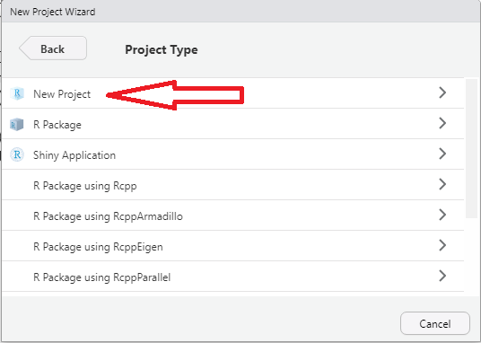

```{r setup, include=FALSE}
library(printr)
library(ggplot2)

#knitr::opts_chunk$set(eval = FALSE)
knitr::opts_chunk$set(echo = TRUE, warning = FALSE, message = FALSE)
ggplot2::theme_set(theme_bw())
```


# Manejando una base de encuestas de hogares con R {.build}

## Fundamentos básicos de R y Rstudio

R fue creado en 1992 en Nueva Zelanda por Ross Ihaka y Robert Gentleman. A manera introductoria, R es un software diseñado para realizar análisis estadístico tanto sencillos como complejos. Este software a ganado popularidad en el gremio estadístico y no estadístico puesto que su manejo es sencillo y además, es de libre uso (Puede descargarse en https://www.r-project.org). Es decir, no requiere de ninguna licencia para su utilización. Como lo menciona Santana Sepúlveda, S., & Mateos Farfán, E. (2014) R es un lenguaje de programación de libre distribución, bajo Licencia GNU, y se mantiene en un ambiente para el cómputo estadístico y gráfico. Este software está diseñado para utilizarse en distintos ambientes como, Windows, MacOS o Linux. El concepto de *ambiente* está enfocado en caracterizarlo como un sistema totalmente planificado y coherente, en lugar de una acumulación gradual de herramientas muy específicas y poco flexibles, como suele ser con otro software de análisis de datos. 

AHora bien, como se mencionó antyeriormente, R es un lenguaje de programación por ende, su interfase es poco amigable para los que incian en este lenguaje. Por esto, se creo RStudio el cual es un Entorno de Desarrollo Integrado (IDE, por sus siglas en inglés), lo que significa que RStudio es un programa que permite manejar R y utilizarlo de manera más cómoda y agradable.

::: white
Es posible utilizar **R** como herramienta de análisis de una base de datos que contenga información de una encuesta de hogares.
:::

## Algunas librerías de interés

Para analizar la PNAD, en `R` utilizaremos las siguientes librerías:

-   `dplyr`, para manejar eficientemente las bases de datos.
-   `readstata13` para leer las bases de datos de `STATA`.
-   `survey` para analizar los datos de las encuestas.
-   `srvyr` para utilizar los *pipe operators* en las consultas.
-   `ggplot2` para generar los gráficos.
-   `TeachingSampling` para seleccionar muestras.
-   `samplesize4surveys` para calcular los tamaños de muestra.

## Instalando las librerias

Antes de poder utilizar las diferentes funciones que cada librería trae, es necesario descargarlas de internet. El comando `install.packages` permite realizar esta tarea. Note que algunas librerías pueden depender de otras, así que para poder utilizarlas es necesario instalar también las dependencias.

```{r, eval=FALSE}
install.packages("dplyr")
install.packages("readstata13")
install.packages("ggplot2")
install.packages("TeachingSampling")
install.packages("samplesize4surveys")
```

## Cargando las librerias

*Recuerde que es necesario haber instalado las librerías para poder utilizarlas*. Una vez instaladas hay que informarle al software que vamos a utilizarlas con el comando `library`.

```{r, warning=FALSE, echo=TRUE, message=FALSE}
rm(list = ls())

library(dplyr)
library(readstata13)
library(survey)
library(srvyr)
library(ggplot2)
library(TeachingSampling)
library(samplesize4surveys)
```

## Cración de proyectos en `R`

Para inicial un procesamiento en `R`, por experiencia y por una cultura de buenas practicas de programación se recomienda crear un proyecto en el cual tengamos disponibles toda nuestra información. A continuación se muestra el paso a paso para crear un proyecto dentro de `RStrudio`

-   **Paso 1:** Abrir `RStudio`.
-   **Paso 2:** ir a file -\> New Project {width="450"}

## *Paso 3:* Tipos de proyecto.

En nuestro caso tomaremos *New Directory* 

{width="450"}

## *Paso 3:* Definir el tipo de proyecto.

-   *New Directory*: Aquí `RStudio` nos brinda una variedad de opciones dependiendo las características del procesamiento que desea realizar.

-   *Existing Directory*: Si contamos con algunos código desarrollados previamente, esta sería la opción a elegir.

-   *Version Control*: Si contamos con cuenta en *Git* y deseamos tener una copia de seguridad podemos emplear esta opción.

## *Paso 4:*

Seleccionar el tipo de proyecto.

{width="450"}

## *Paso 5*

Diligenciar el nombre del proyecto y la carpeta de destino.

{width="450"} 

El realizar esto pasos permite que todas rutinas creadas dentro del proyecto estén ancladas a la carpeta del proyecto.

## Leyendo la base de datos

La función `read.dta13` permite leer la base de datos desde `STATA 13` (es un proceso eficiente de menos de 3 segundos). Luego, convertimos esta base a formato `.RDS` que es un formato más eficiente y genérico de `R`.

```{r, warning=FALSE, echo=TRUE, message=FALSE, eval=FALSE}

data1 <- read.dta13("Z:/BC/BRA_2015N.dta")
saveRDS(data1, "../data/BRA_2015N.rds") 
data2 <- readRDS("../data/BRA_2015N.rds")
```

## Leyendo la base de datos

Para cargar la base de datos en R es necesario utilizar la función `readRDS`.

```{r}
data2 <- readRDS("../data/BRA_2015N.rds")
```

## Registros y variables

La función `nrow` identifica el número de registros (unidades efectivamente medidas) en la base de datos y la función `ncol` muestra el número de variables en la base de datos.

```{r}
nrow(data2)
ncol(data2)
dim(data2)
```

## Visor externo 

La función `View` abre un visor externo y permite navegar por los registros de la base de datos

```{r, eval=FALSE}
View(data2)
```

## La base de datos

{width="850"} 

## Reconociendo las variables

La función `names` identifica las variables de la base de datos.

```{r, eval=FALSE}
names(data2)
```
\tiny
```{r, eval=TRUE, echo=FALSE}
names(data2)
```

## Reconociendo las variables

La función `str` muestra de manera compacta la estructura de un objeto y sus componentes, en este caso la base de datos.

```{r, eval=FALSE}
str(data2)
```
\tiny
```{r, echo=FALSE}
str(data2)
```

## Añadiendo el nombre a los estados

En algunas ocasiones es necesario re-codificar los niveles de los factores. El siguiente código permite generar los nombres de los estados en Brasil.

\scriptsize

```{r}
data2$estados <- factor(data2$uf, 
 levels = c(11:17, 21:29, 31:33, 35, 41:43, 50:53), 
 labels = c("Rondonia", "Acre", "Amazonas", "Roraima", 
            "Para", "Amapa", "Tocantins", "Maranhao", 
            "Piaui", "Ceara", "RioGrandeNorte", "Paraiba",
            "Pernambuco", "Alagoas", "Sergipe", "Bahia", 
            "MinasGerais", "EspirituSanto", "RioJaneiro", 
            "SaoPaulo", "Parana", "SantaCatarina", 
            "RioGrandeSur", "MatoGrossoSur", "MatoGrosso", 
            "Goias", "DistritoFederal"))
```

## Añadiendo el nombre a los estados

Para efectos de visualización en tablas y gráficos a veces conviene codificar los nombres de las variables.

```{r}
data2$deptos <- factor(data2$uf, 
 levels = c(11:17, 21:29, 31:33, 35, 41:43, 50:53), 
 labels = c("RO", "AC", "AM", "RR", "PA", 
 "AP", "TO", "MA", "PI", "CE", "RN", "PB", 
 "PE", "AL", "SE", "BA", "MG", "ES", "RJ", "SP",
 "PR", "SC", "RS", "MS", "MT", "GO", "DF"))
```

## El operador `pipe`

`R` es un lenguaje de programación creado por estadísticos para estadísticos. Una de las contribuciones recientes es el desarrollo de los `pipelines` que permiten de una forma intuitiva generar consultas y objetos desde una base de datos.

El operador más importante es `%>%` que le indica a `R` que el objeto que está a su izquierda debe ser un argumento del código a su derecha.

## Número de encuestas en Brasil

El operador `%>%` indica que el objeto a su izquierda (la base de datos de la PNAD) debe ser un argumento para la función que está a su derecha (el número de filas).

```{r}
data2 %>% count()
```

## Verbos que debemos aprender

-   **filter**: mantiene un criterio de filtro sobre alguna variable o mezcla de variables.
-   **select**: selecciona columnas por nombre.
-   **arrange**: re-ordena las filas de la base de datos.
-   **mutate**: añade nuevas variables a la base de datos.
-   **summarise**: reduce variables a valores y los presenta en una tabla.
-   **group_by**: ejecuta funciones y agrupa el resultado por las variables de interés.

## Utilizando `pipes`

El número de hogares en la base de datos

```{r,eval=FALSE}
data2[,1:5] %>% slice(1:8)
```

\tiny
```{r,echo=FALSE}
data2[,1:5] %>% slice(1:8)
```
\normalsize
El número de encuestas (personas) en la base de datos

```{r}
data2 %>% count()
```

## **filter**

-   Las encuestas de hogares muchas veces recopilan información a nivel de viviendas, hogares y personas.
-   Las bases de datos de datos que están disponibles en `BADEHOG` están a nivel de persona.
-   Se puede filtrar por hogar muy fácilmente porque sólo hay un jefe de hogar por hogar.

## **filter** para hogar

El siguiente código filtra la base de datos por la condición de parentesco.

```{r}
datahogar1 <- data2 %>% filter(parentco == 1)
datahogar2 <- data2 %>% filter(paren_ee == "Jefe") 

# View(datahogar1)
# View(datahogar2)
```

## **filter** para área

El siguiente código filtra la base de datos por la ubicación de la persona en el área rural y urbana.

```{r}
dataurbano <- data2 %>% 
  filter(area_ee == "Area urbana")
datarural <- data2 %>% 
  filter(area_ee == "Area rural") 

# View(dataurbano)
# View(datarural)
```

## **filter** para ingresos

El siguiente código filtra la base de datos por personas de ingresos mensuales bajos y altos.

```{r}
dataingreso1 <- data2 %>% 
  filter(ingcorte %in% c(50, 100))
dataingreso2 <- data2 %>% 
  filter(ingcorte %in% c(1000, 2000))

# View(dataingreso1)
# View(dataingreso2)
```

## **select** para reducción de columnas

El siguiente código reduce la base de datos original utilizando la función `select`.

```{r}
datared <- data2 %>% select(`id_hogar`, `_upm`,
                            `_feh`, `_estrato`)
datablue <- data2 %>% select(id_pers, edad, 
                             sexo, ingcorte)

# View(datared)
# View(datablue)
```

## **select** para reducción de columnas

El siguiente código reduce la base de datos original utilizando la función `select`.

```{r, eval=FALSE}
datagrey <- data2 %>% select(-id_hogar, -id_pers)
datagrey %>% View()
```

## **arrange** para ordenar la base

El siguiente código ordena la base de datos original utilizando la función `arrange`.

```{r}
datadog <- datablue %>% arrange(ingcorte)
datadog %>% head()
```

## **arrange** sobre más variables

Es posible utilizar la función `arrange` para hacer ordenamientos más complicados.

```{r}
datablue %>% arrange(sexo, edad) %>% head()
```

## **arrange** sobre más variables

Es posible utilizar la función `arrange` junto con la opción `desc()` para que el ordenamiento sea descendente.

```{r}
datablue %>% arrange(desc(edad)) %>% head()
```

## **mutate** para crear nuevas variables

Esta función crea nuevas variables en la base de datos que pueden ser guardadas como un objeto diferente en `R`.

```{r}
datablue2 <- datablue %>% 
  mutate(ingreso2 = 2 * ingcorte)
datablue2 %>% head()
```

## **mutate** sistemático

La función `mutate` reconoce sistemáticamente las variables que van siendo creadas de manera ordenada.

```{r}
datacat <- datablue %>% 
  mutate(ingreso2 = 2 * ingcorte,
         ingreso4 = 2 * ingreso2)
datacat %>% head()
```

## Número de encuestas por estado

El siguiente código permite generar el número de encuestas efectivas en cada uno de los estados de Brasil. El comando `group_by` agrupa los datos por estados, el comando `summarise` hace los cálculos requeridos y el comando `arrange` ordena los resultados

```{r eval=FALSE}
data2 %>% 
  group_by(estados) %>% 
  summarise(n = n()) %>% arrange(desc(n))
```

## Número de encuestas por estado

El resultado de la anterior consulta es el siguiente:

```{r echo=FALSE}
data2 %>% 
  group_by(estados) %>% 
  summarise(n = n()) %>% arrange(desc(n))
```

## Número de encuestas por sexo

El siguiente código permite generar el número efectivo de encuestas discriminado por el sexo del respondiente.

```{r}
data2 %>% 
  group_by(sexo) %>% 
  summarise(n = n()) %>% arrange(desc(n)) 
```

## Número de encuestas por área geográfica

El siguiente código reporta el número efectivo de encuestas en el área urbana y rural.

```{r}
data2 %>% 
  group_by(area_ee) %>% 
  summarise(n = n()) %>% arrange(desc(n)) 
```

## Número de encuestas por parentesco

El siguiente código reporta el número efectivo de encuestas clasificado por jefe de hogar, hijos, conyugues, etc.

```{r}
data2 %>% 
  group_by(paren_ee) %>% 
  summarise(n = n()) %>% arrange(desc(n)) 
```

# Descriptivos y reflexión

## Funciones estadísticas básicas

-   Media: `mean()`
-   Mediana: `median()`
-   Varianza: `var()`
-   Desviación estándar: `sd()`
-   Percentiles: `quantile()`
-   Algunas medidas descriptivas: `summary()`
-   Covarianza: `cov( , )`
-   Correlación: `cor( , )`

## Reflexionemos {.build}

-   ¿Qué es una encuesta?
-   ¿Qué es una muestra?
-   ¿Qué es una muestra representativa?
-   ¿Está bien sacar conclusiones sobre una muestra?
-   ¿Podemos tomar la muestra y hacer inferencia directamente desde la muestra?

## Reflexionemos {.build}

-   Si calculamos el promedio de los ingresos en una encuesta, ¿qué significa esa cifra?
-   Si calculamos el total de los ingresos en una encuesta, ¿qué significa esa cifra?
-   ¿Qué necesitamos para que la inferencia sea precisa y exacta?
-   ¿Qué es el principio de representatividad?
-   ¿Qué es el factor de expansión?

## Para reflexionar...

-   Una encuesta de hogares requiere análisis de todas las variables que se quisieron medir, este proceso debe ser llevado a cabo por separado para asegurar la calidad y consistencia de los datos recolectados.
-   Sin embargo, *no* vamos a adentrarnos en el análisis de las variables en la muestra, porque los datos muestrales no son de interés para el investigador.
-   A nosotros nos interesa lo que suceda a nivel poblacional y este análisis se debe abordar desde la teoría del muestreo.

## **¡PELIGRO!**

> Los siguientes resultados no tienen interpretación poblacional y se realizan con el único propósito de ilustrar el manejo de las bases de datos de las encuestas.

## Medias y totales

La función `summarise` permite conocer el total de los ingresos en la base de datos y la media de los ingresos sobre los respondientes.

```{r}
data2 %>% summarise(total.ing = sum(ingcorte),
                    media.ing = mean(ingcorte))
```

NO TIENE INTERPRETACIÓN POBLACIONAL

## Medianas y percentiles

La función `summarise` permite conocer algunas medidas de localización de los ingresos en la base de datos.
\scriptsize
```{r}
data2 %>% summarise(mediana = median(ingcorte),
                    decil1 = quantile(ingcorte, 0.1),
                    decil9 = quantile(ingcorte, 0.9),
                    rangodecil = decil9 - decil1)
```

NO TIENE INTERPRETACIÓN POBLACIONAL

## Varianza y desviación estándar

La función `summarise` permite conocer el comportamiento variacional de los ingresos sobre los respondientes.

```{r}
data2 %>% summarise(varianza = var(ingcorte),
                    desv = sd(ingcorte))
```

NO TIENE INTERPRETACIÓN POBLACIONAL

## Rangos

La función `summarise` permite conocer el comportamiento variacional de los ingresos sobre los respondientes.

```{r}
data2 %>% summarise(mini = min(ingcorte),
                    maxi = max(ingcorte),
                    rango = maxi - mini,
                    rangoiq = IQR(ingcorte))
```

NO TIENE INTERPRETACIÓN POBLACIONAL

# Resúmenes agrupados

## Media de los ingresos por área

```{r}
data2 %>% group_by(area_ee) %>%
  summarise(n = n(),
            media = mean(ingcorte))
```

NO TIENE INTERPRETACIÓN POBLACIONAL

## Media de los ingresos por sexo

```{r}
data2 %>% group_by(sexo) %>%
  summarise(n = n(),
            media = mean(ingcorte))
```

NO TIENE INTERPRETACIÓN POBLACIONAL

## Media de los ingresos por sexo
```{r}
data2 %>% group_by(sexoj) %>%
  summarise(n = n(),
            media = mean(ingcorte))
```

NO TIENE INTERPRETACIÓN POBLACIONAL

## Descriptivos de los ingresos por sexo en hogares

```{r}
data2 %>% filter(paren_ee == "Jefe") %>%
  group_by(sexoj) %>%
  summarise(n = n(),
            media = mean(ingcorte),
            desv = sd(ingcorte),
            rangoiq = IQR(ingcorte))
```

NO TIENE INTERPRETACIÓN POBLACIONAL

## Descriptivos de los ingresos por condición de ocupación

```{r}
data2 %>% group_by(condact) %>%
  summarise(n = n(),
            media = mean(ingcorte),
            desv = sd(ingcorte),
            rangoiq = IQR(ingcorte))
```

NO TIENE INTERPRETACIÓN POBLACIONAL

## Descriptivos de los ingresos por condición de ocupación en hogares

```{r}
data2 %>% filter(paren_ee == "Jefe") %>% 
  group_by(condact) %>%
  summarise(n = n(),
            media = mean(ingcorte),
            desv = sd(ingcorte),
            rangoiq = IQR(ingcorte))
```

NO TIENE INTERPRETACIÓN POBLACIONAL

## Descriptivos de los ingresos en hogares por pobreza
\scriptsize
```{r}
data2 %>% filter(paren_ee == "Jefe") %>% 
  group_by(pobreza) %>%
  summarise(n = n(),
            media = mean(ingcorte),
            desv = sd(ingcorte),
            rangoiq = IQR(ingcorte))
```

NO TIENE INTERPRETACIÓN POBLACIONAL

## ¡Gracias!

::: yellow
*Email*: [andres.gutierrez\@cepal.org](mailto:andres.gutierrez@cepal.org){.email}
:::
