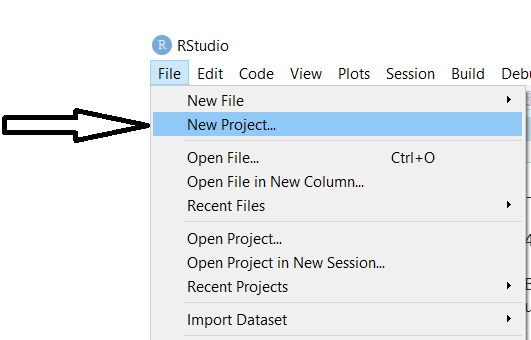
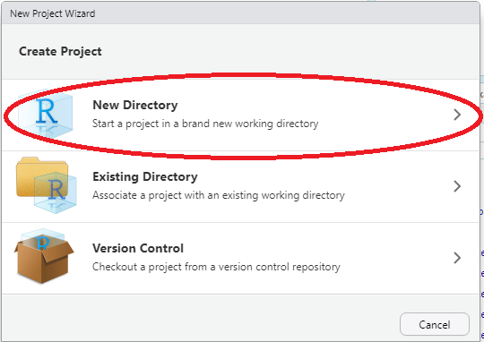

```{r setup, include=FALSE}
library(printr)
library(ggplot2)

#knitr::opts_chunk$set(eval = FALSE)
knitr::opts_chunk$set(echo = TRUE, warning = FALSE, message = FALSE)
ggplot2::theme_set(theme_bw())
```


# Introducción  {.build}

FALTA ESTO: BADEHOG en la Cepal

Las encuestas de hogares son uno de los instrumentos más importantes para hacer seguimiento a los indicadores de los Objetivos de Desarrollo Sostenible (ODS, por sus siglas) en el marco de la agenda 2030. Dada la importancia que tiene estas encuestas en la política pública de cada país, es necesario que los resultados que se obtengan de ellas sean lo más precisos y confiables posibles. En este sentido, las herramientas estadísticas utilizadas para obtener dichos resultados deben ser lo más robustas posibles. Particularmente, el diseño de muestreo utilizando, sin lugar a dudas, es un diseño de muestreo complejo.  Entiéndase esto como como aquello diseños de muestreo en los cuales las unidades experimentales no pueden ser seleccionadas directamente del marco. Es decir, aquellos diseños que contienen más de una etapa, estratificación, conglomerados, etc. 

El objetivo principal de este libro es presentar los conceptos necesarios para hacer un análisis de encuestas complejas enfocadas en las dinámicas de los hogares.  Particularmente, se presenta una guía práctica para analizar encuestas complejas usando R. Es por esto que, la dinámica que se trabaja en este texto es guiar al lector a cómo realizar un análisis completo de una encuesta compleja usando el software estadístico R con el paquete survey. En ese sentido, todos los ejemplos, tablas y gráficos que se presentan en este libro se producen con R, y los códigos computacionales para reproducir estarán disponibles para replicarlos. Se decide utilizar el software estadístico R para hacer los análisis puesto que, es un software de código abierto, lo que permite que cualquier investigador o instituto estadístico tenga acceso a él y es muy conocido y utilizado por el gremio estadístico, lo que lo hace conveniente para la enseñanza.

El lector encontrará en este texto la siguiente estructura. En el capítulo 2 se describen los conceptos básicos de una encuesta compleja fundamentales para la correcta definición del diseño muestral en el entorno de las encuestas de hogares. En el capítulo 3 y 4 se definen los conceptos de variables aleatoria continua y discretas respectivamente en el contexto del muestreo probabilístico y, en el capítulo 5 se muestra como ajustar modelos de regresión lineal utilizando variables discretas y continuas  empleando las herramientas del muestreo probabilístico. En el capítulo 6 se presentan las herramientas para ajustar modelos de regresión logística los cuales son fundamentales en el análisis de encuestas de hogares.

Ahora bien, en los análisis estadísticos no solo son requeridos los modelos de regresión lineales, también, por la misma naturaleza de las variables capturadas en una encuesta de hogares, es necesario el ajuste de modelos lineales generalizados y multiniveles, estos conceptos son trabajados en el capítulo 7 y 8 respectivamente.

Ahora bien, dada la pandemia la no respuesta en encuestas de hogares a aumentado de manera importante en los últimos años por lo que, es necesario recurrir a técnicas de imputación para la información no capturada en el trabajo de campo. Esta temática es trabajada en el capítulo 9. Por último, la presentación gráfica de los resultados en una encuesta de hogares será abordada en el capítulo 10.

# Conceptos básicos en encuestas de hogares

En este capítulo se presentan los conceptos básicos necesarios para la definición y análisis de una encuesta de hogares y son tomadas de *Sarndal, Swensson & Wretman (1992)* & Gutiérrez (2016). Alguno de los conceptos que se encontrarán están relacionados con la población objetivo, universo de estudio, marco muestral, etc. 


## Universo de estudio y población objetivo

El término encuesta se encuentra directamente relacionado con una población finita compuesta de individuos a los cuales es necesario entrevistar. El *universo de estudio* lo constituye el total de individuos o elementos que poseen dichas características a ser estudiadas. Ahora bien, conjunto de unidades de interés sobre los cuales se tendrán resultados recibe el nombre de *población objetivo*. Por ejemplo, *la Encuesta Nacional de Empleo y Desempleo* de Ecuador define su población objetivo como todas las personas mayores de 10 años residentes en viviendas particulares en Ecuador.

## Unidades de análisis

Corresponden a los diferentes niveles de desagregación establecidos para consolidar el diseño probabilístico y sobre los que se presentan los resultados de interés. En México, la *Encuesta Nacional de Ingresos y Gastos de los Hogares* define como unidades de análisis el ámbito al que pertenece la vivienda, urbano alto, complemento urbano y rural. La *Gran Encuesta Integrada de Hogres* de Colombia tiene cobertura nacional y sus unidades de análisis están definidas por 13 grandes ciudades junto con sus áreas metropolitanas.

## Unidades de muestreo

El diseño de una encuesta de hogares en América Latina plantea la necesidad de seleccionar en varias etapas ciertas *unidades de muestreo* que sirven como medio para seleccionar finalmente a los hogares que participarán de la muestra. La *Pesquisa Nacional por Amostra de Domicilios* en Brasil se realiza por medio de una muestra de viviendas en tres etapas, cada etapa se define como una unidad de muestreo. Por ejemplo, las unidades de muestreo en PNAD son:

-   Las unidades primarias de muestreo (UPM) son los municipios,
-   Las unidades secundarias de muestreo (USM) son los sectores censales, que conforman una malla territorial conformada en el último Censo Demográfico.
-   Las últimas unidades en ser seleccionadas son las viviendas.

## Marcos de muestreo

Para realizar el proceso de selección sistemática de los hogares es necesario contar con un marco de muestreo que sirva de *link* entre los hogares y las unidades de muestreo y que permita tener acceso a la población de interés. En este sentido, el *marco muestral* es el conjunto en el cual se identifican a todos los elementos que componen la población objeto de estudio, de la cual se selecciona la muestra. Los marcos de muestreo más utilizados en encuestas complejas son de áreas geográficas que vinculan directamente a los hogares o personas.

A modo de ejemplo, la *Encuesta Nacional de Hogares* de Costa Rica utiliza un marco muestral construido a partir de los censos nacionales de población y vivienda de 2011. Dicho marco corresponde a uno de áreas en donde sus unidades son superficies geográficas asociadas con las viviendas. Este marco permite la definición de UPM con 150 viviendas en las zonas urbanas y 100 viviendas en las zonas rurales. Este marco está conformado por 10461 UPM (64.5% urbanas y 35.5% rurales).

# Manejando una base de encuestas de hogares con R {.build}

## Fundamentos básicos de R y Rstudio {.build}

R fue creado en 1992 en Nueva Zelanda por Ross Ihaka y Robert Gentleman. A manera introductoria, R es un software diseñado para realizar análisis estadístico tanto sencillos como complejos. Este software a ganado popularidad en el gremio estadístico y no estadístico puesto que su manejo es sencillo y además, es de libre uso (Puede descargarse en https://www.r-project.org). Es decir, no requiere de ninguna licencia para su utilización. Como lo menciona Santana Sepúlveda, S., & Mateos Farfán, E. (2014) R es un lenguaje de programación de libre distribución, bajo Licencia GNU, y se mantiene en un ambiente para el cómputo estadístico y gráfico. Este software está diseñado para utilizarse en distintos ambientes como, Windows, MacOS o Linux. El concepto de *ambiente* está enfocado en caracterizarlo como un sistema totalmente planificado y coherente, en lugar de una acumulación gradual de herramientas muy específicas y poco flexibles, como suele ser con otro software de análisis de datos. 

Ahora bien, como se mencionó anteriormente, R es un lenguaje de programación por ende, su interfase es poco amigable para los que inician en este lenguaje. Por esto, se creó RStudio el cual es un Entorno de Desarrollo Integrado (IDE, por sus siglas en inglés), lo que significa que RStudio es un programa que permite manejar R y utilizarlo de manera más cómoda y agradable.


## Algunas librerías de interés {.build}

Puesto que `R` es un lenguaje colaborativo el cual permite que la comunidad vaya haciendo aportes al desarrollo de funciones dentro de paquetes o librerías. Alguna de las librerías más usadas para el análisis de bases de datos son las siguientes:

-   `dplyr`, dplyr es la evolución del paquete plyr, enfocada en herramientas para trabajar con marcos de datos (de ahí la d en el nombre). Según  Hadley  Wickham, las siguientes son las tres propiedades principales de la librería:

    1) Identificar las herramientas de manipulación de datos más importantes necesarias para el análisis de datos y hacerlas fáciles de usar desde R.

    2) Proporcionar un rendimiento ultrarrápido para los datos en memoria escribiendo piezas clave en C++.

    3) Utilizar la misma interfaz para trabajar con datos sin importar dónde estén almacenados, ya sea en un marco de datos, una tabla de datos o una base de datos.Esta librería permite manejar eficientemente las bases de datos.
    
- `tidyverse`, es una colección de paquetes disponibles en R y orientados a la manipulación, importación, exploración y visualización de datos y que se utiliza exhaustivamente en ciencia de datos. El uso de `tidyverse` permite facilitar el trabajo estadístico y la generación de trabajos reproducibles. Está compuesto de los siguientes paquetes: `readr`, `dplyr`, `ggplot2`, `tibble`, `tidyr`, `purr`, `stringr`, `forcats`
    
-   `readstata13`, este paquete permite leer y escribir todos los formatos de archivo de Stata (versión 17 y anteriores) en un marco de datos R. Se admiten las versiones de formato de archivo de datos 102 a 119. para leer las bases de datos de `STATA`. Además, el paquete admite muchas características del formato Stata dta, como conjuntos de etiquetas en diferentes idiomas  o calendarios comerciales.

-   `survey`, este paquete ha sido elaborado por el Profesor Thomas Lumley (Lumley, T. 2011) y nos proporciona funciones en R útiles para analizar datos provenientes de encuestas complejas.Alguno de los parámetros que se pueden estimar usando este paquete son medias, totales, razones, cuantiles, tablas de contingencias, modelos de regresión, modelos loglineales, entre otros.

-   `srvyr`, este paquete permite utilizar el operador *pipe operators* en las consultas que se realizan con el paquete `survey`.

-   `ggplot2`, es un paquete de visualización de datos para el lenguaje R que implementa lo que se conoce como la *Gramática de los Gráficos*, que no es más que una representación esquemática y en capas de lo que se dibuja en dichos gráficos, como lo pueden ser los marcos y los ejes, el texto de los mismos, los títulos, así como, por supuesto, los datos o la información que se grafica, el tipo de gráfico que se utiliza, los colores, los símbolos y tamaños, entre otros.

-   `TeachingSampling`, este paquete permite al usuario extraer muestras probabilísticas y hacer inferencias a partir de una población finita basada en varios diseños de muestreo. Entre los diseño empleados en esta librería están: Muestreo Aleatorio Simple (MAS), Muestreo Bernoullí, Muestreo Sistemático, PiPT, PPT, estre otros.

-   `samplesize4surveys`, este paquete permite calcular el tamaño de muestra requerido para la estimación de totales, medias y proporciones bajo diseños de muestreo complejos.

Antes de poder utilizar las diferentes funciones que cada librería tiene, es necesario descargarlas de antemano de la web. El comando `install.packages` permite realizar esta tarea. Note que algunas librerías pueden depender de otras, así que para poder utilizarlas es necesario instalar también las dependencias.

```{r, eval=F}
install.packages("dplyr")
install.packages("tidyverse")
install.packages("readstata13") 
install.packages("survey")
install.packages("srvyr")
install.packages("ggplot2")
install.packages("TeachingSampling")
install.packages("samplesize4surveys")
```

Una vez instaladas las librerías hay que informarle al software que vamos a utilizarlas con el comando `library`. *Recuerde que es necesario haber instalado las librerías para poder utilizarlas*. 

```{r, warning=FALSE, echo=TRUE, message=FALSE}
rm(list = ls())

library("dplyr")
library("tidyverse")
library("readstata13") 
library("survey")
library("srvyr")
library("ggplot2")
library("TeachingSampling")
library("samplesize4surveys")
```

## Cración de proyectos en `R`

Una vez se descargan e instalan las librerías o paquetes en `R` el paso siguientes es crear proyectos. Un proyecto de R se define como un archivo que contiene los archivos de origen y contenido asociados con el trabajo que se está realizando. Adicionalmente, contiene información que permite la compilación de cada archivo de R a utilizar, mantiene la información para integrarse con sistemas de control de código fuente y ayuda a organizar la aplicación en componentes lógicos.  

Ahora bien, por una cultura de buenas practicas de programación, se recomienda crear un proyecto en el cual se tenga disponible toda la información a trabajar. A continuación, se muestran los pasos para crear un proyecto dentro de `RStrudio`.

-   **Paso 1:** Abrir `RStudio`.
-   **Paso 2:** ir a file -\> New Project {width="450"}

-   *Paso 3:* Tipos de proyecto.

Para este ejemplo se tomará *New Directory* 

{width="450"}

Algo a tener en cuenta en este paso es que en  *New Directory* `RStudio` brinda una variedad de opciones dependiendo las características del procesamiento que desea realizar. Ahora bien, si se cuenta con algunos código previamente desarrollados y se desea continuar con ese proyecto, se debe tomar la opción *Existing Directory* . Por último, Si se cuenta con cuenta en *Git* y se desea tener una copia de seguridad, se debe emplear la opción *Version Control*. 

-   *Paso 4:* Seleccionar el tipo de proyecto.

{width="450"}

-   *Paso 5*: Diligenciar el nombre del proyecto y la carpeta de destino.

{width="450"} 

Al realizar esto pasos permite que todas rutinas creadas dentro del proyecto estén ancladas a la carpeta del proyecto.


## Lectura de las bases de datos y manipulación

Es muy usual que al trabajar proyectos en `R` sea necesario importar bases de datos con información relevante para un estudio en particular. En Colombia, por ejemplo, en la *Encuesta de Calidad de Vida (ECV, por sus siglas)* es necesario, una vez se realiza el trabajo de campo, importar la información recolectada para poder ajustar los factores de expansión y posteriormente estimar los parámetros. Los formatos de bases de datos que `R` permite importar son diversos, entre ellos se tienen `xlsx`, `csv`, `txt`, `STATA`, etc. Particularmente, para la lectura de bases de datos provenientes de `STATA 13` se realiza con la función `read.dta13`. Una vez leída la base de datos en el formato mencionado anteriormente se procede a transformar en el formato `.RDS` el cual es un formato más eficiente y propio de `R`. Para ejemplificar los procedimientos en `R` se utilizará la base de datos de *Pesquisa Nacional por Amostra de Domicílios 2015 * de Brasil la cual está en formato `.dta` el cual se lee en `R` con la función `read.dta13`.  Posteriormente se transformará al formato `.rds` con la función `saveRDS` el cual es un formato propio de `R` y por último se cargar esta base. Lo pasos anteriores se realiza como sigue: 


Primero se carga la base en formato `dta` con la librería `read.dta13` y se guarda en formato `rds` con la función `saveRDS`
`
```{r, warning=FALSE, echo=TRUE, message=FALSE, eval=F}

data1 <- read.dta13("Z:/BC/BRA_2015N.dta")
saveRDS(data1, "../data/BRA_2015N.rds") 

```

Una vez guardada la base en nuestros archivos de trabajo, se procede a cargar la base a `R` con la función `readRDS` para poder utilizar toda la información que en ella se contiene.

```{r}
data2 <- readRDS("Data/BRA_2015N.rds")
```

Una vez cargada la base de datos en `R` ésta se puede empezar a manipular según las necesidades de cada investigador. En este sentido, una de las primeras revisiones que se realizan al cargar las bases de datos es revisar su dimensión, es decir, chequear la cantidad de filas y columnas que tenga la base. Lo anterior se puede hacer con la función `nrow`. Dicha función identifica el número de registros (unidades efectivamente medidas) en la base de datos y la función `ncol` muestra el número de variables en la base de datos. Los códigos computacionales son los siguientes:


```{r}
nrow(data2)
ncol(data2)
```

Una forma resumida de revisar la cantidad de filas y columnas que tiene la base de datos es usar la función `dim`. Esta función nos devuelve un vector indicado en su primera componente la cantidad de fila y en su segundo la cantidad de columnas como se muestra a continuación:

```{r}
dim(data2)
```


Es usual que en las encuestas de hogares las bases de datos sean muy extensas, es decir, contengan una cantidad importante de variables medidas (filas) y por lo general, el tamaño de la muestra de estos estudios con grandes. Es por lo anterior que, para poder visualizar dichas bases una vez cargadas en `R`, es necesario hacerlo de manera externa. Esto es, abrir una pestaña diferente en `R` y hacer la navegación de la base como un texto plano. Lo anterior se realiza con la función `View` como se muestra a continuación:

```{r, eval=F}
View(data2)
```

{width="850"} 

Otro chequeo importante que se debe realizar al momento de cargar una base de datos en `R` es el reconocimiento de las variables que incluye. Esto se puede hacer utilizando la función `names` la cual identifica las variables de la base de datos.

```{r, eval=F}
names(data2)
```

La función `names` solo devuelve un vector un vector con los nombres de las variables que contiene la base. Sin embargo, si se quiere profundizar en qué información contiene cada variable, La función `str` muestra de manera compacta la estructura de un objeto y sus componentes. Para nuestra base se utilizaría de la siguiente manera:


```{r, eval=FALSE}
str(data2)
```


Como se puede observar en la salida anterior, por ejemplo, la variable *id_hogar* es de tipo *Entero* al igual que *id_pers* mientras que *cotiza_ee* es un factor con 2 niveles. Como se observa, esta función es muy útil al momento de querer tener un panorama amplio del contenido y clase de cada variable en una base de datos, particularmente, en una encuesta de hogares en donde se tiene, por la misma estructura del estudio, muchas clases o tipos de variables medidas.

## El operador `pipe`


El software estadístico `R` es un lenguaje de programación creado por estadísticos para estadísticos. Una de las contribuciones recientes es el desarrollo de los `pipelines` que permiten de una forma intuitiva generar consultas y objetos desde una base de datos. El operador *pipe*, `%>%`, viene del paquete magrittr (Bache, S. et al., 2022) y está cargado automáticamente en los paquetes del `Tidyverse`. 

El objetivo del operador pipe es ayudar a escribir código de una manera que sea más fácil de leer y entender. En este sentido, el operador ` %>% ` permite “encadenar” operaciones en el sentido que el resultado de una operación anterior se convierta en el input de la siguiente operación. A continuación, ejemplificaremos el uso del ` %>% ` en la base de datos de Brasil haciendo un conteo del total de elementos que contiene la base de datos utilizando la función `count`.

```{r, eval=T}
data2 %>% count()
```

Otra operación que se puede realizar en `R` es re-codificar los niveles de los factores que en muchas ocasiones son necesarios en las encuestas de hogares. El siguiente código permite generar los nombres de los estados en Brasil.

\scriptsize

```{r}

data2$estados <- factor(data2$uf, 
 levels = c(11:17, 21:29, 31:33, 35, 41:43, 50:53), 
 labels = c("Rondonia", "Acre", "Amazonas", "Roraima", 
            "Para", "Amapa", "Tocantins", "Maranhao", 
            "Piaui", "Ceara", "RioGrandeNorte", "Paraiba",
            "Pernambuco", "Alagoas", "Sergipe", "Bahia", 
            "MinasGerais", "EspirituSanto", "RioJaneiro", 
            "SaoPaulo", "Parana", "SantaCatarina", 
            "RioGrandeSur", "MatoGrossoSur", "MatoGrosso", 
            "Goias", "DistritoFederal"))

```

Adicionalmente, para efectos de visualización en tablas y gráficos es conviene codificar los nombres de las variables. Para este ejemplo, se codificarán de la siguiente manera:

```{r}
data2$deptos <- factor(data2$uf, 
 levels = c(11:17, 21:29, 31:33, 35, 41:43, 50:53), 
 labels = c("RO", "AC", "AM", "RR", "PA", 
 "AP", "TO", "MA", "PI", "CE", "RN", "PB", 
 "PE", "AL", "SE", "BA", "MG", "ES", "RJ", "SP",
 "PR", "SC", "RS", "MS", "MT", "GO", "DF"))
```


Por otro lado, existe una gama amplia de funciones que se pueden utilizar con el operador ` %>% `, A continuación, se enlistan una serie de funciones muy útiles al momento de hacer análisis con bases de datos provenientes de encuestas de hogares:  

-   **filter**: mantiene un criterio de filtro sobre alguna variable o mezcla de variables.
-   **select**: selecciona columnas por nombres.
-   **arrange**: ordena las filas de la base de datos.
-   **mutate**: añade nuevas variables a la base de datos.
-   **summarise**: reduce variables a valores y los presenta en una tabla.
-   **group_by**: ejecuta funciones y agrupa el resultado por las variables de interés.


Ejemplificando alguna de las funciones mostradas anteriormente, una de las primeras consultas que se realizan en las encuestas de hogares es saber el número de encuestas (personas) realizadas y que están contenida en la base de datos. Usando ` %>% ` se realiza de la siguiente manera:


```{r}
data2 %>% count()

```


Otro de los ejercicios que se hacen usualmente con las encuestas de hogares está relacionado con saber la cantidad de hogares que hay en el país de estudio. Una de las formas más sencillas de hacer esta revisión es usar la función `filter`. Las encuestas de hogares muchas veces recopilan información a nivel de viviendas, hogares y personas. Particularmente, las bases de datos que están disponibles en `BADEHOG` están a nivel de persona. Ahora bien, para saber la cantidad de hogares que se encuestaron basta con filtrar por hogar porque sólo hay un jefe de hogar por hogar, como se muestra a continuación:


```{r}
datahogar1 <- data2 %>% filter(parentco == 1)
datahogar2 <- data2 %>% filter(paren_ee == "Jefe") 

```


Por otro lado, si el interés ahora es filtrar la base de datos por la ubicación de la persona en el área rural y urbana se realiza de la siguiente manera:

```{r, eval=T}
dataurbano <- data2 %>% 
  filter(area_ee == "Area urbana")
datarural <- data2 %>% 
  filter(area_ee == "Area rural") 
```


En este mismo sentido, si el objetivo ahora es filtrar la base de datos por algunos ingresos particulares mensuales por personas, por ejemplo, altos o bajos, se realiza de la siguiente manera:

```{r, eval=T}
dataingreso1 <- data2 %>% 
  filter(ingcorte %in% c(50, 100))

dataingreso2 <- data2 %>% 
  filter(ingcorte %in% c(1000, 2000))

```

Otra función muy útil en el análisis en encuestas de hogares es la función `select` la cual, como se mencionó anteriormente permite seleccionar un grupo de variables de interés a analizar. Si por ejemplo, se desea seleccionar de la base de ejemplo solo las variables identificación del hogar (`id_hogar`), unidades primarias de muestreo (`_upm`), factores de expansión (`_feh`) y estratos muestrales ( `_estrato`) se realiza de la siguiente manera:

```{r}
datared <- data2 %>% select(`id_hogar`, `_upm`,
                            `_feh`, `_estrato`)

datablue <- data2 %>% select(id_pers, edad, 
                             sexo, ingcorte)
```


La función `select` no solo sirve para seleccionar variables de una base de datos, también se puede utilizar para eliminar algunas variables de la base de datos que ya no son de interés para el análisis o que simplemente se generaron en la manipulación de la base de datos como variables puentes para realizar algunos cálculos de interés. Por ejemplo, si se desea eliminar de la base de datos de ejemplo las variables identificación del hogar (`id_hogar`) e identificación de las personas (`id_pers`) se realiza introduciendo un signo "menos" (-) delante del nombre de la variable como sigue:


```{r, eval=T}
datagrey <- data2 %>% select(-id_hogar, -id_pers)
```


Por otro lado, si el objetivo ahora en análisis de las encuestas de hogares es ordenar las filas de la base por alguna variable en particular, se utiliza en `R` la función `arrange` para realizar esta operación. A continuación, se ejemplifica con la base de datos de ejemplo, cómo se ordena la base de acuerdo con la variable *ingcorte*:

```{r}
datadog <- datablue %>% arrange(ingcorte)
datadog %>% head()
```


Es posible utilizar la función `arrange` para hacer ordenamientos más complicados. Por ejemplo, ordenar por más de una variable. A modo de ejemplo, ordenemos la base de datos *datablue* de acuerdo con las variables *sexo* y *edad*

```{r, eval=T}
datablue %>% arrange(sexo, edad) %>% head()
```


También es posible utilizar la función `arrange` junto con la opción `desc()` para que el ordenamiento sea descendente.

```{r}
datablue %>% arrange(desc(edad)) %>% head()
```


## Funciones **mutate, summarise y group_by** en encuestas de hogares

Las funciones `mutate`, `summarise` y `group_by` están cargadas en el paquete `tidyverse` y son muy importantes al momento de realizar análisis en encuestas de hogares. En primer lugar, la función `mutate` permite computar transformaciones de variables en una base de datos. Usualmente, en las encuestas de hogares es necesario crear nuevas variables, por ejemplo, si el hogar está en estado de pobreza extrema o no la cual se calcula a partir de los ingresos del hogar, la función `mutate` proporciona una interface clara para realizar este tipo de operaciones. A modo de ejemplo, utilizaremos la base de ejemplo para crear una nueva variable llamada *ingreso2* la cual es el doble de los ingresos por persona dentro de un hogar. Los códigos computacionales se muestran a continuación:

```{r, eval=TRUE}
datablue2 <- datablue %>% 
  mutate(ingreso2 = 2 * ingcorte)
datablue2 %>% head()
```

No solo se puede crear una nueva variable, si es necesario, se pueden crear más de una variable en la base de datos. Cabe recalcar que la función `mutate` reconoce sistemáticamente las variables que van siendo creadas de manera ordenada. A continuación, se presenta cómo crear más de una nueva variable en la base de datos:

```{r, eval=TRUE}
datacat <- datablue %>% 
  mutate(ingreso2 = 2 * ingcorte,
         ingreso4 = 2 * ingreso2)
datacat %>% head()
```


Ahora bien, la función `summarise` funciona de forma similar a la función `mutate`, excepto que en lugar de añadir nuevas columnas crea un nuevo data frame. Como se mencionó anteriormente esta función sirve para resumir o “colapsar filas”. Toma un grupo de valores como input y devuelve un solo valor; por ejemplo, hallar la media de los ingresos, percentiles o medidas de dispersión.

Por otro lado, la función `group_by` permite agrupar información de acuerdo con una(s) variable(s) de interés. El siguiente código permite generar el número de encuestas efectivas en cada uno de los estados de Brasil. El comando `group_by` agrupa los datos por estados, el comando `summarise` hace los cálculos requeridos y el comando `arrange` ordena los resultados

```{r eval=T}
data2 %>% 
  group_by(estados) %>% 
  summarise(n = n()) %>% arrange(desc(n)) %>% head()
```


Hay otro tipos de análisis que se quieren realizar en encuestas de hogares, por ejemplo, generar el número de encuestas efectivas discriminado por el sexo del respondiente. A continuación, se presenta el código computacional:

```{r}
data2 %>% 
  group_by(sexo) %>% 
  summarise(n = n()) %>% arrange(desc(n)) 
```

Si ahora se desea realizar la consulta del número de encuestas efectivas por área geográfica, se realiza de la siguiente manera:

```{r}
data2 %>% 
  group_by(area_ee) %>% 
  summarise(n = n()) %>% arrange(desc(n))
```


Otras consultas que se realizan de manera frecuente en encuestas de hogares es reporta el número efectivo de encuestas clasificado por parentezco (jefe de hogar, hijos, conyugues, etc)

```{r}
data2 %>% 
  group_by(paren_ee) %>% 
  summarise(n = n()) %>% arrange(desc(n)) 
```


# Medidas descriptivos y reflexiones

En estadística, según *Tellez Piñerez, C. F., & Lemus Polanía, D. F. (2015)* las medidas descriptivas permiten la presentación y caracterización de un conjunto de datos con el fin de poder describir apropiadamente las diversas características presentes en la información de la muestra. Involucra cualquier labor o actividad para resumir y describir los datos univariados o multivariados sin tratar de hacer inferencia más allá de los mismos. Este tipo de análisis son primordiales en cualquier encuesta de hogares dado que, permiten tener una idea inicial del comportamiento de la población en ciertas variables de estudio. A continuación, se presentan las funciones básicas en `R` para realizar análisis descriptivo.

-   Media: `mean()`
-   Mediana: `median()`
-   Varianza: `var()`
-   Desviación estándar: `sd()`
-   Percentiles: `quantile()`
-   Algunas medidas descriptivas: `summary()`
-   Covarianza: `cov( , )`
-   Correlación: `cor( , )`

Ahora bien, para continuar con lo análisis de las encuestas de hogares es necesario que el lector tenga claro algunos conceptos básicos en el muestreo probabilístico. A continuación, se dan unas definiciones básicas:


-   *¿Qué es una encuesta?*

Según  Groves, R. M., et al (2011) una encuesta es un método sistemático para recopilar información de una muestra de elementos con el propósito de construir descriptores cuantitativos de los parámetros de la población.

-   *¿Qué es una muestra?*

La definición más básica de una muestra es un subconjunto de la población. Esta definición es muy general dado que, no es específico de si la muestra es representativa de una población o no.

-   *¿Qué es una muestra representativa?*

Según *Gutiérrez (2016)* una muestra representativa es un modelo reducido de la población y de aquí se desprende un argumento de validez sobre la muestra. En pocas palabras, se desea que la muestra representativa tenga la cantidad de información suficiente para poder hacer una inferencia adecuada a la población.

-   *¿Está bien sacar conclusiones sobre una muestra?*

Si la muestra es representativa, las conclusiones que se obtienen de la población utilizando las técnicas de muestreo adecuadas, son correctas. Sin embargo, si se toma una muestra no representativa, no es correcto realizar inferencias dado que estas no representan la realidad de la población.

## Algunas reflexiones generales {.build}

Como se mencionó anteriormente, antes de realizar los análisis en las encuestas de hogares es necesario hacernos algunas preguntas que nos permiten dar claridad de los análisis que se desean hacer. A continuación, se presentan las preguntas:  

-   *Si calculamos el promedio de los ingresos en una encuesta, ¿qué significa esa cifra?* 

Esta cifra representa los ingresos medios que reportaron las personas entrevistadas en el estudio. En ningún momento se puede hablar de que este valor representa a la población a la cual queremos hacer inferencia. Para poder realizar las conclusiones a nivel poblacional se deben utilizar los factores de expansión que se obtuvieron empleando el diseño muestral.

-   *Si calculamos el total de los ingresos en una encuesta, ¿qué significa esa cifra?*

Similar a lo anterior, significa los ingresos totales que reportaron los entrevistados en el estudio. Se recalca que, bajo ninguna circunstancia se puede inferir que este valor muestral representa a la población de estudio.

-   *¿Qué necesitamos para que la inferencia sea precisa y exacta?*

Se requiere de un buen diseño muestral, que la muestra que se recolecte sea representativa de la población en estudio y que el tamaño de muestra sea suficiente para poder inferir en todas las desagregaciones, tanto geográficas como temáticas que se plantearon en el diseño muestral.

-   *¿Qué es el principio de representatividad?*

La representatividad es la característica más importante de una muestra probabilística, y se define como la capacidad que tiene una muestra de poder representar a la población a la cual se desea hacer inferencia. En este sentido, el muestreo adquiere todo su sentido en cuanto se garantice que las características que se quieren medir en la población quedan reflejadas adecuadamente en la muestra. Cabe resaltar que, una muestra representativa no es aquella que se parece a la población, de tal forma que las categorías aparecen
con las mismas proporciones que en la población dado que, en algunas ocasiones
es fundamental sobre-representar algunas categorías o incluso seleccionar unidades con probabilidades desiguales para poderlas medir con precisión *(Tillé, 2006)*

-   *¿Qué es el factor de expansión?*

Según *Guitiérrez (2016)* el factor de expansión es el número de elementos menos uno de la población (no incluidos en la muestra) representados por el elemento incluido. También se conoce como el inverso de la probabilidad de inclusión.


Dadas las definiciones hechas anteriormente, una encuesta de hogares requiere el análisis de todas las variables que dispuestas en la encuesta. Este proceso debe ser llevado a cabo por separado para asegurar la calidad y consistencia de los datos recolectados. Sin embargo, *no* vamos a adentrarnos en el análisis de las variables en la muestra, porque los datos muestrales no son de interés para el investigador. El interés se centra en lo que suceda a nivel poblacional y este análisis se debe abordar desde la teoría del muestreo.

## **¡Observación importante!**

> Los siguientes resultados no tienen interpretación poblacional y se realizan con el único propósito de ilustrar el manejo de las bases de datos de las encuestas.

## Medias y totales

La función `summarise` permite conocer el total de los ingresos en la base de datos y la media de los ingresos sobre los respondientes.

```{r}
data2 %>% summarise(total.ing = sum(ingcorte),
                    media.ing = mean(ingcorte))
```

También se puede calcular medias de manera agrupada. Particularmente, si se desea calcular la media de los ingresos por área se hace de la siguiente manera:

```{r}
data2 %>% group_by(area_ee) %>%
  summarise(n = n(),
            media = mean(ingcorte))
```

Si ahora el análisis de los ingresos se desea hacer por sexo se realiza de la siguiente manera:


```{r}
data2 %>% group_by(sexo) %>%
  summarise(n = n(),
            media = mean(ingcorte))
```


## Medianas y percentiles

La función `summarise` también permite conocer algunas medidas de localización de los ingresos en la base de datos.

\scriptsize
```{r}
data2 %>% summarise(mediana = median(ingcorte),
                    decil1 = quantile(ingcorte, 0.1),
                    decil9 = quantile(ingcorte, 0.9),
                    rangodecil = decil9 - decil1)
```


## Varianza, desviación estándar y rangos

Utilizando la función `summarise` podemos conocer también el comportamiento variacional de los ingresos sobre los respondientes.

```{r}
data2 %>% summarise(varianza = var(ingcorte),
                    desv = sd(ingcorte))

data2 %>% summarise(mini = min(ingcorte),
                    maxi = max(ingcorte),
                    rango = maxi - mini,
                    rangoiq = IQR(ingcorte))

```


Ahora bien, si se desea realizar el cálculo de la media, la desviación estándar y el rango de los ingresos por hogares, se realiza de la siguiente manera:


```{r}
data2 %>% filter(paren_ee == "Jefe") %>%
  group_by(sexoj) %>%
  summarise(n = n(),
            media = mean(ingcorte),
            desv = sd(ingcorte),
            rangoiq = IQR(ingcorte))
```


y por condicción de ocupación se realizaría:

```{r}
data2 %>% group_by(condact) %>%
  summarise(n = n(),
            media = mean(ingcorte),
            desv = sd(ingcorte),
            rangoiq = IQR(ingcorte))
```

a nivel de hogar:

```{r}
data2 %>% filter(paren_ee == "Jefe") %>% 
  group_by(condact) %>%
  summarise(n = n(),
            media = mean(ingcorte),
            desv = sd(ingcorte),
            rangoiq = IQR(ingcorte))
```

Si se desea hacer un descriptivo a nivel de hogar para el ingreso se realizaría de la siguiente manera:


```{r}
data2 %>% filter(paren_ee == "Jefe") %>% 
  group_by(pobreza) %>%
  summarise(n = n(),
            media = mean(ingcorte),
            desv = sd(ingcorte),
            rangoiq = IQR(ingcorte))
```


# Selección de una muestra

## Motivación

> Desde que se popularizaron las encuestas de hogares en 1940, se ha hecho evidente algunas tendencias que están ligadas a los avances tecnológicos en las agencias estadísticas y en la sociedad y se han acelerado con la introducción del computador.

Gambino & Silva (2009)


El muestreo es un procedimiento que responde a la necesidad de información estadística precisa sobre una población objetivo de estudio; Como lo menciona *Gutiérrez (2016)* el muestreo trata con investigaciones parciales sobre la población que apuntan a inferir a la población completa. Es así como en las últimas décadas ha tenido bastante desarrollo en diferentes campos principalmente en el sector gubernamental con la publicación de las estadísticas oficiales que permiten realizar un seguimiento a las metas del gobierno, en el sector académico, en el sector privado y de comunicaciones. 

Como se ha venido mencionando anteriormente, este libro está enfocado en el análisis de las encuestas de hogares. En ese sentido y para que el lector tenga una gama más amplia de ejemplos, en este capítulo se utilizará, para los ejemplos computacionales, la base de datos **BigCity**. Esta base es un conjunto de datos que contiene algunas variables socioeconómicas de $150266$ personas de una ciudad en un año en particular. Alguna de las variables de esta base de datos son:

-  *HHID:* Corresponde al identificador del hogar.

-  *PersonID:* Corresponde al identificador de la persona dentro del hogar.

-  *Stratum:* Corresponde al estrato geográfico del hogar. Son 119 estratos.

-   *PSU:* Corresponde a las unidades primarias de muestreo. La base de datos cuenta con $1664$ PSU.

-   *Zone:* Corresponde a las áreas urbanas o rurales a lo largo de la ciudad.

-   *Sex:* Corresponde al sexo del entrevistado.

-   *Income:* Corresponde a los ingresos mensual per cápita.

-   *Expenditure:* Corresponde a los gastos mensual per cápita.

-   *Employment:* Situación laboral de la persona entrevistada.

-   *Poverty:* Esta variable indica si la persona es pobre o no. Depende de los ingresos.


## Muestreo aleatorio simple en dos etapas estratificado

Con la finalidad de mantener un equilibrio entre los costos económicos y las propiedades estadísticas de la estrategia de muestreo se puede aprovechar la homogeneidad dentro de los conglomerados y, así, no tener que realizar censos dentro de cada Unidad Primaria de Muestreo (UPM) sino, proceder a seleccionar una sub-muestra dentro del conglomerado seleccionado.

Los diseños de muestreo en las encuestas de hogares se caracterizan por ser **diseños complejos** los cuales involucran, entre otras, más de una etapa en la selección de las unidades de observación, estratos y estimadores complejos. En su mayoría, las unidades primarias de muestreo  son seleccionadas dentro de los estrato. Ahora bien, según la teoría de muestreo *(Cochran, W. G., 1977)* se asume que el muestreo en cada estrato respeta el principio de la independencia. Esto es, las estimaciones del total, así como el cálculo y estimación de la varianza son el resultado de añadir o sumar para cada estrato la respectiva cantidad. Dentro de cada estrato $U_h$ con $h=1,\ldots, H$ existen $N_{Ih}$ unidades primarias de muestreo, de las cuales se selecciona una muestra $s_{Ih}$ de tamaño $n_{Ih}$ mediante un diseño de muestreo aleatorio simple. Suponga, además que el sub-muestreo dentro de cada unidad primaria seleccionada es también aleatorio simple. En este sentido, para cada unidad primaria de muestreo seleccionada $i\in s_{Ih}$ de tamaño $N_i$ se selecciona una muestra $s_i$ de elementos de tamaño $n_i$.

Como es ampliamente conocido, el proceso de estimación de un parámetro particular, por ejemplo, la media de los ingresos consiste en multiplicar la observación obtenida en la muestra por su respectivo factor de expansión y dividirlo sobre la suma de los factores de expansión de acuerdo con el nivel de desagregación que se quiera estimar. Sin embargo, cuando el diseño es complejo como es el caso de las encuestas de hogares, la estimación de la varianza se torna un poco difícil de realizar utilizando ecuaciones cerradas. Para estos casos y como lo recomienda la literatura especializada *(Hansen, M. H., & Steinberg, J., 1956))*, se procede a utilizar la técnica del último conglomerado. Esta técnica consiste en aproximar la varianza sólo teniendo en cuenta la varianza de los
estimadores en la primera etapa. Para esto se debe suponer que el diseño de muestreo fue realizado con reemplazo. 

Para poder utilizar los principios de estimación del último conglomerado en las encuestas de hogares se definen las siguientes cantidades:

1. $d_{I_i} = \dfrac{N_{Ih}}{n_{Ih}}$, que es el factor de expansión de la $i$-ésima UPM en el estrato $h$.

2. $d_{k|i} = \dfrac{N_{i}}{n_{i}}$, que es el factor de expansión del $k$-ésimo hogar para la $i$-ésima UPM.

3. $d_k = d_{I_i} \times d_{k|i} = \dfrac{N_{Ih}}{n_{Ih}} \times \dfrac{N_{i}}{n_{i}}$, que es el factor de expansión final del $k$-ésimo elemento para toda la población $U$.


## Práctica en `R`

En esta sección se utilizarán las funciones estudiadas en el capítulo anterior para la manipulación de la base de datos de ejemplo. Inicialmente, se cargarán las librerías `ggplot2` que permitirá generar gráficos de alta calidad en `R`, `TeachingSampling` que permite tomar muestras probabilísticas utilizando los diseños de muestreo usuales, `survey` y `srvyr` que permitirán definir los diseños muestrales y por último `dplyr` que permite la manipulación de las bases de datos.

```{r eval=T, include=FALSE}
library(knitr)
library(printr)

```

```{r, eval=TRUE}
library(ggplot2)
library(TeachingSampling)
library(dplyr)
library(survey)
library(srvyr)
```

Una vez cargada las librerías, se procede a calcular la cantidad de personas en la base de datos, el total de ingresos y total de gastos para cada UPM dentro de cada estrato:  


```{r, eval=TRUE}
data('BigCity')

 FrameI <- BigCity %>% group_by(PSU) %>%
 summarise(Stratum = unique(Stratum),
           Persons = n(),
           Income = sum(Income),
           Expenditure = sum(Expenditure))
             
attach(FrameI)

```

```{r, eval=FALSE}
head(FrameI, 10)
```
\tiny
```{r, echo=FALSE}
head(FrameI, 10)
```


Ahora bien, para calcular los tamaños poblacionales de los estratos (NIh) y los tamaños de muestra dentro de cada estrato (nIh), se realiza de la siguiente manera:


```{r, eval=TRUE}
sizes = FrameI %>% group_by(Stratum) %>%
        summarise(NIh = n(),
        nIh = 2,
        dI = NIh/nIh)
        
NIh <- sizes$NIh
nIh <- sizes$nIh
```

\scriptsize
```{r}
head(sizes, 10)
```


Si se desea extraer una muestra probabilística bajo un diseño aleatorio simple estratificado, se procede a utilizar la función `S.STSI` de la librería `TeachingSampling` como se muestra a continuación:

\footnotesize
```{r, eval=TRUE}
samI <- S.STSI(Stratum, NIh, nIh)
UI <- levels(as.factor(FrameI$PSU))
sampleI <- UI[samI]
```

Ahora bien, con la función `left_join` se procede a pegar los tamaños muestrales a aquellas UPM's que fueron seleccionadas en la muestra:


```{r, eval=TRUE}
FrameII <- left_join(sizes, 
            BigCity[which(BigCity$PSU %in% sampleI), ])
attach(FrameII)
```

Una vez se tiene la base de datos con la muestra de UMP's. se selecciona aquellas variables que son de inetrés para el estudio como sigue a continuación:

\scriptsize
```{r}
head(FrameII, 10) %>% select(Stratum:Zone)
```

Luego de tener la información muestral de la primera etapa en la base **FrameII** se procede a calcular los tamaños de muestra dentro de cada UPM's. En este caso, a modo de ejemplo, se tomará el 10% del tamaño de la UPM y se utilizará la función `ceiling` la cual aproxima al siguiente entero.


```{r, eval=TRUE}
HHdb <- FrameII %>% 
        group_by(PSU) %>%
        summarise(Ni = length(unique(HHID)))
        
Ni <- as.numeric(HHdb$Ni)
ni <- ceiling(Ni * 0.1)
sum(ni)
```

Teniendo el vector de tamaños de muestra para cada UMP, se procede a realizar la selección mediante un muestreo aleatorio simple con la función `S.SI` de la librería `TeachingSampling`. A modo ilustrativo, la selección en la segunda etapa del diseño se realizará, inicialmente para la primera UPM. Posterior a eso, se realizará un ciclo "for" para hacerlo con las demás UPM's. Para la primera UPM se realiza de la siguiente manera:

\footnotesize
```{r, eval=TRUE}
sam = S.SI(Ni[1], ni[1])

clusterII = FrameII[which(FrameII$PSU == sampleI[1]),]

sam.HH <- data.frame(HHID = unique(clusterII$HHID)[sam])

clusterHH <- left_join(sam.HH, clusterII, by = "HHID")

clusterHH$dki <- Ni[1] / ni[1]

clusterHH$dk <- clusterHH$dI * clusterHH$dki

sam_data = clusterHH
```


\scriptsize
```{r}
head(sam_data, 10) %>% select(Stratum:Zone)
```

Para las demás UPM's seleccionadas en la etapa 1,

\footnotesize

```{r, eval=TRUE}
for (i in 2:length(Ni)) {
  sam = S.SI(Ni[i], ni[i])
  
  clusterII = FrameII[which(FrameII$PSU == sampleI[i]),]
  
  sam.HH <- data.frame(HHID = unique(clusterII$HHID)[sam])
  
  clusterHH <- left_join(sam.HH, clusterII, by = "HHID")
  
  clusterHH$dki <- Ni[i] / ni[i]
  
  clusterHH$dk <- clusterHH$dI * clusterHH$dki
  
  data1 = clusterHH
  
  sam_data = rbind(sam_data, data1)
}
encuesta <- sam_data

attach(encuesta)
```

Una vez se obtiene la muestra (como se mostró anteriormente), el paso siguiente es definir el diseño utilizado y guardarlo como un objeto en `R` para posteriormente poderlo utilizar y realizar el proceso de estimación de parámetros y cálculo de indicadores. Para realizar esta tarea, se utilizará el paquete `srvyr` el cual ya fue definido en el capítulo anterior. Para este ejemplo, el diseño de muestreo utilizado fue un estratificado-multietápico en el cual, los estratos correspondieron a la variable *Stratum*, las UPM's correspondieron a la variable *PSU*, los factores de expansión están en la variable *dk* y por último, se le indica a la función `as_survey_design` que las UPM's están dentro de los estrato con el argumento *nest = T*. A continuación, se presenta el código computacional:

```{r, eval=TRUE}

diseno <- encuesta %>%
  as_survey_design(
    strata = Stratum,
    ids = PSU,
    weights = dk,
    nest = T
  )

```


Ya definido el diseño de muestreo como un objeto de `R` se puede empezar a extraer información del mismo. Por ejemplo, se pueden extraer los pesos de muestreo de dicho diseño con la función `weights` y luego sumarlos para revisar hasta cuánto me está expandiendo mi muestra. El código es el siguiente:

```{r}
sum(weights(diseno))
```

Como se puede observar, el tamaño poblacional estimado utilizando el diseño propuesto es de $140579.2$. Sin embargo, el tamaño poblacional de la base BigCity es de $150266$. Es normal que esto suceda pero debe ser corregido puesto que la suma de los factores de expansión debe sumar el total de la población. La solución para esto es calibrar los pesos de muestreo que se abordará a continuación.

## Calibrando con `R`

La calibración es un ajuste que se realiza a los pesos de muestreo con el propósito de que las estimaciones de algunas variables de control reproduzcan de forma perfecta los totales poblacionales de estas variables *(Sarndal, 2003)*. Esta propiedad de consistencia es deseable en un sistema de ponderadores. En este sentido, cuando los estudios por muestreo están afectados por la ausencia de respuesta, como en muchos casos pasa en las encuestas de hogares, es deseable tener las siguientes propiedades en la estructura inferencial que sustenta el muestreo:

-   Sesgo pequeño o nulo.
-   Errores estándares pequeños.
-   Un sistema de ponderación que reproduzca la información auxiliar disponible.
-   Un sistema de ponderación que sea eficiente al momento de estimar cualquier característica de interés en un estudio multipropósito.

La calibración es usualmente el último paso en el ajuste de los ponderadores. Hace uso de información auxiliar que reduce la varianza y corrige los problemas de cobertura que no pudieron ser corregidos en los pasos previos. 

Puesto que el estimador de calibración depende exclusivamente de la información auxiliar disponible, esta información puede aparecer en diversas formas:

1. Puede estar de forma explícita en el marco de unidades. $x_k \ (\forall \ k \in U)$

2. Puede ser un agregado poblacional proveniente de un censo o de  registros administrativos. $t_x = \sum_U x_k$

3. Puede ser una estimación poblacional $\hat{t}_x = \sum_s w_kx_k$ muy confiable.

Particularmente, en encuestas de hogares, existen conteos de personas disponibles a nivel de desagregaciones de interés. Por ejemplo, número de personas por edad, raza y género que se permite utilizar como información auxiliar para calibrar las estimaciones.

La necesidad de calibrar en las encuestas de hogares es porque no todos los grupos de personas se cubren apropiadamente desde el diseño de muestreo. Además, las estimaciones del número de personas en estos subgrupos son menores a las proyecciones que se tienen desde los censos. Por último, al ajustar los pesos para que sumen exactamente la cifra de los conteos censales, se reduce el sesgo de subcobertura.

Para ejemplificar el estimador de calibración en `R` usando la base de datos de ejemplo se utilizarán la función `calibrate` del paquete `survey`. En primer lugar, para poder calibrar se requiere construir la información poblacional a la cual se desea calibrar. En este ejemplo se calibrará a nivel de zona y sexo. Por tanto, los totales se obtienen como sigue: 

\scriptsize
```{r}
library(survey)
totales <- colSums(
  model.matrix(~ -1 + Zone:Sex, BigCity)) 
```

En la salida anterior se puede observar que, por ejemplo, en la zona rural hay 37238 mujeres mientras que en la urbana hay 41952. De igual manera se puede leer para el caso de los hombres.

Una vez obtenido estos totales, se procede a utilizar la función `calibrate` para calibrar los pesos de muestreo como sigue:

```{r}
diseno_cal <- calibrate(
  diseno, ~ -1 + Zone:Sex, totales, calfun = "linear")  

```

Luego de que se hayan calibrado los pesos se puede observar que, al sumar los pesos calibrados estos reproducen el total poblacional de la base de ejemplo.

```{r}
sum(weights(diseno_cal))
encuesta$wk <- weights(diseno_cal)

```

Dado que uno de los principios de los pesos calibrados es que dichos pesos no sean muy diferentes a los pesos originales que provienen del diseño de muestreo, se puede observar a continuación, la distribución de los pesos, sin calibrar y calibrados respectivamente.

```{r, fig.align='center',  out.width="90%"}
par(mfrow = c(1,2))
hist(encuesta$dk)
hist(encuesta$wk)
```


```{r}
plot(encuesta$dk,encuesta$wk)
```


\scriptsize
```{r, eval=F}
Region <- as.numeric(
  gsub(pattern = "\\D",
      replacement =  "", x = encuesta$Stratum))
encuesta$Region <- 
  cut(Region, breaks = 5,
      labels = c("Norte","Sur","Centro","Occidente","Oriente"))
encuesta %<>% mutate(
  CatAge = case_when(
    Age <= 5 ~ "0-5",
    Age <= 15 ~ "6-15",
    Age <= 30 ~ "16-30",
    Age <= 45 ~ "31-45",
    Age <= 60 ~ "46-60",
    TRUE ~ "Más de 60"
  ),
  CatAge = factor(
    CatAge,
    levels = c("0-5", "6-15", "16-30", "31-45",
               "46-60", "Más de 60"),
    ordered = TRUE
  )
)
saveRDS(object = encuesta, file = "../Curso Tellez/Data/encuesta.rds")
```


# Análisis de las variables continuas en encuestas de hogares

Los desarrollos estadísticos están en permanente evolución, surgiendo nuevas metodologías y desarrollando nuevos enfoques en el análisis de encuestas. Estos desarrollos parten de la academia, luego son adoptados por las empresas (privadas o estatales) y entidades estatales, las cuales crean la necesidad que estos desarrollos sean incluidos en software estadísticos licenciados, proceso que puede llevar mucho tiempo.

Algunos investigadores para acortar los tiempos y poner al servicio de la comunidad sus descubrimientos y desarrollos, hacen la implementación de sus metodologías en paquetes estadísticos de código abierto como **R** o **Python**. Teniendo **R** un mayor número de desarrollos en el procesamiento de las encuestas.

Como se ha venido mencionando anteriormente, dentro del software *R* se disponen de múltiples librerías para el procesamiento de encuestas, estas varían dependiendo del enfoque de programación desarrollado por el autor o la necesidad que se busque suplir. Como es el objetivo de este libro y como se ha venido trabajando en los capítulos anteriores nos centraremos en las libreria `survey` y `srvyr`. Se incluiran más librerías de acuerdo a las necesidades que se presenten. 

## Lectura de bases de datos y definición del diseño muestral

Las bases de datos (tablas de datos) pueden estar disponibles en una variedad de formatos (.`xlsx`, `.dat`, `.cvs`, `.sav`, `.txt`, etc.), sin embargo, por experiencia es recomendable realizar la lectura de cualesquiera de estos formatos y proceder inmediatamente a guardarlo en un archivo de extensión **.rds**, la cual es nativa de `R.` las extensiones **rds** permiten almacenar cualquier objeto o información en `R` como pueden ser marco de datos, vectores, matrices, lista, entre otros. Los archivos **.rds** se carcaterizan por su flexibilidad a la hora de almacenarlos, sin limitarse a su base de datos, y por su perfecta compatibilidad con R.

Por otro lado, existe otro tipos de archivos propios de `R` como lo es **.Rdata**. Sin embargo existen diferencia entre ellos. Por ejemplo, mientras que los archivos **.rds** pueden contener cualquier número de objetos, los **.Rdata** se limitan a un solo objeto. Es por lo anterior que, se recomeinda trabajar con archivos **.rds**.

Para ejemplifcar las sintaxis que se utilizarán en `R`, se tomará la misma base del capítulo anterior la cual contiene una muestra de 2427 registro y proviene de un muestreo complejo. A continuación, se muestra la sintaxis en `R` de cómo cargar un archivo con extensión **.rsd**


```{r, eval=T}
encuesta <- readRDS("../Curso Tellez/Data/encuesta.rds")
head(encuesta)
```

Una vez caraga la muestra de hogares en `R`, el siguiente paso es definir el diseño muestral del cual proviene dicha muestra. Para esto se utilizará el paquete `srvyr` el cual, como se definió anteriormente, surge como un complemento para `survey`. Estas librerías permiten definir objetos  tipo **survey.design** a los que se aplican las funciones de estimación y análisis de encuestas cargadas en el paquete `srvyr` complementados con la programación de tubería ( %>% ) del paquete `tidyverse`. A manera de ejemplificar los conceptos mencionados anteriormente, se definirá en `R` el diseño de muestreo del cual proviene la muestra contenida en el objeto **encuesta**:

```{r}
options(survey.lonely.psu = "adjust") 

library(srvyr)

diseno <- encuesta %>% 
  as_survey_design(
    strata = Stratum,  
    ids = PSU,        
    weights = wk,      
    nest = T)
```

En el código anterior se puede observar que, en primera instancia se debe definir la base de datos en la cual se encuentra la muestra seleccionada. Seguido de eso, se debe definir el tipo de objeto en `R` con el cual se trabajará, para nuestro caso, será un objeto *survey_design* el cual se define usando la función *as_survey_design*. ahora bien, una vez definido el tipo de objeto se procede a definir los parámetros del diseño definido. Para este caso fue un diseño de muestreo estratificado y en varias etapas. Estos argumentos se definen dentro de la función *as_survey_design* como sigue. Para definir los estratos de utiliza el argumento *strata* y se define en qué columna están los estratos en mi base de datos. Ahora bien, para definir las UPM´s, en el argumento *ids* se definen la columna donde se encuntran los conglomerados seleccionados en la primera etapa. También, se definen los pesos de muestreo en el argumento *weights* y, por último, con el argumento *nest=T* se define que las UPM´s están dentro de los estratos. 

## Análisis gráfico: Histogramas y Boxplot

Una vez cargada la muestra a `R` y definido el diseño muestral del cual proviene se pueden hacer los primeros análisis. Como es natural, se inician con análisis gráficos. A continuación, se muestran los códigos computacionales con los cuales se hacen histogramas en `R` para la variable ingresos teniendo en cuenta el diseño muestral y los factores de expansión haciendo uso la función `svyhist` de la librería `survey`.


```{r, hist1, eval = T}
svyhist(
  ~ Income ,
  diseno,
  main = "Ingresos por hogar",
  col = "grey80",
  xlab = "Ingreso",
  probability = FALSE
)

```

Como se pudo observar en el código anterior, para generar un histograma teniendo en cuenta el diseño muestral se usó la función `svyhist`. En primer lugar, se definió la variable a graficar, que para nuestro caso fue *Income*. Seguido, se define el diseño muestral utilizado en la encuesta. Luego, se definen los argumentos relacionados con la estética del gráfico como lo son: el título principal (*main*), el color (*col*) y el título horizontal (*xlab*). Finalmente, se define si el histograma es de frecuencias o probabilidades con el argumento *probability*. Para este ejemplo, se tomó la opción *probability = False* indicando que es un histograma de frecuencias.

Una pregunta que surge de manera natural es ¿cuál es la diferencia entre los histogramas sin usar los factores de expansión y utilizándolo? A continuación, se generan 3 histogramas, en el primero se grafica la variable ingreso utilizando los factores de expansión, en el segundo se grafica la misma variable sin usar los factores de expansión y en el tercero, se hace el gráfico poblacional.

```{r, hist2, eval=T}

library(survey)
data("BigCity", package = "TeachingSampling")
par(mfrow = c(1,3))

svyhist(~ Income,
  diseno, main = "Ponderado",
  col = "green", breaks = 50)

hist( encuesta$Income,
  main = "Sin ponderar",
  col = "red", prob = TRUE, breaks = 50)

hist(BigCity$Income,
  main = "Poblacional",
  col = "purple", prob = TRUE,
  xlim = c(0, 2500), breaks = 500)

```

Uno de los análisis gráficos más comunes que se realizan ene encuestas de hogares están relacionados con subgrupos geográficos como lo son las zonas (urbano - rural) o también realizar desagregaciones temáticas como lo son por sexo (hombre mujer). A continuación, se muestra la sintaxis en `R` como se realizan histogramas para hombres y mujeres mayores de 18 años:


```{r, eval=TRUE}
sub_Mujer  <- diseno %>%  filter(Sex == "Female")
sub_Hombre <- diseno %>%  filter(Sex == "Male")

par(mfrow = c(1,2))

svyhist(
  ~ Income ,
  design = subset(sub_Mujer, Age >= 18),
  main = "Mujer",
  breaks = 30,
  col = "grey80",
  xlab = "Ingreso")

svyhist(
  ~ Income ,
  design = subset(sub_Hombre, Age >= 18),
  main = "Hombre",
  breaks = 30,
  col = "grey80",
  xlab = "Ingreso")
```

Como se puede observar, los argumentos utilizando para realizar los gráficos son los mismo que se utilizaron y ejemplificaron anteriormente. Cabe notar que la función *subset* permite hacer un subconjunto de la población, que para nuetro caso son aquellos hombres y mujeres mayores o iguales a 18 años.

Si el objetivo ahora es realizar análisis de localización y variablidad, por ejemplo, graficar Bloxplot teniendo en cuenta los factores de expansión, a continuación, se muestran las sintaxis de como realizarlo en `R`.


```{r,box1, echo = TRUE, eval = T}

sub_Urbano <- diseno %>%  filter(Zone == "Urban")
sub_Rural  <- diseno %>%  filter(Zone == "Rural")

par(mfrow = c(1,2))
svyboxplot(
  Income~1 ,
  sub_Urbano,
  col = "grey80",
  ylab = "Ingreso",
  xlab = "Urbano")

svyboxplot(
  Income ~ 1 ,
  sub_Rural,
  col = "grey80",
  ylab = "Ingreso",
  xlab = "Rural")
```

Los argumentos usados en la función *svyboxplot* para generar el gráfico son muy similares a los usados en la función *svyhist*. Algo a recalcar el los argumentos de esta función es que el símbolo "Income ~ 1" hace referencia a que todas las personas pertenecen a un solo grupo que puede ser urbano o rural dependiendo del caso y por eso se requiere indicarle a `R` esa restricción, lo cual se hace con el símbolo "~1".

## Estimación puntual

Después de realizar el análisis gráfico de las tendencias de las variables continuas de la encuesta, es necesario obtener las estimaciones puntuales de los parámetros que se midieron. Dichas estimaciones se obtienen de forma general o desagregado por niveles de acuerdo con las necesidades de la investigación. Entiéndase como estimaciones puntuales en el contexto de las encuestas de hogares a la estimación de totales, pormedios, razones, etc.  Como lo menciona **Heeringa, et al (2017)** la estimación del total o promedio de una población y su varianza muestral ha jugado un papel muy importante en el desarrollo de la teoría del muestreo probabilístico, particularmente en las encuestas de hogares dado que, permiten dar un valor muy acertado de lo que puede estar pasando en los hogares estudiados y con ello tomar decisiones de política publica de manera informada.

### Estimación de totales e intervalos de confianza

Una vez definido el diseño muestral, lo cual se hizo en la sección anterior), se procede a realizar los procesos de estimación de los parámetros de interés. Para efectos de este texto se iniciará con la estimación del total de los ingresos de los hogares. 

En su mayoría, los paquetes estadístico actuales no utilizan técnicas avanzadas para estimar los totales de la población, por ejemplo, usar estimadores generales de regresión (GREG) o métodos de calibración. Sin embargo, **Valiente et al. (2000)** realizó una librería implementada en *S-plus* que premite realizar estos procedimientos de estimación, que se pueden escribir de manera sencilla en códigos en R **(Valliant et al., 2013)**.

Para la estimación de totales con diseños muestrales complejos que incluya estratificación $\left(h=1,2,...,H\right)$y muestreo por conglomerados (cuyos conglomerados están dentro del estrato $h$) indexados por $\alpha=1,2,...,a_{h}$, el estimador para el total se puede escribir como:

\begin{eqnarray*}
\hat{Y}_{\omega} & = & \sum_{h=1}^{H}\sum_{\alpha=1}^{a_{h}}\sum_{i=1}^{n_{h\alpha}}\omega_{h\alpha i}y_{h\alpha i}.
\end{eqnarray*}

El estimador insesgado de la varianza para este estimador es:

\begin{eqnarray*}
var\left(\hat{Y}_{\omega}\right) & = & \sum_{h=1}^{H}\frac{a_{h}}{\left(a_{h}-1\right)}\left[\sum_{\alpha=1}^{a_{h}}\left(\sum_{i=1}^{n_{h\alpha}}\omega_{h\alpha i}y_{h\alpha i}\right)^{2}-\frac{\left({\displaystyle \sum_{\alpha=1}^{a_{h}}}\omega_{h\alpha i}y_{h\alpha i}\right)^{2}}{a_{h}}\right]
\end{eqnarray*}


Como se puede observar, calcular la estimación del total y su varianza estimada es complejo. Sin embargo,  dichos cálculos se pueden hacer en `R` mediante la función `svytotal` y el intervalos de confianza se calcula con la función `confint`, ambos usando la librería `survey`. A continuación, se muestran los códigos:

```{r, eval = TRUE}
total_Ingresos<- svytotal(~Income, diseno, deff=T, )
total_Ingresos
confint(total_Ingresos, level = 0.95)

```

Los argumentos que utiliza de la función `svytotal` con muy sencillos. Para el ejemplo, se le introduce primero la variable en la cual está la información que se desea estimar (Income). Posterior a esto, se introduce el diseño muestral del cual proviene la muestra y, por último, se indica si desea que se reporte el deff de la estimación o no.

Por otro lado, para el cálculo del intervalo de confianza, lo único que requiere es indicarle a la función `confint` el estimador y la confianza requerida.

Paras seguir ilustrando el uso de la función `svytotal` y de `confint`, estimemos el total de gastos de los hogares, pero ahora el intervalo de confianza se calculará al 90% de confianza. Los siguientes códigos realizan las estimaciones:

```{r}
total_gastos<- svytotal (~Expenditure, diseno, deff=T) 
total_gastos
confint(total_gastos, level = 0.9)
```


Si el objetivo ahora es estimar el total de los ingreso de los hogares pero discriminado por sexo, se utilizará ahora la función `cascade`de la libraría `srvyr`, la cual permite agregar
la suma de las categorías al final la tabla. También se utilizará la función `group_by` la cual permite obtener resultados agrupados por los niveles de interés. 

```{r}
diseno %>% group_by(Sex) %>%
  cascade(Total = survey_total(
    Income, level = 0.95,
    vartype =  c("se", "ci")),
          .fill = "Total ingreso")
```

Como se pudo observar en lo códigos anteriores, otra forma de obtener las estimaciones del total, su desviación estándar y el intervalo de confianza es usando el argumento `vartype` e indicándole las opciones "se", "ci" respectivamente.

### Estimación de la media e intervalo de confianza

La estimación de la media poblacional es un parámetro muy importante en las encuestas de hogares, dado que, por ejemplo, uno de los indicadores trazadores en este tipo de encuestas son los ingresos medios por hogar. Además, este tipo de parámetros no permiten describir y analizar las tendencias centrales de estas variables en poblaciones de interés. Según **Gutiérrez (2016)** un estimador de la media poblacional se puede escribir como una razón no lineal de dos totales de población finitas estimados como sigue:

\begin{eqnarray*}
\bar{Y}_{\omega} & = & \frac{\sum_{h=1}^{H}\sum_{\alpha=1}^{a_{h}}\sum_{i=1}^{n_{h\alpha}}\omega_{h\alpha i}y_{h\alpha i}}{\sum_{h=1}^{H}\sum_{\alpha=1}^{a_{h}}\sum_{i=1}^{n_{h\alpha}}\omega_{h\alpha i}}\\
 & = & \frac{\hat{Y}}{\hat{N}}.
\end{eqnarray*}

Como una observación tenga en cuenta que, si $y$ es una variable
binaria, la media ponderada estima la proporción de la población.
Por otro lado, como $\bar{Y}_{\omega}$ no es una estadística lineal,
no existe una fórmula cerrada para la varianza de este estimador.
Es por lo anterior que, se deben recurrir a usar métodos de remuestreo
o series de Taylor. Para este caso en particular, usando series de
Taylor el estimador insesgado de la varianza para este estimador es:

\begin{eqnarray*}
var\left(\bar{Y}_{\omega}\right) & \dot{=} & \frac{var\left(\hat{Y}\right)+\bar{Y}_{\omega}^{2}\times var\left(\hat{N}\right)-2\times\bar{Y}_{\omega}\times cov\left(\hat{Y},\hat{N}\right)}{\hat{N}^{2}}
\end{eqnarray*}

Como se puede observar, el cálculo de la estimación de la varianza tiene componentes complejos de calcular de manera analítica, como la covarianza entre el total estimado y el tamaño poblacional estimado. Sin embargo, `R` tiene funciones que incorpora estos estimadores. A continuación, se presenta la sintaxis para hacer dichos cálculos.


```{r}
Media_ingresos<- svymean(~Income, diseno, deff=T) 
Media_ingresos
confint(Media_ingresos, level = 0.95)
```

Como se puede observar, los argumentos que utiliza la función `svymean` para realizar la estimación de la media de los ingresos de los hogares y la desviación estándar estimada del estimador son similares a los utilizando con la función `svytotal`. Similarmente ocurre con el intervalo de confianza. 

Por otro lado, tal como se realizó con el total, a manera de ejemplo, se estima la media de los gastos en los hogares como sigue a continuación:

```{r}
Media_gastos<- svymean (~Expenditure, diseno, deff=T)
Media_gastos
confint(Media_gastos)

```

También se pueden realizar estimaciones de la media por subgrupos siguiendo el mismo esquema mostrado para la función `svytotal`. Particularmente, los gastos de los hogares discriminados por sexo es:


```{r}
diseno %>% group_by(Sex) %>%
  cascade(
    Media = survey_mean(
      Expenditure, level = 0.95,
       vartype =  c("se", "ci")), 
        .fill = "El gasto medio"  ) %>%
  arrange(desc(Sex))
```

Por zona,

```{r}
diseno %>% group_by(Zone) %>%
  cascade(
    Media = survey_mean(
      Expenditure, level = 0.95,
       vartype =  c("se", "ci")), 
        .fill = "El gasto medio")%>%
  arrange(desc(Zone))
```

Por sexo y zona,


```{r}
diseno %>% group_by(Zone, Sex) %>%
  cascade(
    Media = survey_mean(
      Expenditure, level = 0.95,
       vartype =  c("se", "ci")),
        .fill = "El gasto medio") %>%
  arrange(desc(Zone), desc(Sex)) %>%
  data.frame()

```

### Estimación de medidas de dispersión y localización

En las encuestas de hogares siempre es necesario estimar medidas de dispersión de las variables estudiadas. Esto con el fin de, por ejemplo, ver qué tan disímiles son los ingresos medios de los hogares en un país determinado y con esto poder tomar acciones de política pública. Por lo anterior, es importante estudiar este parámetro en este texto. A continuación, se presenta el estimador de la desviación estándar:

\begin{eqnarray}
s\left(y\right){}_{\omega} & = & \frac{\sum_{h=1}^{H}\sum_{\alpha=1}^{a_{h}}\sum_{i=1}^{n_{h\alpha}}\omega_{h\alpha i}\left(y_{h\alpha i}-\bar{Y}_{\omega}\right)^{2}}{\sum_{h=1}^{H}\sum_{\alpha=1}^{a_{h}}\sum_{i=1}^{n_{h\alpha}}\omega_{h\alpha i}-1}
\end{eqnarray}

Para llevar a cabo la estimación en `R` de la desviación estándar en encuestas de hogares, se utilizan la función `survey_var` la cual se ejemplifica a continuación:

```{r}
(sd_Est <- diseno %>% group_by(Zone) %>% 
   summarise(Sd = sqrt(
  survey_var(
    Income,
    level = 0.95,
    vartype =  c("se", "ci"),
  ) )))
```

Como se pudo ver en el ejemplo anterior, se estimó la desviación estándar de los ingresos por zona reportando el error estándar en la estimación y un intervalo de confianza al 95%. Los argumentos que utiliza la función `survey_var` son similares a los usados en las funciones anteriores para estimar medias y totales.

Si el interés ahora se centra en estimar la desviación estándar clasificando por sexo y zona, los códigos computacionales son los siguientes:


```{r}
(sd_Est <- diseno %>% group_by(Zone, Sex) %>% 
   summarise(Sd = sqrt(
  survey_var(
    Income,
    level = 0.95,
    vartype =  c("se", "ci"),
   )
))) %>% data.frame()

```

Las medidas de posición no central (Percentiles) se diseñaron con el fin de conocer otros puntos característicos de la distribución de los datos que no son los valores centrales. Entre las medidas de posición no central más importantes están la mediana, cuartiles y percentiles. En la mayoría de las encuestas de hogares no solo estiman totales, medias y proporciones. En algunos indicadores es necesario estimar otros parámetros, por ejemplo, medianas y percentiles. Como lo menciona **Tellez et al (2015)** la mediana una medida de tendencia central la cual, a diferencia del promedio, no es fácilmente influenciada por datos atípicos y, por esto, se conoce como una medida robusta. La mediana es el valor que divide la población en dos partes iguales. Lo que implica que, la mitad de las observaciones de la característica de interés está por encima de la media y la otra mitad está por debajo. 

Por otro lado, la estimación de percentiles de ingresos en un país determinado puede definir el inicio de una política pública. por ejemplo, poner a tributar aquellas personas naturales que son el 10% más alto de la distribución de los ingresos o por el contrario, generar subsidios de transporte a aquellas familias que están en el 15% inferior de la distribución de los ingresos.

La estimación de cuantiles **(Loomis et al., 2005)** se basa en los resultados relacionados con el estimador ponderado para totales, empleando una estimación de la función de distribución (CDF, por sus siglas en inglés) acumulada de la población. Específicamente, la CDF para una variable y en una población finita dada de tamaño $N$ se define de la siguiente manera:

\begin{eqnarray*}
F\left(x\right) & = & \frac{{\displaystyle \sum_{i=1}^{N}}I\left(y_{i}\leq x\right)}{N}
\end{eqnarray*}

Donde, $I\left(y_{i}\leq x\right)$ es una variable indicadora la
cual es igual a 1 si $y_{i}$ es menor o igual a un valor específico
$x$, 0 en otro caso. Un estimador de la CDF en un diseño complejo
(encuesta de hogares) de tamaño $n$ está dado por:

\begin{eqnarray*}
\hat{F}\left(x\right) & = & \frac{\sum_{h=1}^{H}\sum_{\alpha=1}^{a_{h}}\sum_{i=1}^{n_{h\alpha}}\omega_{h\alpha i}I\left(y_{i}\leq x\right)}{\sum_{h=1}^{H}\sum_{\alpha=1}^{a_{h}}\sum_{i=1}^{n_{h\alpha}}\omega_{h\alpha i}}
\end{eqnarray*}

Una vez estimada la CDF utilizando los pesos del diseño muestral, el cuantil q-ésimo de una variable $y$ es el valor más pequeño de $y$ tal que la CDF de la población es mayor o igual que $q$. Como es bien sabido, la mediana es aquel valor donde la CDF es mayor o igual a 0.5 y, por tanto, la media estimada es aquel valor donde la estimación de CDF es mayor o igual a 0.5.

Siguiendo las recomendaciones de *Heeringa et al (2017)* para estimar cuantiles, primero se considera las estadísticas de orden que se denotan como $y_{1},\ldots,y_{n}$, y encuentra el valor de $j$ $(j=1,\ldots,n)$ tal que:

\begin{eqnarray*}
 & \hat{F}\left(y_{j}\right)\leq q\leq\hat{F}\left(y_{j+1}\right)
\end{eqnarray*}

Ahora bien, la estimación del q-ésimo cuantil $Y_{q}$ en un diseño de muestreo complejo está dado por:

\begin{eqnarray*}
\hat{Y}_{q} & = & y_{j}+\frac{q-\hat{F}\left(y_{j}\right)}{\hat{F}\left(y_{j+1}\right)-\hat{F}\left(y_{j}\right)}\left(y_{j+1}-y_{j}\right)
\end{eqnarray*}

Para la estimación de la varianza e intervalos de confianza de cuantiles, **Kovar et al. (1988)** muestra los resultados de un estudio de simulación en donde recomienda el uso de Balanced Repeated Replication (BRR) para estimarla. 

Los estimadores y procedimientos antes mencionados para la estimación de percentiles y sus varianzas están implementados en `R`. Particularmente, la estimación de la mediana se realiza usando la función `survey_median`. A continuación, se muestra la sintaxis de cómo calcular la mediana de los gastos, la desviación estándar y el intervalo de confianza al 95% de los hogares en la base de datos de ejemplo.

```{r}
diseno %>% summarise(Mediana = 
  survey_median(
    Expenditure,
    level = 0.95,
    vartype =  c("se", "ci"),
   ))
```

Como se puede observar, los argumentos de la función `survey_median` son similares a los del total y la media.

Ahora bien, al igual que con los demás parámetros, si el objetivo ahora es estimar la mediana de los gastos de los hogares, pero esta vez discriminada por zona y también por sexo, el código computacional sería el siguiente:


```{r}
diseno %>% group_by(Zone) %>% 
  summarise(Mediana = 
  survey_median(
    Expenditure,
    level = 0.95,
    vartype =  c("se", "ci"),
   ))
```


```{r}
diseno %>% group_by(Sex) %>% 
  summarise(Mediana = 
  survey_median(
    Expenditure,
    level = 0.95,
    vartype =  c("se", "ci"),
   ))
```

Si el objetivo ahora es estimar cuantiles, por ejemplo, el cuantil 0.25 de los gastos de los hogares, se realizaría usando la función `survey_quantile` como sigue:


```{r}
diseno %>% 
  summarise(
    Q =  survey_quantile(
    Expenditure,
    quantiles = 0.5,
    level = 0.95,
    vartype =  c("se", "ci"),
    interval_type = "score"
   ))
```

si ahora se desea estimar el cuantil 0.25 pero discriminando por sexo y por zona se realizaría como sigue:


```{r}
diseno %>% group_by(Sex) %>% 
  summarise(
    Q =  survey_quantile(
    Expenditure,
    quantiles = 0.25,
    level = 0.95,
    vartype =  c("se", "ci"),
    interval_type = "score"
   ))
```


```{r}
diseno %>% group_by(Zone) %>% 
  summarise(
    Q =  survey_quantile(
    Expenditure,
    quantiles = 0.25,
    level = 0.95,
    vartype =  c("se", "ci"),
    interval_type = "score"
   ))
```


## Estimación del coeficiente de Ginni en encuestas de hogares

Para iniciar esta sección tengamos en cuenta la siguiente reflexión: *Definir lo justo siempre será difícil y es algo a lo que quizá sea poco realista aspirar a conseguir. Sin embargo si estamos un poco más conscientes de cómo la desigualdad afecta nuestra libertad y cómo se refleja en el bienestar y calidad de vida de las personas, podremos poner en contexto una discusión que tendremos cada vez más presente en el mundo y en el país.*

La desigualdad en todos los aspectos es un problema más comunes en todos los países del mundo. Particularmente, la desigualdad económica es un problema que atañe a muchas instituciones internacionales como, por ejemplo, Naciones Unidas quien tiene este problema detectado en los Objetivos de Desarrollo Sostenibles (ODS, por sus siglas). Dado lo anterior, es clave poder medir la desigualdad económica de los hogares en los países y para esto, el indicador más utilizado es el coeficiente de Gini (CG). El valor del índice de Gini se encuentra entre 0 y 1. Un valor del coeficiente de Gini de $G = 0$ indica perfecta igualdad en la distribución de la riqueza, con valores más grandes significa una desigualdad cada vez mayor en la distribución de la riqueza. Siguiendo la ecuación de estimación de *Binder y Kovacevic (1995)*, un estimador del coeficiente de Gini es:

\begin{eqnarray*}
\hat{G}\left(y\right) & = & \frac{2\times\sum_{h=1}^{H}\sum_{\alpha=1}^{a_{h}}\sum_{i=1}^{n_{h\alpha}}\omega_{h\alpha i}^{*}\hat{F}_{h\alpha i}y_{h\alpha i}-1}{\bar{y}_{\omega}}
\end{eqnarray*}

Donde,


-    $\omega_{h\alpha i}^{*}=\frac{\omega_{h\alpha i}}{\sum_{h=1}^{H}\sum_{\alpha=1}^{a_{h}}\sum_{i=1}^{n_{h\alpha}}\omega_{h\alpha i}}$.

-    $\hat{F}_{h\alpha i}=$ La estimación de la CDF en el conglomerado $\alpha$ en el estrato $h$.

-    $\bar{y}_{\omega}=$ La estimación del promedio.

Para calcular el índice de Gini y su varianza estimada en una encuesta de hogares, `R` tiene cargados los procedimientos en la librería `convey`.  A continuación, se muestra la sintaxis de cómo se realiza la estimación del índice de Gini para los hogares en la base de ejemplo de este capítulo. 

```{r, eval=T}
library(convey)
 diseno_gini <- convey_prep(diseno)
svygini( ~Income, design = diseno_gini) %>%
  data.frame()
```

En primer lugar, se carga el diseño de muestreo con la función `convey_prep`. Luego, se estima el índice Gini con la función `svygini`. En los argumentos de esta última función se introducen la variable ingresos y el diseño muestral complejo.

Por otro lado, si el interés ahora es estimar la **curva de Lorenz**. La cual, según *Kovacevic, M. S. et. al (1997)* para una distribución dada de ingresos, traza el porcentaje acumulado de la población (desplegado desde el más pobre hasta el más rico) frente a su participación en el ingreso total. El área entre la curva de Lorenz y la línea de 45 grados se conoce como el área de Lorenz. El índice de Gini es igual al doble del área de Lorenz. Una población con la curva de Lorenz más cerca de la línea de 45 grados tiene una distribución de ingresos más equitativa. Si todos los ingresos son iguales, la curva de Lorenz degenera a la línea de 45 grados.

Para realizar la curva de Lorenz en `R` se utiliza la función `svylorenz`. A continuación, se muestran los códigos computacionales para realizar la curva de Lorenz para los ingresos:

```{r, out.width="70%", fig.align="center"}
library(convey)
svylorenz(formula = ~Income, 
          design = diseno_gini, 
          quantiles = seq(0,1,.05), 
          alpha = .01 )

```

Los argumentos que requiere la función son, inicialmente, los ingresos de los hogares y el diseño muestral complejo. Adicionalmente, se definen una secuencia de probabilidades que define la suma de los cuantiles a calcular (quantiles) y por último, un número que especifica el nivel de confianza para el gráfico (alpha).

# Análisis de la relación entre dos variable continuas

En muchos análisis de variables relacionadas con encuestas de hogares no solo basta con analizar el comportamiento de variables de manera individual, por ejemplo, ingresos medios de hombres y mujeres en un país sino también, analizar la diferencia entre los ingresos de los hombres y las mujeres. Esto último con el fin de ir cerrando la brecha salarial que existe. 

En este capítulo se estudiará la prueba de hipótesis para diferencia de medias, se darán las herramientas computacionales para estimar razones y contrastes.

## Prueba de hipótesis para la diferencia de medias en encuestas de hogares


Es llamado prueba de hipótesis a una técnica la cual consiste en hacer una afirmación acerca del valor que el parámetro de la población bajo estudio puede tomar. Esta afirmación puede estar basada en alguna creencia o experiencia pasada que será contrastada con la evidencia que se obtengan a través de la información contenida en la muestra. Como dicha afirmación puede ser o no cierta, dos hipótesis pueden ser planteadas (antagónicas) las cuales se conocen como $H_{0}:$ Hipótesis nula y $H_{1}:$ Hipótesis alterna. Si se sospecha que el parámetro $\theta$ es igual a cierto valor particular  $\theta_{0}$, los posibles juegos de hipótesis a contrastar son:

$$
\begin{cases}
H_{0}: & \theta=\theta_{0}\\
H_{1}: & \theta\neq\theta_{0}
\end{cases}\,\,\,	\begin{cases}
H_{0}: & \theta=\theta_{0}\\
H_{1}: & \theta>\theta_{0}
\end{cases}\,\,\,	\begin{cases}
H_{0}: & \theta=\theta_{0}\\
H_{1}: & \theta<\theta_{0}
\end{cases}
$$

Se dirá que una de las dos hipótesis es cierta solo si la evidencia estadística, la cual es obtenida de la muestra, la apoya. El proceso por medio del cual se escoge una de las dos hipótesis es llamado Prueba de Hipótesis. 

En términos generales, algunos parámetros importantes en la estadística descriptivas se pueden escribir como una combinación lineal de medidas de interés. Los casos más usuales son diferencias de medias, sumas ponderadas de medias utilizadas para construir índices económicos, etc. 

Considere una función que es una combinación lineal de $j$ estadísticas descriptivas como se muestra a continuación:


\begin{eqnarray*}
f\left(\theta_{1},\theta_{2},...,\theta_{j}\right) & = & \sum_{j=1}^{J}a_{j}\theta_{j}
\end{eqnarray*}

Una estimación de esta función está dada por:

\begin{eqnarray*}
f\left(\hat{\theta}_{1},\hat{\theta}_{2},...,\hat{\theta}_{j}\right) & = & \sum_{j=1}^{J}a_{j}\hat{\theta}_{j}
\end{eqnarray*}

cuya varianza del estimador se calcula como sigue:

\begin{eqnarray*}
var\left(\sum_{j=1}^{J}a_{j}\hat{\theta}_{j}\right) & = & \sum_{j=1}^{J}a_{j}^{2}var\left(\hat{\theta}_{j}\right)+2\times\sum_{j=1}^{J-1}\sum_{k>j}^{J}a_{j}a_{k}\,cov\left(\hat{\theta}_{j},\hat{\theta}_{k}\right)
\end{eqnarray*}

Como se pudo observar en la ecuación de la varianza del estimador, esta incorpora las varianzas de las estimaciones de los componentes individuales, así como las covarianzas de las estadísticas estimadas.

En primer lugar, una combinación lineal de estadísticas descriptivas de interés en este capítulo es la diferencia de media cuyo parámetro es ${\bar{Y}_{1}-\bar{Y}_{2}}$, donde, $\bar{Y}_{1}$ es la media de la población 1, por ejemplo, ingresos medios en los hogares obtenido por los padres de familia y $\bar{Y}_{2}$ es la media de la población 2, que para seguir el ejemplo serían, los ingresos medios de las madres en un hogar.

Considerando el parámetro de interés en esta sección, las hipótesis a estudiar serían las siguientes:

\begin{eqnarray*}
\begin{cases}
H_{0}:\bar{Y}_{1}-\bar{Y}_{2}=0\\
H_{1}:\bar{Y}_{1}-\bar{Y}_{2}\neq0
\end{cases} & \begin{cases}
H_{0}:\bar{Y}_{1}-\bar{Y}_{2}=0\\
H_{1}:\bar{Y}_{1}-\bar{Y}_{2}>0
\end{cases} & \begin{cases}
H_{0}:\bar{Y}_{1}-\bar{Y}_{2}=0\\
H_{1}:\bar{Y}_{1}-\bar{Y}_{2}<0
\end{cases}
\end{eqnarray*}

Para probar estas hipótesis se utiliza el siguiente estadístico de prueba que se distribuye t-student:


\begin{eqnarray*}
t & = & \frac{\bar{Y}_{1}-\bar{Y}_{2}}{se\left(\bar{Y}_{1}-\bar{Y}_{2}\right)},
\end{eqnarray*}

donde,

\begin{eqnarray*}
se\left(\bar{Y}_{1}-\bar{Y}_{2}\right) & = & \sqrt{var\left(\bar{y}_{1}\right)+var\left(\bar{y}_{2}\right)-2cov\left(\bar{y}_{1},\bar{y}_{2}\right)}
\end{eqnarray*}

Si se desea construir un intervalo de confianza para la diferencia de media se realizaría de la siguiente manera:

\begin{eqnarray*}
 & \left(\bar{Y}_{1}-\bar{Y}_{2}\right)\pm t_{gl,\,\alpha/2}\,se\left(\bar{Y}_{1}-\bar{Y}_{2}\right)
\end{eqnarray*}

Para poder llevar a cabo la prueba de hipótesis para la diferencia de media de los ingresos en un hogar por sexo, tomemos la base de datos que tenemos como ejemplo. La función que se encarga de realizar la prueba es `svyttest` y solo requiere como argumentos la variable ingreso (o variable de interés), la variable sexo (variable discriminadora), el diseño muestral y el nivel de confianza. A continuación, se muestran los códigos computacionales que se requieren:


```{r, test1, eval=T}
svyttest(Income ~ Sex, design = diseno, level=0.95) 
```

En esta salida podemos observar que el p-valor de la prueba es 0.14. Si tomamos una significancia del 5% para la prueba se puede concluir que, con una confianza del 95% y basados en la muestra, no existe suficiente evidencia estadística para decir que los ingresos medios en los hogares son diferentes por sexo.

Por otro lado, el intervalo de confianza al 95% para la diferencia de medias entre los ingresos de hombres y mujeres es $\left(-77.35,\,11.41\right)$. 

Si ahora el objetivo es realizar la prueba de diferencia de medias para los ingresos entre hombres y mujeres pero solo en la zona urbana, los códigos computacionales son los siguientes:


```{r, test2, eval=T}
svyttest(Income ~ Sex, design = sub_Urbano, level = 0.95) 
```

En donde, al igual que el anterior, no se rechaza la hipótesis nula con una confianza del 95%. 

Por otro lado, la función `svyttest` permite usar filtro. Si se requiere probar la hipótesis de diferencia de medias de ingresos por sexo pero solo en aquellas personas del hogar mayores a 18 años, se utilizará dentro de la función `svyttest` la función `filter` como se muestra a continuación:

```{r, test3, eval=T}
svyttest(Income ~ Sex, design = diseno %>% filter(Age > 18), level = 0.95 )
```

y con una confianza del 95% y basado en la muestra tampoco se rechaza la hipótesis hula. Es decir, no existe evidencia estadística para concluir que los ingresos medios entre hombres y mujeres mayores de 18 años son diferentes.

## Estimando razones en encuestas de hogares

Un caso particular de una función no lineal de totales es la razón poblacional. Esta se define como el cociente de dos totales poblacionales de características de interés. En las encuestas de hogares, en ocasiones se requiere estimar este parámetro, por ejemplo, cantidad de hombres por cada mujer o la cantidad de mascotas por cada hogar en un país determinado. Puesto que la razón es un cociente de totales, tanto en numerador como el denominador son cantidades desconocidas y por tanto requieren estimarse *(Bautista, 1998)*. Por definición la razón poblacional se define de la siguiente manera:

\begin{eqnarray*}
R & = & \frac{Y}{X}
\end{eqnarray*}

El estimador puntual de una razón en muestreos complejos no es más que estimar los totales por separados como se define a continuación:

\begin{eqnarray*}
\hat{R} & = & \frac{\hat{Y}}{\hat{X}}\\
 & = & \frac{{\displaystyle \sum_{h=1}^{H}\sum_{\alpha=1}^{\alpha_{h}}\sum_{i=1}^{nh\alpha}}\omega_{h\alpha i}y_{h\alpha i}}{{\displaystyle \sum_{h=1}^{H}\sum_{\alpha=1}^{\alpha_{h}}\sum_{i=1}^{nh\alpha}}\omega_{h\alpha i}x_{h\alpha i}}
\end{eqnarray*}

Sin embargo, dado que estimador de la razón es un cociente entre dos estimadores, es decir, dos variables aleatorias, el cálculo de la estimación de la varianza no es sencillo de obtener. Para ellos, se debe aplicar linealización de Taylor como lo muestra *Gutiérrez (2016)*. 

De manera computacional, la función `survey_ratio` tiene implementado los procedimientos para estimar las razones y sus varianzas. Para un correcto cálculo de la estimación de la razón y su varianza estimada se le debe introducir a la función el numerados de la razón (numerator) y el denominador (denominator). Adicional a esto, se le debe indicar el nivel de confianza de los intervalos y qué estadística de resúmenes debe calcular (vartype). A continuación, se muestran los códigos computacionales para estimar la razón entre el gasto y el ingreso.


```{r, eval=TRUE}
diseno %>% summarise(
    Razon =  survey_ratio(
      numerator = Expenditure,
      denominator = Income,
      level = 0.95,
    vartype =  c("se", "ci")
    ))
```

Como se puede observar, la razón entre el gasto y el ingreso es, aproximando, 0.71. Lo que implica que por cada unidad 100 unidades monetarias que le ingrese al hogar, se gastan 71 unidades, consiguiendo un intervalo de confianza al 95% de 0.65 y 0.76.

Si ahora el objetivo es estimar la razón entre mujeres y hombres en la base de ejemplo, se realiza de la siguiente manera:


```{r}
diseno %>% summarise(
    Razon =  survey_ratio(
      numerator = (Sex == "Female"),
      denominator = (Sex == "Male"),
      level = 0.95,
    vartype =  c("se", "ci")
    ))
```

Como la variable sexo en la base de datos es una variable categórica, se tuvo la necesidad de generar las variables dummys para su cálculo realizando, Sex == "Female" para el caso de las mujeres y Sex == "Male" para el caso de los hombres. Los resultados del ejercicio anterior muestran que en la base de datos hay más mujeres que hombres, generando una razón de 1.13. Esto significa que, por cada 100 hombres hay aproximadamente 113 mujeres con un intervalo que varía entre 1.04 y 1.21.

Si se desea hacer la razón de mujeres y hombres pero en la zona rural, se haría de la siguiente manera:

```{r}
sub_Rural %>% summarise(
    Razon =  survey_ratio(
      numerator = (Sex == "Female"),
      denominator = (Sex == "Male"),
      level = 0.95,
    vartype =  c("se", "ci")
    ))
```

Obteniendo nuevamente que hay más mujeres que hombres. Ahora bien, otro análisis de interés es estimar la razón de gastos pero solo en la población femenina. A continuación, se presentan los códigos computacionales.


```{r}
sub_Mujer %>% summarise(
    Razon =  survey_ratio(
      numerator = Expenditure,
      denominator = Income,
      level = 0.95,
    vartype =  c("se", "ci")
    ))
```

Dando como resultado que por cada 100 unidades monetarias que le ingresan a las mujeres se gastan 70 con un intervalo de confianza entre 0.65 y 0.76. Por último, análogamente para los hombres, la razón de gastos resulta muy similar que para las mujeres.

```{r}
sub_Hombre %>% summarise(
    Razon =  survey_ratio(
      numerator = Expenditure,
      denominator = Income,
      level = 0.95,
    vartype =  c("se", "ci")
    ))
```


## Estimando contrastes en encuestas de hogares

En muchas ocasiones, en encuestas de hogares se requiere comparar más de dos poblaciones al mismo tiempo, por ejemplo, comparar los ingresos medios de los hogares en 3 regiones o municipalidades en la postpandemia con el fin de verificar y sectorizar aquellas municipalidades o regiones donde más impacto en el desempleo y falta de ingresos tuvo el Covid-19 en los hogares. En casos como estos la diferencia de media que estudiamos en capítulos anteriores se queda corta dado que permite solo comprar parejas de poblaciones y por ende que, hacer contraste resulta una muy buena alternativa para abordar este tipo de problemas.

Recurriendo en las definiciones que se han trabajado en este capítulo, un contraste es una combinación lineal de parámetros de la forma:

\begin{eqnarray*}
f\left(\theta_{1},\theta_{2},...,\theta_{j}\right) & = & \sum_{j=1}^{J}a_{j}\theta_{j}
\end{eqnarray*}

Una estimación de esta función está dada por:

\begin{eqnarray*}
f\left(\hat{\theta}_{1},\hat{\theta}_{2},...,\hat{\theta}_{j}\right) & = & \sum_{j=1}^{J}a_{j}\hat{\theta}_{j}
\end{eqnarray*}

cuya varianza del estimador se calcula como sigue:

\begin{eqnarray*}
var\left(\sum_{j=1}^{J}a_{j}\hat{\theta}_{j}\right) & = & \sum_{j=1}^{J}a_{j}^{2}var\left(\hat{\theta}_{j}\right)+2\times\sum_{j=1}^{J-1}\sum_{k>j}^{J}a_{j}a_{k}\,cov\left(\hat{\theta}_{j},\hat{\theta}_{k}\right)
\end{eqnarray*}

Los procedimientos metodológicos para implementar los contrastes en diseños de muestreo complejos están desarrolladas en la función `svycontrast`. A continuación, se muestra el uso de dicha función para el cálculo de contraste en la base de datos de ejemplo, comparando el promedio de ingresos por región.

Como primer ejemplo, se realizará la comparación de dos poblaciones, las regiones Norte y Sur ($\bar{Y}_{Norte} - \bar{Y}_{Sur}$) y luego sí se compararán todas las regiones. 

Puesto que esto es un contraste en donde hay 5 regiones y solo se construirá el contraste para la región Norte y la Sur, el contraste queda definido de la siguiente manera:

\begin{eqnarray*}
 & 1\times\hat{\bar{Y}}_{Norte}+\left(-1\right)\times\hat{\bar{Y}}_{Sur}+0\times\hat{\bar{Y}}_{Centro}+0\times\hat{\bar{Y}}_{Occidente}+0\times\hat{\bar{Y}}_{Oriente}
\end{eqnarray*}

que de forma matricial queda de la siguiente manera:


\begin{eqnarray*}
 & \left[1,\,-1,\,0,\,0,\,0\right]\times\left[\begin{array}{c}
\hat{\bar{Y}}_{Norte}\\
\hat{\bar{Y}}_{Sur}\\
\hat{\bar{Y}}_{Centro}\\
\hat{\bar{Y}}_{Occidente}\\
\hat{\bar{Y}}_{Oriente}
\end{array}\right]
\end{eqnarray*}

Como se puede observar, en este caso el vector de contraste es $\left[1,\,-1,\,0,\,0,\,0\right]$.

Ahora bien, para realizar el procesos de la construcción del estimador del contraste y su varianza estimada paso a paso se inicia con calcular las medias estimadas por región con la función `svyby` como se muestra a continuación:

```{r, eval =T}
prom_region <- svyby(formula = ~Income, 
                      by = ~Region, 
                      design = diseno, 
                      FUN = svymean, 
                      na.rm=T, 
                      covmat = TRUE, 
                      vartype = c("se", "ci"))
prom_region
```

La función `svyby` permite aplicar una función, en este caso la media (svymean) por región (by) utilizando el diseño muestral empleado (design). Las demás componentes de la función ya se han utilizado previamente. Como resultado de aplicar esta función se obtienen las medias estimadas de los ingresos por región. Se tomarán solo los ingresos medios estimados de las regiones Norte y Sur y calcularemos su diferencia:


```{r, eval=TRUE}
# Paso 1: diferencia de estimaciones (Norte - Sur) 
552.4 - 625.8
```

El paso siguiente es calcular la matriz de varianzas y covarianzas y de allí extraer las varianzas y covarianzas de las regiones Norte y Sur:


```{r,contr1_var,eval=T}
# Paso 2: Matriz de varianzas y covarianzas
vcov(prom_region)
```

Para calcular el error estándar de la diferencia (contraste) se usará las propiedades de la varianza como es 
$se\left(\hat{\bar{y}}_{Norte}-\hat{\bar{y}}_{Sur}\right)=\sqrt{var\left(\hat{\bar{y}}_{Norte}\right)+var\left(\hat{\bar{y}}_{Sur}\right)-2\,cov\left(\hat{\bar{y}}_{Norte},\hat{\bar{y}}_{Sur}\right)}$ tenemos:

```{r}
sqrt(3065 + 3894 - 2*0)
```

Finalmente, la función `svycontrast` nos devuelve el contraste estimado y su error estándar. Los argumentos de esta función son los promedios de los ingresos estimados (stat) y las constantes de contraste (contrasts).


```{r}
svycontrast(stat = prom_region, 
            contrasts = list(diff_NS = c(1, -1, 0, 0, 0))) %>%
            data.frame()

```

Obteniendo como resultado que los ingresos medios estimados para la región Sur es 73.4 unidades monetarias mayor que los ingresos en la región Norte con un error estándar de 83.42 unidades.

Ahora bien, si el objetivo es estimar los siguientes contrastes:

-   $\bar{Y}_{Norte} - \bar{Y}_{Centro}$, 
-   $\bar{Y}_{Sur}-\bar{Y}_{Centro}$ 	
-   $\bar{Y}_{Occidente}-\bar{Y}_{Oriente}$	

Que escritas de forma matricial se tiene: 

$$
\left[\begin{array}{ccccc}
1 & 0 & -1 & 0 & 0\\
0 & 1 & -1 & 0 & 0\\
0 & 0 & 0 & 1 & -1
\end{array}\right]
$$

Ahora, aplicando la función `svycontrast` en R se obtiene:

```{r, eval=TRUE}

svycontrast(stat = prom_region, 
            contrasts = list(
                             Norte_sur = c(1, 0, -1, 0, 0),
                             Sur_centro = c(0, 1, -1, 0, 0),
                             Occidente_Oriente = c(0, 0, 0, 1, -1))) %>%                               data.frame()

```

De lo cual se puede concluir que, las regiones con los ingresos medios de los hogares más similares son la región sur y la región centro.

También es posible construir contraste en variables que estén correlacionadas. Por ejemplo, Ingreso y Sexo. Como se hizo en el ejemplo anterior, se inicia con el promedio estimado por sexo.

```{r, eval=T}
prom_sexo <- svyby(formula = ~Income, 
                   by = ~Sex, 
                   design = diseno,
                   FUN = svymean, 
                   na.rm=T,
                   covmat = TRUE,
                   vartype = c("se", "ci"))
prom_sexo

```


El contraste a estimar es:

$$ \bar{Y}_{F} - \bar{Y}_{M}$$
Por tanto, usando la función `svycontrast` se obtiene el contraste estimado: 

```{r}
svycontrast(stat = prom_sexo,
            contrasts = list(diff_Sexo = c(1, -1))) %>% 
            data.frame()
```

Obteniendo como resultado que, en promedio, los hombres obtienen 28.3 unidades monetarias más que las mujeres con una desviación de 20.76.

Otra posibilidad es poder obtener resultados agregados, por ejemplo: 

$\hat{\bar{y}}_{Norte}+\hat{\bar{y}}_{Sur} +\hat{\bar{y}}_{Centro}$

```{r}
sum_region <- svyby( ~ Income,  ~ Region,
                     diseno, svytotal, na.rm = T,
                     covmat = TRUE,
                     vartype = c("se", "ci"))
sum_region
```

La matriz de contraste queda como: 
$$
\left[\begin{array}{cccccc}
1 & 1 & 1 & 0 & 0
\end{array}\right]
$$
el procedimiento en R es:

```{r, eval=T}
svycontrast(stat = sum_region,
            contrasts = list(
                             Agregado_NCS = c(1, 1, 1, 0, 0))) %>%                        data.frame()

```


Por otro lado, si se desean obtener los promedios por categorías. Por ejemplo:

$$
\hat{\bar{y}}_{Edad} = \frac{1}{k}\sum_{k=1}^K\hat{\bar{y}}_{k}
$$
donde $K$ es el número de categorías de la variable. En R se hace de la siguiente manera:

```{r, eval=TRUE}
prom_edad <- svyby(formula = ~Income, 
                   by = ~CatAge,
                   design =  diseno, 
                   FUN = svymean, 
                   na.rm=T,
                   covmat = TRUE)
prom_edad
```

Cuya matriz de contraste estaría dada por:
$$
\left[\begin{array}{cccccc}
\frac{1}{6} & \frac{1}{6} & \frac{1}{6} & \frac{1}{6} & \frac{1}{6} & \frac{1}{6}
\end{array}\right]
$$

El procedimiento en R es: 

```{r, eval=TRUE}
svycontrast(stat = prom_edad, 
            contrasts = list(
                             agregado_edad = c(1/6, 1/6, 1/6, 1/6, 1/6, 1/6)))             %>% data.frame()

```

Puesto que los contrastes, como ya se mencionó, es una función lineal de parámetros, se puede también realizar contraste con parámetros tipo razón. Por ejemplo, la relación de gastos contra ingresos por sexo. A continuación, se muestran los códigos computacionales:

```{r,c2, echo=TRUE, eval=T}
razon_sexo <- svyby( formula = ~Income, 
                     by = ~Sex,
                     denominator = ~Expenditure,
                     design = diseno, 
                     FUN = svyratio, 
                     na.rm=T, covmat = TRUE, 
                     vartype = c("se", "ci"))
razon_sexo
```

Cuya estimación de contraste sería:

```{r}
svycontrast(stat = razon_sexo, 
            contrasts = list(
                             diff_sexo = c(1, -1))) %>% data.frame()

```
de lo que se puede concluir que la diferencia de las proporciones es 0.045 en favor de los hombres.


# Referencias 

-   Sarndal, C., Swensson, B. &Wretman, J. (1992), Model Assisted Survey Sampling, Springer, New York.

-   Rojas, H. A. G. (2016). Estrategias de muestreo: diseño de encuestas y estimación de parámetros. Ediciones de la U.

-   Santana Sepúlveda, S., & Mateos Farfán, E. (2014). El arte de programar en R: un lenguaje para la estadística.

- Lumley, T. (2011). Complex surveys: a guide to analysis using R. John Wiley & Sons.

- Bache, S. M., Wickham, H., Henry, L., & Henry, M. L. (2022). Package ‘magrittr’.

-   Tellez Piñerez, C. F., & Lemus Polanía, D. F. (2015). Estadística Descriptiva y Probabilidad con aplicaciones en R. Fundación Universitaria Los Libertadore.

-   Groves, R. M., Fowler Jr, F. J., Couper, M. P., Lepkowski, J. M., Singer, E., & Tourangeau, R. (2011). Survey methodology. John Wiley & Sons.

-   Tille, Y. & Ardilly, P. (2006), Sampling Methods: Exercises and Solutions, Springer.

-   Gambino, J. G., & do Nascimento Silva, P. L. (2009). Sampling and estimation in household surveys. In Handbook of Statistics (Vol. 29, pp. 407-439). Elsevier.

-   Cochran, W. G. (1977) *Sampling Techniques*. John Wiley and Sons. 

-   Gutiérrez, H. A. (2017)  `TeachingSampling`. *R package*.

-   Wickham, H., Chang, W., & Wickham, M. H. (2016). Package ‘ggplot2’. Create elegant data visualisations using the grammar of graphics. Version, 2(1), 1-189.

-   Lumley, T. (2020). Package ‘survey’. Available at the following link: https://cran. r-project. org.

-   Hansen, M. H., & Steinberg, J. (1956). Control of errors in surveys. Biometrics, 12(4), 462-474.

- Heeringa, S. G., West, B. T., & Berglund, P. A. (2017). Applied survey data analysis. chapman and hall/CRC.

-   Valliant, R., Dever, J.A., and Kreuter, F., Practical Tools for Designing and Weighting Survey Samples, Springer, New York, 2013.

-   Valliant, R., Dorfman, A.H., and Royall, R.M., Finite Population Sampling and Inference: A Prediction Approach, John Wiley & Sons, New York, 2000.

-   Loomis, D., Richardson, D.B., and Elliott, L., Poisson regression analysis of ungrouped data, Occupational and Environmental Medicine, 62, 325–329, 2005.

-   Kovar, J.G., Rao, J.N.K., and Wu, C.F.J., Bootstrap and other methods to measure errors in survey estimates, Canadian Journal of Statistics, 16(Suppl.), 25–45, 1988.

-   Binder, D.A. and Kovacevic, M.S., Estimating some measures of income inequality from survey data: An application of the estimating equations approach, Survey Methodology, 21(2), 137–145, 1995.

-   Kovacevic, M. S., & Binder, D. A. (1997). Variance estimation for measures of income inequality and polarization-the estimating equations approach. Journal of Official Statistics, 13(1), 41.

-   Bautista, J. (1998), Dise~nos de muestreo estadístico, Universidad Nacional de Colombia.