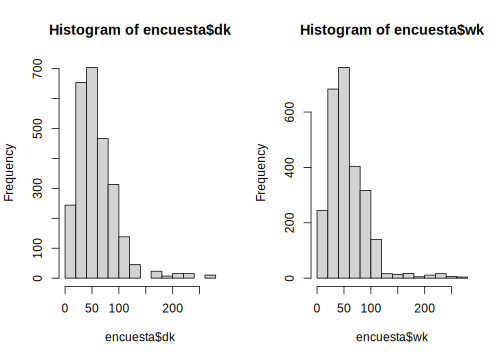
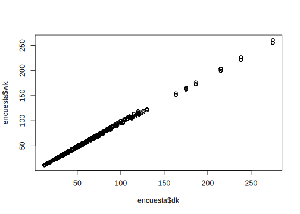

# Conceptos básicos en encuestas de hogares

En este capítulo se presentan los conceptos básicos necesarios para la definición y análisis de una encuesta de hogares y son tomadas de *Sarndal, Swensson & Wretman (1992)* & Gutiérrez (2016). Alguno de los conceptos que se encontrarán están relacionados con la población objetivo, universo de estudio, marco muestral, etc. 


## Universo de estudio y población objetivo

El término encuesta se encuentra directamente relacionado con una población finita compuesta de individuos a los cuales es necesario entrevistar. El *universo de estudio* lo constituye el total de individuos o elementos que poseen dichas características a ser estudiadas. Ahora bien, conjunto de unidades de interés sobre los cuales se tendrán resultados recibe el nombre de *población objetivo*. Por ejemplo, *la Encuesta Nacional de Empleo y Desempleo* de Ecuador define su población objetivo como todas las personas mayores de 10 años residentes en viviendas particulares en Ecuador.

## Unidades de análisis

Corresponden a los diferentes niveles de desagregación establecidos para consolidar el diseño probabilístico y sobre los que se presentan los resultados de interés. En México, la *Encuesta Nacional de Ingresos y Gastos de los Hogares* define como unidades de análisis el ámbito al que pertenece la vivienda, urbano alto, complemento urbano y rural. La *Gran Encuesta Integrada de Hogres* de Colombia tiene cobertura nacional y sus unidades de análisis están definidas por 13 grandes ciudades junto con sus áreas metropolitanas.

## Unidades de muestreo

El diseño de una encuesta de hogares en América Latina plantea la necesidad de seleccionar en varias etapas ciertas *unidades de muestreo* que sirven como medio para seleccionar finalmente a los hogares que participarán de la muestra. La *Pesquisa Nacional por Amostra de Domicilios* en Brasil se realiza por medio de una muestra de viviendas en tres etapas, cada etapa se define como una unidad de muestreo. Por ejemplo, las unidades de muestreo en PNAD son:

-   Las unidades primarias de muestreo (UPM) son los municipios,
-   Las unidades secundarias de muestreo (USM) son los sectores censales, que conforman una malla territorial conformada en el último Censo Demográfico.
-   Las últimas unidades en ser seleccionadas son las viviendas.

## Marcos de muestreo

Para realizar el proceso de selección sistemática de los hogares es necesario contar con un marco de muestreo que sirva de *link* entre los hogares y las unidades de muestreo y que permita tener acceso a la población de interés. En este sentido, el *marco muestral* es el conjunto en el cual se identifican a todos los elementos que componen la población objeto de estudio, de la cual se selecciona la muestra. Los marcos de muestreo más utilizados en encuestas complejas son de áreas geográficas que vinculan directamente a los hogares o personas.

A modo de ejemplo, la *Encuesta Nacional de Hogares* de Costa Rica utiliza un marco muestral construido a partir de los censos nacionales de población y vivienda de 2011. Dicho marco corresponde a uno de áreas en donde sus unidades son superficies geográficas asociadas con las viviendas. Este marco permite la definición de UPM con 150 viviendas en las zonas urbanas y 100 viviendas en las zonas rurales. Este marco está conformado por 10461 UPM (64.5% urbanas y 35.5% rurales).


## Selección de una muestra

## Motivación

> Desde que se popularizaron las encuestas de hogares en 1940, se ha hecho evidente algunas tendencias que están ligadas a los avances tecnológicos en las agencias estadísticas y en la sociedad y se han acelerado con la introducción del computador.

Gambino & Silva (2009)


El muestreo es un procedimiento que responde a la necesidad de información estadística precisa sobre una población objetivo de estudio; Como lo menciona *Gutiérrez (2016)* el muestreo trata con investigaciones parciales sobre la población que apuntan a inferir a la población completa. Es así como en las últimas décadas ha tenido bastante desarrollo en diferentes campos principalmente en el sector gubernamental con la publicación de las estadísticas oficiales que permiten realizar un seguimiento a las metas del gobierno, en el sector académico, en el sector privado y de comunicaciones. 

Como se ha venido mencionando anteriormente, este libro está enfocado en el análisis de las encuestas de hogares. En ese sentido y para que el lector tenga una gama más amplia de ejemplos, en este capítulo se utilizará, para los ejemplos computacionales, la base de datos **BigCity**. Esta base es un conjunto de datos que contiene algunas variables socioeconómicas de $150266$ personas de una ciudad en un año en particular. Alguna de las variables de esta base de datos son:

-  *HHID:* Corresponde al identificador del hogar.

-  *PersonID:* Corresponde al identificador de la persona dentro del hogar.

-  *Stratum:* Corresponde al estrato geográfico del hogar. Son 119 estratos.

-   *PSU:* Corresponde a las unidades primarias de muestreo. La base de datos cuenta con $1664$ PSU.

-   *Zone:* Corresponde a las áreas urbanas o rurales a lo largo de la ciudad.

-   *Sex:* Corresponde al sexo del entrevistado.

-   *Income:* Corresponde a los ingresos mensual per cápita.

-   *Expenditure:* Corresponde a los gastos mensual per cápita.

-   *Employment:* Situación laboral de la persona entrevistada.

-   *Poverty:* Esta variable indica si la persona es pobre o no. Depende de los ingresos.


## Muestreo aleatorio simple en dos etapas estratificado

Con la finalidad de mantener un equilibrio entre los costos económicos y las propiedades estadísticas de la estrategia de muestreo se puede aprovechar la homogeneidad dentro de los conglomerados y, así, no tener que realizar censos dentro de cada Unidad Primaria de Muestreo (UPM) sino, proceder a seleccionar una sub-muestra dentro del conglomerado seleccionado.

Los diseños de muestreo en las encuestas de hogares se caracterizan por ser **diseños complejos** los cuales involucran, entre otras, más de una etapa en la selección de las unidades de observación, estratos y estimadores complejos. En su mayoría, las unidades primarias de muestreo  son seleccionadas dentro de los estrato. Ahora bien, según la teoría de muestreo *(Cochran, W. G., 1977)* se asume que el muestreo en cada estrato respeta el principio de la independencia. Esto es, las estimaciones del total, así como el cálculo y estimación de la varianza son el resultado de añadir o sumar para cada estrato la respectiva cantidad. Dentro de cada estrato $U_h$ con $h=1,\ldots, H$ existen $N_{Ih}$ unidades primarias de muestreo, de las cuales se selecciona una muestra $s_{Ih}$ de tamaño $n_{Ih}$ mediante un diseño de muestreo aleatorio simple. Suponga, además que el sub-muestreo dentro de cada unidad primaria seleccionada es también aleatorio simple. En este sentido, para cada unidad primaria de muestreo seleccionada $i\in s_{Ih}$ de tamaño $N_i$ se selecciona una muestra $s_i$ de elementos de tamaño $n_i$.

Como es ampliamente conocido, el proceso de estimación de un parámetro particular, por ejemplo, la media de los ingresos consiste en multiplicar la observación obtenida en la muestra por su respectivo factor de expansión y dividirlo sobre la suma de los factores de expansión de acuerdo con el nivel de desagregación que se quiera estimar. Sin embargo, cuando el diseño es complejo como es el caso de las encuestas de hogares, la estimación de la varianza se torna un poco difícil de realizar utilizando ecuaciones cerradas. Para estos casos y como lo recomienda la literatura especializada *(Hansen, M. H., & Steinberg, J., 1956))*, se procede a utilizar la técnica del último conglomerado. Esta técnica consiste en aproximar la varianza sólo teniendo en cuenta la varianza de los
estimadores en la primera etapa. Para esto se debe suponer que el diseño de muestreo fue realizado con reemplazo. 

Para poder utilizar los principios de estimación del último conglomerado en las encuestas de hogares se definen las siguientes cantidades:

1. $d_{I_i} = \dfrac{N_{Ih}}{n_{Ih}}$, que es el factor de expansión de la $i$-ésima UPM en el estrato $h$.

2. $d_{k|i} = \dfrac{N_{i}}{n_{i}}$, que es el factor de expansión del $k$-ésimo hogar para la $i$-ésima UPM.

3. $d_k = d_{I_i} \times d_{k|i} = \dfrac{N_{Ih}}{n_{Ih}} \times \dfrac{N_{i}}{n_{i}}$, que es el factor de expansión final del $k$-ésimo elemento para toda la población $U$.


## Práctica en `R`

En esta sección se utilizarán las funciones estudiadas en el capítulo anterior para la manipulación de la base de datos de ejemplo. Inicialmente, se cargarán las librerías `ggplot2` que permitirá generar gráficos de alta calidad en `R`, `TeachingSampling` que permite tomar muestras probabilísticas utilizando los diseños de muestreo usuales, `survey` y `srvyr` que permitirán definir los diseños muestrales y por último `dplyr` que permite la manipulación de las bases de datos.


```r
library(ggplot2)
library(TeachingSampling)
```

```
## Loading required package: dplyr
```

```
## 
## Attaching package: 'dplyr'
```

```
## The following objects are masked from 'package:stats':
## 
##     filter, lag
```

```
## The following objects are masked from 'package:base':
## 
##     intersect, setdiff, setequal, union
```

```
## Loading required package: magrittr
```

```r
library(dplyr)
library(survey)
```

```
## Loading required package: grid
```

```
## Loading required package: Matrix
```

```
## Loading required package: survival
```

```
## 
## Attaching package: 'survey'
```

```
## The following object is masked from 'package:graphics':
## 
##     dotchart
```

```r
library(srvyr)
```

```
## 
## Attaching package: 'srvyr'
```

```
## The following object is masked from 'package:stats':
## 
##     filter
```

Una vez cargada las librerías, se procede a calcular la cantidad de personas en la base de datos, el total de ingresos y total de gastos para cada UPM dentro de cada estrato:  


```r
data('BigCity')

 FrameI <- BigCity %>% group_by(PSU) %>%
 summarise(Stratum = unique(Stratum),
           Persons = n(),
           Income = sum(Income),
           Expenditure = sum(Expenditure))
             
attach(FrameI)
```


```r
head(FrameI, 10)
```
\tiny

|PSU     |Stratum   | Persons|   Income| Expenditure|
|:-------|:---------|-------:|--------:|-----------:|
|PSU0001 |idStrt001 |     118| 70911.72|    44231.78|
|PSU0002 |idStrt001 |     136| 68886.60|    38381.90|
|PSU0003 |idStrt001 |      96| 37213.10|    19494.78|
|PSU0004 |idStrt001 |      88| 36926.46|    24030.74|
|PSU0005 |idStrt001 |     110| 57493.88|    31142.36|
|PSU0006 |idStrt001 |     116| 75272.06|    43473.28|
|PSU0007 |idStrt001 |      68| 33027.84|    21832.66|
|PSU0008 |idStrt001 |     136| 64293.02|    47660.02|
|PSU0009 |idStrt001 |     122| 33156.14|    23292.16|
|PSU0010 |idStrt002 |      70| 65253.78|    37114.76|


Ahora bien, para calcular los tamaños poblacionales de los estratos (NIh) y los tamaños de muestra dentro de cada estrato (nIh), se realiza de la siguiente manera:


```r
sizes = FrameI %>% group_by(Stratum) %>%
        summarise(NIh = n(),
        nIh = 2,
        dI = NIh/nIh)
        
NIh <- sizes$NIh
nIh <- sizes$nIh
```

\scriptsize

```r
head(sizes, 10)
```


|Stratum   | NIh| nIh|  dI|
|:---------|---:|---:|---:|
|idStrt001 |   9|   2| 4.5|
|idStrt002 |  11|   2| 5.5|
|idStrt003 |   7|   2| 3.5|
|idStrt004 |  13|   2| 6.5|
|idStrt005 |  11|   2| 5.5|
|idStrt006 |   5|   2| 2.5|
|idStrt007 |  14|   2| 7.0|
|idStrt008 |   7|   2| 3.5|
|idStrt009 |   8|   2| 4.0|
|idStrt010 |   8|   2| 4.0|


Si se desea extraer una muestra probabilística bajo un diseño aleatorio simple estratificado, se procede a utilizar la función `S.STSI` de la librería `TeachingSampling` como se muestra a continuación:

\footnotesize

```r
samI <- S.STSI(Stratum, NIh, nIh)
UI <- levels(as.factor(FrameI$PSU))
sampleI <- UI[samI]
```

Ahora bien, con la función `left_join` se procede a pegar los tamaños muestrales a aquellas UPM's que fueron seleccionadas en la muestra:


```r
FrameII <- left_join(sizes, 
            BigCity[which(BigCity$PSU %in% sampleI), ])
```

```
## Joining, by = "Stratum"
```

```r
attach(FrameII)
```

```
## The following objects are masked _by_ .GlobalEnv:
## 
##     nIh, NIh
## 
## The following objects are masked from FrameI:
## 
##     Expenditure, Income, PSU, Stratum
```

Una vez se tiene la base de datos con la muestra de UMP's. se selecciona aquellas variables que son de inetrés para el estudio como sigue a continuación:

\scriptsize

```r
head(FrameII, 10) %>% select(Stratum:Zone)
```


|Stratum   | NIh| nIh|  dI|HHID      |PersonID |PSU     |Zone  |
|:---------|---:|---:|---:|:---------|:--------|:-------|:-----|
|idStrt001 |   9|   2| 4.5|idHH00001 |idPer01  |PSU0001 |Rural |
|idStrt001 |   9|   2| 4.5|idHH00001 |idPer02  |PSU0001 |Rural |
|idStrt001 |   9|   2| 4.5|idHH00001 |idPer03  |PSU0001 |Rural |
|idStrt001 |   9|   2| 4.5|idHH00001 |idPer04  |PSU0001 |Rural |
|idStrt001 |   9|   2| 4.5|idHH00001 |idPer05  |PSU0001 |Rural |
|idStrt001 |   9|   2| 4.5|idHH00002 |idPer01  |PSU0001 |Rural |
|idStrt001 |   9|   2| 4.5|idHH00002 |idPer02  |PSU0001 |Rural |
|idStrt001 |   9|   2| 4.5|idHH00002 |idPer03  |PSU0001 |Rural |
|idStrt001 |   9|   2| 4.5|idHH00002 |idPer04  |PSU0001 |Rural |
|idStrt001 |   9|   2| 4.5|idHH00002 |idPer05  |PSU0001 |Rural |

Luego de tener la información muestral de la primera etapa en la base **FrameII** se procede a calcular los tamaños de muestra dentro de cada UPM's. En este caso, a modo de ejemplo, se tomará el 10% del tamaño de la UPM y se utilizará la función `ceiling` la cual aproxima al siguiente entero.


```r
HHdb <- FrameII %>% 
        group_by(PSU) %>%
        summarise(Ni = length(unique(HHID)))
        
Ni <- as.numeric(HHdb$Ni)
ni <- ceiling(Ni * 0.1)
sum(ni)
```

```
## [1] 709
```

Teniendo el vector de tamaños de muestra para cada UMP, se procede a realizar la selección mediante un muestreo aleatorio simple con la función `S.SI` de la librería `TeachingSampling`. A modo ilustrativo, la selección en la segunda etapa del diseño se realizará, inicialmente para la primera UPM. Posterior a eso, se realizará un ciclo "for" para hacerlo con las demás UPM's. Para la primera UPM se realiza de la siguiente manera:

\footnotesize

```r
sam = S.SI(Ni[1], ni[1])

clusterII = FrameII[which(FrameII$PSU == sampleI[1]),]

sam.HH <- data.frame(HHID = unique(clusterII$HHID)[sam])

clusterHH <- left_join(sam.HH, clusterII, by = "HHID")

clusterHH$dki <- Ni[1] / ni[1]

clusterHH$dk <- clusterHH$dI * clusterHH$dki

sam_data = clusterHH
```


\scriptsize

```r
head(sam_data, 10) %>% select(Stratum:Zone)
```


|Stratum   | NIh| nIh|  dI|PersonID |PSU     |Zone  |
|:---------|---:|---:|---:|:--------|:-------|:-----|
|idStrt001 |   9|   2| 4.5|idPer01  |PSU0001 |Rural |
|idStrt001 |   9|   2| 4.5|idPer02  |PSU0001 |Rural |
|idStrt001 |   9|   2| 4.5|idPer03  |PSU0001 |Rural |
|idStrt001 |   9|   2| 4.5|idPer04  |PSU0001 |Rural |
|idStrt001 |   9|   2| 4.5|idPer01  |PSU0001 |Rural |
|idStrt001 |   9|   2| 4.5|idPer02  |PSU0001 |Rural |
|idStrt001 |   9|   2| 4.5|idPer03  |PSU0001 |Rural |
|idStrt001 |   9|   2| 4.5|idPer04  |PSU0001 |Rural |
|idStrt001 |   9|   2| 4.5|idPer05  |PSU0001 |Rural |
|idStrt001 |   9|   2| 4.5|idPer06  |PSU0001 |Rural |

Para las demás UPM's seleccionadas en la etapa 1,

\footnotesize


```r
for (i in 2:length(Ni)) {
  sam = S.SI(Ni[i], ni[i])
  
  clusterII = FrameII[which(FrameII$PSU == sampleI[i]),]
  
  sam.HH <- data.frame(HHID = unique(clusterII$HHID)[sam])
  
  clusterHH <- left_join(sam.HH, clusterII, by = "HHID")
  
  clusterHH$dki <- Ni[i] / ni[i]
  
  clusterHH$dk <- clusterHH$dI * clusterHH$dki
  
  data1 = clusterHH
  
  sam_data = rbind(sam_data, data1)
}
encuesta <- sam_data

attach(encuesta)
```

```
## The following objects are masked _by_ .GlobalEnv:
## 
##     nIh, NIh
```

```
## The following objects are masked from FrameII:
## 
##     Age, dI, Employment, Expenditure, HHID, Income, MaritalST, nIh,
##     NIh, PersonID, Poverty, PSU, Sex, Stratum, Zone
```

```
## The following objects are masked from FrameI:
## 
##     Expenditure, Income, PSU, Stratum
```

Una vez se obtiene la muestra (como se mostró anteriormente), el paso siguiente es definir el diseño utilizado y guardarlo como un objeto en `R` para posteriormente poderlo utilizar y realizar el proceso de estimación de parámetros y cálculo de indicadores. Para realizar esta tarea, se utilizará el paquete `srvyr` el cual ya fue definido en el capítulo anterior. Para este ejemplo, el diseño de muestreo utilizado fue un estratificado-multietápico en el cual, los estratos correspondieron a la variable *Stratum*, las UPM's correspondieron a la variable *PSU*, los factores de expansión están en la variable *dk* y por último, se le indica a la función `as_survey_design` que las UPM's están dentro de los estrato con el argumento *nest = T*. A continuación, se presenta el código computacional:


```r
diseno <- encuesta %>%
  as_survey_design(
    strata = Stratum,
    ids = PSU,
    weights = dk,
    nest = T
  )
```


Ya definido el diseño de muestreo como un objeto de `R` se puede empezar a extraer información del mismo. Por ejemplo, se pueden extraer los pesos de muestreo de dicho diseño con la función `weights` y luego sumarlos para revisar hasta cuánto me está expandiendo mi muestra. El código es el siguiente:


```r
sum(weights(diseno))
```

```
## [1] 157224.7
```

Como se puede observar, el tamaño poblacional estimado utilizando el diseño propuesto es de $140579.2$. Sin embargo, el tamaño poblacional de la base BigCity es de $150266$. Es normal que esto suceda pero debe ser corregido puesto que la suma de los factores de expansión debe sumar el total de la población. La solución para esto es calibrar los pesos de muestreo que se abordará a continuación.

## Calibrando con `R`

La calibración es un ajuste que se realiza a los pesos de muestreo con el propósito de que las estimaciones de algunas variables de control reproduzcan de forma perfecta los totales poblacionales de estas variables *(Sarndal, 2003)*. Esta propiedad de consistencia es deseable en un sistema de ponderadores. En este sentido, cuando los estudios por muestreo están afectados por la ausencia de respuesta, como en muchos casos pasa en las encuestas de hogares, es deseable tener las siguientes propiedades en la estructura inferencial que sustenta el muestreo:

-   Sesgo pequeño o nulo.
-   Errores estándares pequeños.
-   Un sistema de ponderación que reproduzca la información auxiliar disponible.
-   Un sistema de ponderación que sea eficiente al momento de estimar cualquier característica de interés en un estudio multipropósito.

La calibración es usualmente el último paso en el ajuste de los ponderadores. Hace uso de información auxiliar que reduce la varianza y corrige los problemas de cobertura que no pudieron ser corregidos en los pasos previos. 

Puesto que el estimador de calibración depende exclusivamente de la información auxiliar disponible, esta información puede aparecer en diversas formas:

1. Puede estar de forma explícita en el marco de unidades. $x_k \ (\forall \ k \in U)$

2. Puede ser un agregado poblacional proveniente de un censo o de  registros administrativos. $t_x = \sum_U x_k$

3. Puede ser una estimación poblacional $\hat{t}_x = \sum_s w_kx_k$ muy confiable.

Particularmente, en encuestas de hogares, existen conteos de personas disponibles a nivel de desagregaciones de interés. Por ejemplo, número de personas por edad, raza y género que se permite utilizar como información auxiliar para calibrar las estimaciones.

La necesidad de calibrar en las encuestas de hogares es porque no todos los grupos de personas se cubren apropiadamente desde el diseño de muestreo. Además, las estimaciones del número de personas en estos subgrupos son menores a las proyecciones que se tienen desde los censos. Por último, al ajustar los pesos para que sumen exactamente la cifra de los conteos censales, se reduce el sesgo de subcobertura.

Para ejemplificar el estimador de calibración en `R` usando la base de datos de ejemplo se utilizarán la función `calibrate` del paquete `survey`. En primer lugar, para poder calibrar se requiere construir la información poblacional a la cual se desea calibrar. En este ejemplo se calibrará a nivel de zona y sexo. Por tanto, los totales se obtienen como sigue: 

\scriptsize

```r
library(survey)
totales <- colSums(
  model.matrix(~ -1 + Zone:Sex, BigCity)) 
```

En la salida anterior se puede observar que, por ejemplo, en la zona rural hay 37238 mujeres mientras que en la urbana hay 41952. De igual manera se puede leer para el caso de los hombres.

Una vez obtenido estos totales, se procede a utilizar la función `calibrate` para calibrar los pesos de muestreo como sigue:


```r
diseno_cal <- calibrate(
  diseno, ~ -1 + Zone:Sex, totales, calfun = "linear")  
```

Luego de que se hayan calibrado los pesos se puede observar que, al sumar los pesos calibrados estos reproducen el total poblacional de la base de ejemplo.


```r
sum(weights(diseno_cal))
```

```
## [1] 150266
```

```r
encuesta$wk <- weights(diseno_cal)
```

Dado que uno de los principios de los pesos calibrados es que dichos pesos no sean muy diferentes a los pesos originales que provienen del diseño de muestreo, se puede observar a continuación, la distribución de los pesos, sin calibrar y calibrados respectivamente.


```r
par(mfrow = c(1,2))
hist(encuesta$dk)
hist(encuesta$wk)
```




```r
plot(encuesta$dk,encuesta$wk)
```




\scriptsize

```r
Region <- as.numeric(
  gsub(pattern = "\\D",
      replacement =  "", x = encuesta$Stratum))
encuesta$Region <- 
  cut(Region, breaks = 5,
      labels = c("Norte","Sur","Centro","Occidente","Oriente"))
encuesta %<>% mutate(
  CatAge = case_when(
    Age <= 5 ~ "0-5",
    Age <= 15 ~ "6-15",
    Age <= 30 ~ "16-30",
    Age <= 45 ~ "31-45",
    Age <= 60 ~ "46-60",
    TRUE ~ "Más de 60"
  ),
  CatAge = factor(
    CatAge,
    levels = c("0-5", "6-15", "16-30", "31-45",
               "46-60", "Más de 60"),
    ordered = TRUE
  )
)
saveRDS(object = encuesta, file = "../Curso Tellez/Data/encuesta.rds")
```

