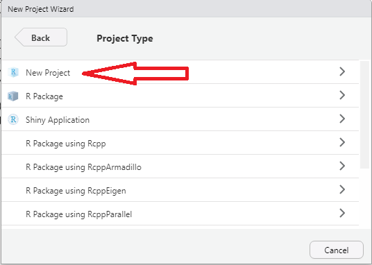

# Manejando una base de encuestas de hogares con R 

## Fundamentos básicos de R y Rstudio 

R fue creado en 1992 en Nueva Zelanda por Ross Ihaka y Robert Gentleman. A manera introductoria, R es un software diseñado para realizar análisis estadístico tanto sencillos como complejos. Este software a ganado popularidad en el gremio estadístico y no estadístico puesto que su manejo es sencillo y además, es de libre uso (Puede descargarse en https://www.r-project.org). Es decir, no requiere de ninguna licencia para su utilización. Como lo menciona Santana Sepúlveda, S., & Mateos Farfán, E. (2014) R es un lenguaje de programación de libre distribución, bajo Licencia GNU, y se mantiene en un ambiente para el cómputo estadístico y gráfico. Este software está diseñado para utilizarse en distintos ambientes como, Windows, MacOS o Linux. El concepto de *ambiente* está enfocado en caracterizarlo como un sistema totalmente planificado y coherente, en lugar de una acumulación gradual de herramientas muy específicas y poco flexibles, como suele ser con otro software de análisis de datos. 

Ahora bien, como se mencionó anteriormente, R es un lenguaje de programación por ende, su interfase es poco amigable para los que inician en este lenguaje. Por esto, se creó RStudio el cual es un Entorno de Desarrollo Integrado (IDE, por sus siglas en inglés), lo que significa que RStudio es un programa que permite manejar R y utilizarlo de manera más cómoda y agradable.


## Algunas librerías de interés

Puesto que `R` es un lenguaje colaborativo el cual permite que la comunidad vaya haciendo aportes al desarrollo de funciones dentro de paquetes o librerías. Alguna de las librerías más usadas para el análisis de bases de datos son las siguientes:

-   `dplyr`, dplyr es la evolución del paquete plyr, enfocada en herramientas para trabajar con marcos de datos (de ahí la d en el nombre). Según  Hadley  Wickham, las siguientes son las tres propiedades principales de la librería:

    1) Identificar las herramientas de manipulación de datos más importantes necesarias para el análisis de datos y hacerlas fáciles de usar desde R.

    2) Proporcionar un rendimiento ultrarrápido para los datos en memoria escribiendo piezas clave en C++.

    3) Utilizar la misma interfaz para trabajar con datos sin importar dónde estén almacenados, ya sea en un marco de datos, una tabla de datos o una base de datos.Esta librería permite manejar eficientemente las bases de datos.
    
- `tidyverse`, es una colección de paquetes disponibles en R y orientados a la manipulación, importación, exploración y visualización de datos y que se utiliza exhaustivamente en ciencia de datos. El uso de `tidyverse` permite facilitar el trabajo estadístico y la generación de trabajos reproducibles. Está compuesto de los siguientes paquetes: `readr`, `dplyr`, `ggplot2`, `tibble`, `tidyr`, `purr`, `stringr`, `forcats`
    
-   `readstata13`, este paquete permite leer y escribir todos los formatos de archivo de Stata (versión 17 y anteriores) en un marco de datos R. Se admiten las versiones de formato de archivo de datos 102 a 119. para leer las bases de datos de `STATA`. Además, el paquete admite muchas características del formato Stata dta, como conjuntos de etiquetas en diferentes idiomas  o calendarios comerciales.

-   `survey`, este paquete ha sido elaborado por el Profesor Thomas Lumley (Lumley, T. 2011) y nos proporciona funciones en R útiles para analizar datos provenientes de encuestas complejas.Alguno de los parámetros que se pueden estimar usando este paquete son medias, totales, razones, cuantiles, tablas de contingencias, modelos de regresión, modelos loglineales, entre otros.

-   `srvyr`, este paquete permite utilizar el operador *pipe operators* en las consultas que se realizan con el paquete `survey`.

-   `ggplot2`, es un paquete de visualización de datos para el lenguaje R que implementa lo que se conoce como la *Gramática de los Gráficos*, que no es más que una representación esquemática y en capas de lo que se dibuja en dichos gráficos, como lo pueden ser los marcos y los ejes, el texto de los mismos, los títulos, así como, por supuesto, los datos o la información que se grafica, el tipo de gráfico que se utiliza, los colores, los símbolos y tamaños, entre otros.

-   `TeachingSampling`, este paquete permite al usuario extraer muestras probabilísticas y hacer inferencias a partir de una población finita basada en varios diseños de muestreo. Entre los diseño empleados en esta librería están: Muestreo Aleatorio Simple (MAS), Muestreo Bernoullí, Muestreo Sistemático, PiPT, PPT, estre otros.

-   `samplesize4surveys`, este paquete permite calcular el tamaño de muestra requerido para la estimación de totales, medias y proporciones bajo diseños de muestreo complejos.

Antes de poder utilizar las diferentes funciones que cada librería tiene, es necesario descargarlas de antemano de la web. El comando `install.packages` permite realizar esta tarea. Note que algunas librerías pueden depender de otras, así que para poder utilizarlas es necesario instalar también las dependencias.


```r
install.packages("dplyr")
install.packages("tidyverse")
install.packages("readstata13") 
install.packages("survey")
install.packages("srvyr")
install.packages("ggplot2")
install.packages("TeachingSampling")
install.packages("samplesize4surveys")
```

Una vez instaladas las librerías hay que informarle al software que vamos a utilizarlas con el comando `library`. *Recuerde que es necesario haber instalado las librerías para poder utilizarlas*. 


```r
rm(list = ls())

library("dplyr")
library("tidyverse")
library("readstata13") 
library("survey")
library("srvyr")
library("ggplot2")
library("TeachingSampling")
library("samplesize4surveys")
```

## Cración de proyectos en `R`

Una vez se descargan e instalan las librerías o paquetes en `R` el paso siguientes es crear proyectos. Un proyecto de R se define como un archivo que contiene los archivos de origen y contenido asociados con el trabajo que se está realizando. Adicionalmente, contiene información que permite la compilación de cada archivo de R a utilizar, mantiene la información para integrarse con sistemas de control de código fuente y ayuda a organizar la aplicación en componentes lógicos.  

Ahora bien, por una cultura de buenas practicas de programación, se recomienda crear un proyecto en el cual se tenga disponible toda la información a trabajar. A continuación, se muestran los pasos para crear un proyecto dentro de `RStrudio`.

-   **Paso 1:** Abrir `RStudio`.
-   **Paso 2:** ir a file -\> New Project {width="450"}

-   *Paso 3:* Tipos de proyecto.

Para este ejemplo se tomará *New Directory* 

{width="450"}

Algo a tener en cuenta en este paso es que en  *New Directory* `RStudio` brinda una variedad de opciones dependiendo las características del procesamiento que desea realizar. Ahora bien, si se cuenta con algunos código previamente desarrollados y se desea continuar con ese proyecto, se debe tomar la opción *Existing Directory* . Por último, Si se cuenta con cuenta en *Git* y se desea tener una copia de seguridad, se debe emplear la opción *Version Control*. 

-   *Paso 4:* Seleccionar el tipo de proyecto.

{width="450"}

-   *Paso 5*: Diligenciar el nombre del proyecto y la carpeta de destino.

{width="450"} 

Al realizar esto pasos permite que todas rutinas creadas dentro del proyecto estén ancladas a la carpeta del proyecto.


## Lectura de las bases de datos y manipulación

Es muy usual que al trabajar proyectos en `R` sea necesario importar bases de datos con información relevante para un estudio en particular. En Colombia, por ejemplo, en la *Encuesta de Calidad de Vida (ECV, por sus siglas)* es necesario, una vez se realiza el trabajo de campo, importar la información recolectada para poder ajustar los factores de expansión y posteriormente estimar los parámetros. Los formatos de bases de datos que `R` permite importar son diversos, entre ellos se tienen `xlsx`, `csv`, `txt`, `STATA`, etc. Particularmente, para la lectura de bases de datos provenientes de `STATA 13` se realiza con la función `read.dta13`. Una vez leída la base de datos en el formato mencionado anteriormente se procede a transformar en el formato `.RDS` el cual es un formato más eficiente y propio de `R`. Para ejemplificar los procedimientos en `R` se utilizará la base de datos de *Pesquisa Nacional por Amostra de Domicílios 2015 * de Brasil la cual está en formato `.dta` el cual se lee en `R` con la función `read.dta13`.  Posteriormente se transformará al formato `.rds` con la función `saveRDS` el cual es un formato propio de `R` y por último se cargar esta base. Lo pasos anteriores se realiza como sigue: 


Primero se carga la base en formato `dta` con la librería `read.dta13` y se guarda en formato `rds` con la función `saveRDS`
`

```r
data1 <- read.dta13("Z:/BC/BRA_2015N.dta")
saveRDS(data1, "../data/BRA_2015N.rds") 
```

Una vez guardada la base en nuestros archivos de trabajo, se procede a cargar la base a `R` con la función `readRDS` para poder utilizar toda la información que en ella se contiene.


```r
data2 <- readRDS("Data/BRA_2015N.rds")
```

Una vez cargada la base de datos en `R` ésta se puede empezar a manipular según las necesidades de cada investigador. En este sentido, una de las primeras revisiones que se realizan al cargar las bases de datos es revisar su dimensión, es decir, chequear la cantidad de filas y columnas que tenga la base. Lo anterior se puede hacer con la función `nrow`. Dicha función identifica el número de registros (unidades efectivamente medidas) en la base de datos y la función `ncol` muestra el número de variables en la base de datos. Los códigos computacionales son los siguientes:


```r
nrow(data2)
```

```
## [1] 356904
```

```r
ncol(data2)
```

```
## [1] 109
```

Una forma resumida de revisar la cantidad de filas y columnas que tiene la base de datos es usar la función `dim`. Esta función nos devuelve un vector indicado en su primera componente la cantidad de fila y en su segundo la cantidad de columnas como se muestra a continuación:


```r
dim(data2)
```

```
## [1] 356904    109
```


Es usual que en las encuestas de hogares las bases de datos sean muy extensas, es decir, contengan una cantidad importante de variables medidas (filas) y por lo general, el tamaño de la muestra de estos estudios con grandes. Es por lo anterior que, para poder visualizar dichas bases una vez cargadas en `R`, es necesario hacerlo de manera externa. Esto es, abrir una pestaña diferente en `R` y hacer la navegación de la base como un texto plano. Lo anterior se realiza con la función `View` como se muestra a continuación:


```r
View(data2)
```

{width="850"} 

Otro chequeo importante que se debe realizar al momento de cargar una base de datos en `R` es el reconocimiento de las variables que incluye. Esto se puede hacer utilizando la función `names` la cual identifica las variables de la base de datos.


```r
names(data2)
```

La función `names` solo devuelve un vector un vector con los nombres de las variables que contiene la base. Sin embargo, si se quiere profundizar en qué información contiene cada variable, La función `str` muestra de manera compacta la estructura de un objeto y sus componentes. Para nuestra base se utilizaría de la siguiente manera:


```r
str(data2)
```


Como se puede observar en la salida anterior, por ejemplo, la variable *id_hogar* es de tipo *Entero* al igual que *id_pers* mientras que *cotiza_ee* es un factor con 2 niveles. Como se observa, esta función es muy útil al momento de querer tener un panorama amplio del contenido y clase de cada variable en una base de datos, particularmente, en una encuesta de hogares en donde se tiene, por la misma estructura del estudio, muchas clases o tipos de variables medidas.

## El operador `pipe`


El software estadístico `R` es un lenguaje de programación creado por estadísticos para estadísticos. Una de las contribuciones recientes es el desarrollo de los `pipelines` que permiten de una forma intuitiva generar consultas y objetos desde una base de datos. El operador *pipe*, `%>%`, viene del paquete magrittr (Bache, S. et al., 2022) y está cargado automáticamente en los paquetes del `Tidyverse`. 

El objetivo del operador pipe es ayudar a escribir código de una manera que sea más fácil de leer y entender. En este sentido, el operador ` %>% ` permite “encadenar” operaciones en el sentido que el resultado de una operación anterior se convierta en el input de la siguiente operación. A continuación, ejemplificaremos el uso del ` %>% ` en la base de datos de Brasil haciendo un conteo del total de elementos que contiene la base de datos utilizando la función `count`.


```r
data2 %>% count()
```

```
##        n
## 1 356904
```

Otra operación que se puede realizar en `R` es re-codificar los niveles de los factores que en muchas ocasiones son necesarios en las encuestas de hogares. El siguiente código permite generar los nombres de los estados en Brasil.

\scriptsize


```r
data2$estados <- factor(data2$uf, 
 levels = c(11:17, 21:29, 31:33, 35, 41:43, 50:53), 
 labels = c("Rondonia", "Acre", "Amazonas", "Roraima", 
            "Para", "Amapa", "Tocantins", "Maranhao", 
            "Piaui", "Ceara", "RioGrandeNorte", "Paraiba",
            "Pernambuco", "Alagoas", "Sergipe", "Bahia", 
            "MinasGerais", "EspirituSanto", "RioJaneiro", 
            "SaoPaulo", "Parana", "SantaCatarina", 
            "RioGrandeSur", "MatoGrossoSur", "MatoGrosso", 
            "Goias", "DistritoFederal"))
```

Adicionalmente, para efectos de visualización en tablas y gráficos es conviene codificar los nombres de las variables. Para este ejemplo, se codificarán de la siguiente manera:


```r
data2$deptos <- factor(data2$uf, 
 levels = c(11:17, 21:29, 31:33, 35, 41:43, 50:53), 
 labels = c("RO", "AC", "AM", "RR", "PA", 
 "AP", "TO", "MA", "PI", "CE", "RN", "PB", 
 "PE", "AL", "SE", "BA", "MG", "ES", "RJ", "SP",
 "PR", "SC", "RS", "MS", "MT", "GO", "DF"))
```


Por otro lado, existe una gama amplia de funciones que se pueden utilizar con el operador ` %>% `, A continuación, se enlistan una serie de funciones muy útiles al momento de hacer análisis con bases de datos provenientes de encuestas de hogares:  

-   **filter**: mantiene un criterio de filtro sobre alguna variable o mezcla de variables.
-   **select**: selecciona columnas por nombres.
-   **arrange**: ordena las filas de la base de datos.
-   **mutate**: añade nuevas variables a la base de datos.
-   **summarise**: reduce variables a valores y los presenta en una tabla.
-   **group_by**: ejecuta funciones y agrupa el resultado por las variables de interés.


Ejemplificando alguna de las funciones mostradas anteriormente, una de las primeras consultas que se realizan en las encuestas de hogares es saber el número de encuestas (personas) realizadas y que están contenida en la base de datos. Usando ` %>% ` se realiza de la siguiente manera:


```r
data2 %>% count()
```

```
##        n
## 1 356904
```


Otro de los ejercicios que se hacen usualmente con las encuestas de hogares está relacionado con saber la cantidad de hogares que hay en el país de estudio. Una de las formas más sencillas de hacer esta revisión es usar la función `filter`. Las encuestas de hogares muchas veces recopilan información a nivel de viviendas, hogares y personas. Particularmente, las bases de datos que están disponibles en `BADEHOG` están a nivel de persona. Ahora bien, para saber la cantidad de hogares que se encuestaron basta con filtrar por hogar porque sólo hay un jefe de hogar por hogar, como se muestra a continuación:


```r
datahogar1 <- data2 %>% filter(parentco == 1)
datahogar2 <- data2 %>% filter(paren_ee == "Jefe") 
```


Por otro lado, si el interés ahora es filtrar la base de datos por la ubicación de la persona en el área rural y urbana se realiza de la siguiente manera:


```r
dataurbano <- data2 %>% 
  filter(area_ee == "Area urbana")
datarural <- data2 %>% 
  filter(area_ee == "Area rural") 
```


En este mismo sentido, si el objetivo ahora es filtrar la base de datos por algunos ingresos particulares mensuales por personas, por ejemplo, altos o bajos, se realiza de la siguiente manera:


```r
dataingreso1 <- data2 %>% 
  filter(ingcorte %in% c(50, 100))

dataingreso2 <- data2 %>% 
  filter(ingcorte %in% c(1000, 2000))
```

Otra función muy útil en el análisis en encuestas de hogares es la función `select` la cual, como se mencionó anteriormente permite seleccionar un grupo de variables de interés a analizar. Si por ejemplo, se desea seleccionar de la base de ejemplo solo las variables identificación del hogar (`id_hogar`), unidades primarias de muestreo (`_upm`), factores de expansión (`_feh`) y estratos muestrales ( `_estrato`) se realiza de la siguiente manera:


```r
datared <- data2 %>% select(`id_hogar`, `_upm`,
                            `_feh`, `_estrato`)

datablue <- data2 %>% select(id_pers, edad, 
                             sexo, ingcorte)
```


La función `select` no solo sirve para seleccionar variables de una base de datos, también se puede utilizar para eliminar algunas variables de la base de datos que ya no son de interés para el análisis o que simplemente se generaron en la manipulación de la base de datos como variables puentes para realizar algunos cálculos de interés. Por ejemplo, si se desea eliminar de la base de datos de ejemplo las variables identificación del hogar (`id_hogar`) e identificación de las personas (`id_pers`) se realiza introduciendo un signo "menos" (-) delante del nombre de la variable como sigue:


```r
datagrey <- data2 %>% select(-id_hogar, -id_pers)
```


Por otro lado, si el objetivo ahora en análisis de las encuestas de hogares es ordenar las filas de la base por alguna variable en particular, se utiliza en `R` la función `arrange` para realizar esta operación. A continuación, se ejemplifica con la base de datos de ejemplo, cómo se ordena la base de acuerdo con la variable *ingcorte*:


```r
datadog <- datablue %>% arrange(ingcorte)
datadog %>% head()
```

```
##   id_pers edad   sexo ingcorte
## 1       1   38  Mujer        0
## 2       2   12  Mujer        0
## 3       1   26 Hombre        0
## 4       2   29  Mujer        0
## 5       1   50 Hombre        0
## 6       1   53  Mujer        0
```


Es posible utilizar la función `arrange` para hacer ordenamientos más complicados. Por ejemplo, ordenar por más de una variable. A modo de ejemplo, ordenemos la base de datos *datablue* de acuerdo con las variables *sexo* y *edad*


```r
datablue %>% arrange(sexo, edad) %>% head()
```

```
##   id_pers edad   sexo  ingcorte
## 1       6    0 Hombre  660.4400
## 2       6    0 Hombre  162.5000
## 3       3    0 Hombre  381.6667
## 4       5    0 Hombre  320.0000
## 5       6    0 Hombre  375.0000
## 6       4    0 Hombre 1425.0000
```


También es posible utilizar la función `arrange` junto con la opción `desc()` para que el ordenamiento sea descendente.


```r
datablue %>% arrange(desc(edad)) %>% head()
```

```
##   id_pers edad   sexo  ingcorte
## 1       2  115  Mujer  103.0000
## 2       4  110  Mujer 1156.5300
## 3       2  107 Hombre  415.5904
## 4       1  107  Mujer 1754.4600
## 5       3  105  Mujer  380.7904
## 6       2  105  Mujer  898.3200
```


## Funciones **mutate, summarise y group_by** en encuestas de hogares

Las funciones `mutate`, `summarise` y `group_by` están cargadas en el paquete `tidyverse` y son muy importantes al momento de realizar análisis en encuestas de hogares. En primer lugar, la función `mutate` permite computar transformaciones de variables en una base de datos. Usualmente, en las encuestas de hogares es necesario crear nuevas variables, por ejemplo, si el hogar está en estado de pobreza extrema o no la cual se calcula a partir de los ingresos del hogar, la función `mutate` proporciona una interface clara para realizar este tipo de operaciones. A modo de ejemplo, utilizaremos la base de ejemplo para crear una nueva variable llamada *ingreso2* la cual es el doble de los ingresos por persona dentro de un hogar. Los códigos computacionales se muestran a continuación:


```r
datablue2 <- datablue %>% 
  mutate(ingreso2 = 2 * ingcorte)
datablue2 %>% head()
```

```
##   id_pers edad   sexo ingcorte ingreso2
## 1       1   23 Hombre    800.0   1600.0
## 2       1   23  Mujer   1150.0   2300.0
## 3       1   35  Mujer    904.4   1808.8
## 4       2   34 Hombre    904.4   1808.8
## 5       3   11  Mujer    904.4   1808.8
## 6       4    7  Mujer    904.4   1808.8
```

No solo se puede crear una nueva variable, si es necesario, se pueden crear más de una variable en la base de datos. Cabe recalcar que la función `mutate` reconoce sistemáticamente las variables que van siendo creadas de manera ordenada. A continuación, se presenta cómo crear más de una nueva variable en la base de datos:


```r
datacat <- datablue %>% 
  mutate(ingreso2 = 2 * ingcorte,
         ingreso4 = 2 * ingreso2)
datacat %>% head()
```

```
##   id_pers edad   sexo ingcorte ingreso2 ingreso4
## 1       1   23 Hombre    800.0   1600.0   3200.0
## 2       1   23  Mujer   1150.0   2300.0   4600.0
## 3       1   35  Mujer    904.4   1808.8   3617.6
## 4       2   34 Hombre    904.4   1808.8   3617.6
## 5       3   11  Mujer    904.4   1808.8   3617.6
## 6       4    7  Mujer    904.4   1808.8   3617.6
```


Ahora bien, la función `summarise` funciona de forma similar a la función `mutate`, excepto que en lugar de añadir nuevas columnas crea un nuevo data frame. Como se mencionó anteriormente esta función sirve para resumir o “colapsar filas”. Toma un grupo de valores como input y devuelve un solo valor; por ejemplo, hallar la media de los ingresos, percentiles o medidas de dispersión.

Por otro lado, la función `group_by` permite agrupar información de acuerdo con una(s) variable(s) de interés. El siguiente código permite generar el número de encuestas efectivas en cada uno de los estados de Brasil. El comando `group_by` agrupa los datos por estados, el comando `summarise` hace los cálculos requeridos y el comando `arrange` ordena los resultados


```r
data2 %>% 
  group_by(estados) %>% 
  summarise(n = n()) %>% arrange(desc(n)) %>% head()
```

```
## # A tibble: 6 × 2
##   estados          n
##   <fct>        <int>
## 1 SaoPaulo     40008
## 2 MinasGerais  32933
## 3 RioGrandeSur 26259
## 4 Bahia        26155
## 5 RioJaneiro   25858
## 6 Para         22489
```


Hay otro tipos de análisis que se quieren realizar en encuestas de hogares, por ejemplo, generar el número de encuestas efectivas discriminado por el sexo del respondiente. A continuación, se presenta el código computacional:


```r
data2 %>% 
  group_by(sexo) %>% 
  summarise(n = n()) %>% arrange(desc(n)) 
```

```
## # A tibble: 2 × 2
##   sexo        n
##   <fct>   <int>
## 1 Mujer  183681
## 2 Hombre 173223
```

Si ahora se desea realizar la consulta del número de encuestas efectivas por área geográfica, se realiza de la siguiente manera:


```r
data2 %>% 
  group_by(area_ee) %>% 
  summarise(n = n()) %>% arrange(desc(n))
```

```
## # A tibble: 2 × 2
##   area_ee          n
##   <fct>        <int>
## 1 Area urbana 304564
## 2 Area rural   52340
```


Otras consultas que se realizan de manera frecuente en encuestas de hogares es reporta el número efectivo de encuestas clasificado por parentezco (jefe de hogar, hijos, conyugues, etc)


```r
data2 %>% 
  group_by(paren_ee) %>% 
  summarise(n = n()) %>% arrange(desc(n)) 
```

```
## # A tibble: 6 × 2
##   paren_ee                n
##   <fct>               <int>
## 1 Hijos              126206
## 2 Jefe               117939
## 3 Cónyuge             73725
## 4 Otros parientes     36508
## 5 Otros no parientes   2342
## 6 Servicio doméstico    184
```


## Medidas descriptivos y reflexiones

En estadística, según *Tellez Piñerez, C. F., & Lemus Polanía, D. F. (2015)* las medidas descriptivas permiten la presentación y caracterización de un conjunto de datos con el fin de poder describir apropiadamente las diversas características presentes en la información de la muestra. Involucra cualquier labor o actividad para resumir y describir los datos univariados o multivariados sin tratar de hacer inferencia más allá de los mismos. Este tipo de análisis son primordiales en cualquier encuesta de hogares dado que, permiten tener una idea inicial del comportamiento de la población en ciertas variables de estudio. A continuación, se presentan las funciones básicas en `R` para realizar análisis descriptivo.

-   Media: `mean()`
-   Mediana: `median()`
-   Varianza: `var()`
-   Desviación estándar: `sd()`
-   Percentiles: `quantile()`
-   Algunas medidas descriptivas: `summary()`
-   Covarianza: `cov( , )`
-   Correlación: `cor( , )`

Ahora bien, para continuar con lo análisis de las encuestas de hogares es necesario que el lector tenga claro algunos conceptos básicos en el muestreo probabilístico. A continuación, se dan unas definiciones básicas:


-   *¿Qué es una encuesta?*

Según  Groves, R. M., et al (2011) una encuesta es un método sistemático para recopilar información de una muestra de elementos con el propósito de construir descriptores cuantitativos de los parámetros de la población.

-   *¿Qué es una muestra?*

La definición más básica de una muestra es un subconjunto de la población. Esta definición es muy general dado que, no es específico de si la muestra es representativa de una población o no.

-   *¿Qué es una muestra representativa?*

Según *Gutiérrez (2016)* una muestra representativa es un modelo reducido de la población y de aquí se desprende un argumento de validez sobre la muestra. En pocas palabras, se desea que la muestra representativa tenga la cantidad de información suficiente para poder hacer una inferencia adecuada a la población.

-   *¿Está bien sacar conclusiones sobre una muestra?*

Si la muestra es representativa, las conclusiones que se obtienen de la población utilizando las técnicas de muestreo adecuadas, son correctas. Sin embargo, si se toma una muestra no representativa, no es correcto realizar inferencias dado que estas no representan la realidad de la población.

## Algunas reflexiones generales

Como se mencionó anteriormente, antes de realizar los análisis en las encuestas de hogares es necesario hacernos algunas preguntas que nos permiten dar claridad de los análisis que se desean hacer. A continuación, se presentan las preguntas:  

-   *Si calculamos el promedio de los ingresos en una encuesta, ¿qué significa esa cifra?* 

Esta cifra representa los ingresos medios que reportaron las personas entrevistadas en el estudio. En ningún momento se puede hablar de que este valor representa a la población a la cual queremos hacer inferencia. Para poder realizar las conclusiones a nivel poblacional se deben utilizar los factores de expansión que se obtuvieron empleando el diseño muestral.

-   *Si calculamos el total de los ingresos en una encuesta, ¿qué significa esa cifra?*

Similar a lo anterior, significa los ingresos totales que reportaron los entrevistados en el estudio. Se recalca que, bajo ninguna circunstancia se puede inferir que este valor muestral representa a la población de estudio.

-   *¿Qué necesitamos para que la inferencia sea precisa y exacta?*

Se requiere de un buen diseño muestral, que la muestra que se recolecte sea representativa de la población en estudio y que el tamaño de muestra sea suficiente para poder inferir en todas las desagregaciones, tanto geográficas como temáticas que se plantearon en el diseño muestral.

-   *¿Qué es el principio de representatividad?*

La representatividad es la característica más importante de una muestra probabilística, y se define como la capacidad que tiene una muestra de poder representar a la población a la cual se desea hacer inferencia. En este sentido, el muestreo adquiere todo su sentido en cuanto se garantice que las características que se quieren medir en la población quedan reflejadas adecuadamente en la muestra. Cabe resaltar que, una muestra representativa no es aquella que se parece a la población, de tal forma que las categorías aparecen
con las mismas proporciones que en la población dado que, en algunas ocasiones
es fundamental sobre-representar algunas categorías o incluso seleccionar unidades con probabilidades desiguales para poderlas medir con precisión *(Tillé, 2006)*

-   *¿Qué es el factor de expansión?*

Según *Guitiérrez (2016)* el factor de expansión es el número de elementos menos uno de la población (no incluidos en la muestra) representados por el elemento incluido. También se conoce como el inverso de la probabilidad de inclusión.


Dadas las definiciones hechas anteriormente, una encuesta de hogares requiere el análisis de todas las variables que dispuestas en la encuesta. Este proceso debe ser llevado a cabo por separado para asegurar la calidad y consistencia de los datos recolectados. Sin embargo, *no* vamos a adentrarnos en el análisis de las variables en la muestra, porque los datos muestrales no son de interés para el investigador. El interés se centra en lo que suceda a nivel poblacional y este análisis se debe abordar desde la teoría del muestreo.

## **¡Observación importante!**

> Los siguientes resultados no tienen interpretación poblacional y se realizan con el único propósito de ilustrar el manejo de las bases de datos de las encuestas.

## Medias y totales

La función `summarise` permite conocer el total de los ingresos en la base de datos y la media de los ingresos sobre los respondientes.


```r
data2 %>% summarise(total.ing = sum(ingcorte),
                    media.ing = mean(ingcorte))
```

```
##   total.ing media.ing
## 1 422286293  1183.193
```

También se puede calcular medias de manera agrupada. Particularmente, si se desea calcular la media de los ingresos por área se hace de la siguiente manera:


```r
data2 %>% group_by(area_ee) %>%
  summarise(n = n(),
            media = mean(ingcorte))
```

```
## # A tibble: 2 × 3
##   area_ee          n media
##   <fct>        <int> <dbl>
## 1 Area urbana 304564 1278.
## 2 Area rural   52340  634.
```

Si ahora el análisis de los ingresos se desea hacer por sexo se realiza de la siguiente manera:


```r
data2 %>% group_by(sexo) %>%
  summarise(n = n(),
            media = mean(ingcorte))
```

```
## # A tibble: 2 × 3
##   sexo        n media
##   <fct>   <int> <dbl>
## 1 Hombre 173223 1192.
## 2 Mujer  183681 1174.
```


## Medianas y percentiles

La función `summarise` también permite conocer algunas medidas de localización de los ingresos en la base de datos.

\scriptsize

```r
data2 %>% summarise(mediana = median(ingcorte),
                    decil1 = quantile(ingcorte, 0.1),
                    decil9 = quantile(ingcorte, 0.9),
                    rangodecil = decil9 - decil1)
```

```
##    mediana   decil1 decil9 rangodecil
## 1 732.8571 244.8872 2308.5   2063.613
```


## Varianza, desviación estándar y rangos

Utilizando la función `summarise` podemos conocer también el comportamiento variacional de los ingresos sobre los respondientes.


```r
data2 %>% summarise(varianza = var(ingcorte),
                    desv = sd(ingcorte))
```

```
##   varianza    desv
## 1  3407496 1845.94
```

```r
data2 %>% summarise(mini = min(ingcorte),
                    maxi = max(ingcorte),
                    rango = maxi - mini,
                    rangoiq = IQR(ingcorte))
```

```
##   mini   maxi  rango  rangoiq
## 1    0 171000 171000 869.8312
```


Ahora bien, si se desea realizar el cálculo de la media, la desviación estándar y el rango de los ingresos por hogares, se realiza de la siguiente manera:


```r
data2 %>% filter(paren_ee == "Jefe") %>%
  group_by(sexoj) %>%
  summarise(n = n(),
            media = mean(ingcorte),
            desv = sd(ingcorte),
            rangoiq = IQR(ingcorte))
```

```
## # A tibble: 2 × 5
##   sexoj           n media  desv rangoiq
##   <fct>       <int> <dbl> <dbl>   <dbl>
## 1 Jefe hombre 70154 1456. 2325.   1026.
## 2 Jefa mujer  47785 1334. 2076.    943.
```


y por condicción de ocupación se realizaría:


```r
data2 %>% group_by(condact) %>%
  summarise(n = n(),
            media = mean(ingcorte),
            desv = sd(ingcorte),
            rangoiq = IQR(ingcorte))
```

```
## # A tibble: 4 × 5
##   condact      n media  desv rangoiq
##     <int>  <int> <dbl> <dbl>   <dbl>
## 1      -1  22937  764. 1136.    524.
## 2       1 165325 1458. 2191.   1028.
## 3       2  17896  695.  949.    497.
## 4       3 150746 1003. 1527.    706.
```

a nivel de hogar:


```r
data2 %>% filter(paren_ee == "Jefe") %>% 
  group_by(condact) %>%
  summarise(n = n(),
            media = mean(ingcorte),
            desv = sd(ingcorte),
            rangoiq = IQR(ingcorte))
```

```
## # A tibble: 3 × 5
##   condact     n media  desv rangoiq
##     <int> <int> <dbl> <dbl>   <dbl>
## 1       1 77852 1526. 2459.   1096.
## 2       2  4469  535.  778.    441.
## 3       3 35618 1256. 1730.    880.
```

Si se desea hacer un descriptivo a nivel de hogar para el ingreso se realizaría de la siguiente manera:


```r
data2 %>% filter(paren_ee == "Jefe") %>% 
  group_by(pobreza) %>%
  summarise(n = n(),
            media = mean(ingcorte),
            desv = sd(ingcorte),
            rangoiq = IQR(ingcorte))
```

```
## # A tibble: 3 × 5
##   pobreza                  n  media   desv rangoiq
##   <fct>                <int>  <dbl>  <dbl>   <dbl>
## 1 Pobreza extrema       3918   79.9   52.7    88.9
## 2 Pobreza no extrema   13688  269.    62.5   107. 
## 3 Fuera de la pobreza 100333 1614.  2355.   1055.
```

