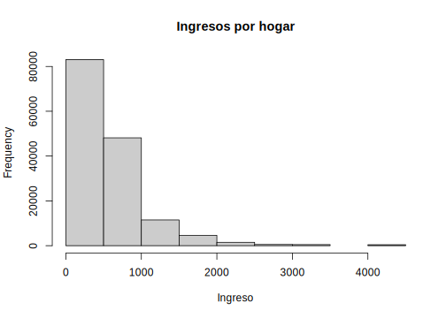
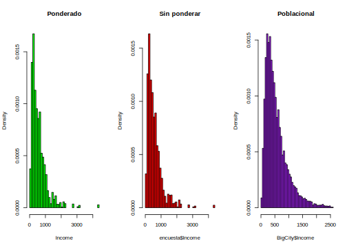
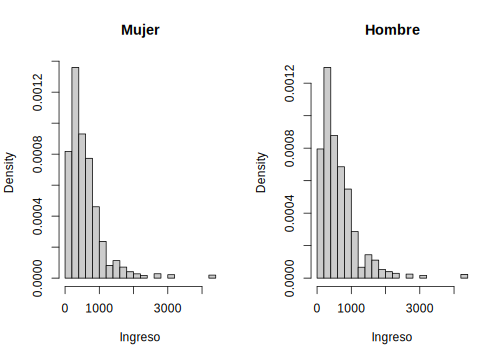
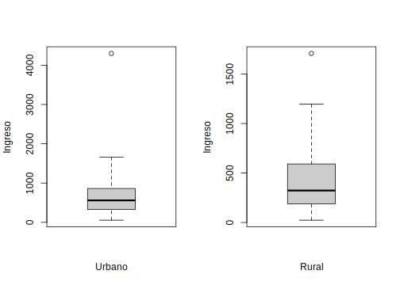
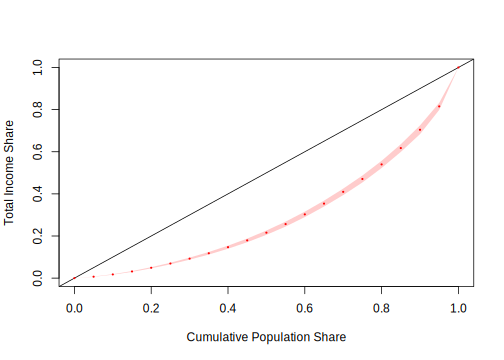

# Análisis de las variables continuas en encuestas de hogares

Los desarrollos estadísticos están en permanente evolución, surgiendo nuevas metodologías y desarrollando nuevos enfoques en el análisis de encuestas. Estos desarrollos parten de la academia, luego son adoptados por las empresas (privadas o estatales) y entidades estatales, las cuales crean la necesidad que estos desarrollos sean incluidos en software estadísticos licenciados, proceso que puede llevar mucho tiempo.

Algunos investigadores para acortar los tiempos y poner al servicio de la comunidad sus descubrimientos y desarrollos, hacen la implementación de sus metodologías en paquetes estadísticos de código abierto como **R** o **Python**. Teniendo **R** un mayor número de desarrollos en el procesamiento de las encuestas.

Como se ha venido mencionando anteriormente, dentro del software *R* se disponen de múltiples librerías para el procesamiento de encuestas, estas varían dependiendo del enfoque de programación desarrollado por el autor o la necesidad que se busque suplir. Como es el objetivo de este libro y como se ha venido trabajando en los capítulos anteriores nos centraremos en las libreria `survey` y `srvyr`. Se incluiran más librerías de acuerdo a las necesidades que se presenten. 

## Lectura de bases de datos y definición del diseño muestral

Las bases de datos (tablas de datos) pueden estar disponibles en una variedad de formatos (.`xlsx`, `.dat`, `.cvs`, `.sav`, `.txt`, etc.), sin embargo, por experiencia es recomendable realizar la lectura de cualesquiera de estos formatos y proceder inmediatamente a guardarlo en un archivo de extensión **.rds**, la cual es nativa de `R.` las extensiones **rds** permiten almacenar cualquier objeto o información en `R` como pueden ser marco de datos, vectores, matrices, lista, entre otros. Los archivos **.rds** se carcaterizan por su flexibilidad a la hora de almacenarlos, sin limitarse a su base de datos, y por su perfecta compatibilidad con R.

Por otro lado, existe otro tipos de archivos propios de `R` como lo es **.Rdata**. Sin embargo existen diferencia entre ellos. Por ejemplo, mientras que los archivos **.rds** pueden contener cualquier número de objetos, los **.Rdata** se limitan a un solo objeto. Es por lo anterior que, se recomeinda trabajar con archivos **.rds**.

Para ejemplifcar las sintaxis que se utilizarán en `R`, se tomará la misma base del capítulo anterior la cual contiene una muestra de 2427 registro y proviene de un muestreo complejo. A continuación, se muestra la sintaxis en `R` de cómo cargar un archivo con extensión **.rsd**


```r
library(tidyverse)
```

```
## ── Attaching packages ─────────────────────────────────────── tidyverse 1.3.2 ──
## ✔ ggplot2 3.3.6     ✔ purrr   0.3.4
## ✔ tibble  3.1.8     ✔ dplyr   1.0.9
## ✔ tidyr   1.2.0     ✔ stringr 1.4.1
## ✔ readr   2.1.2     ✔ forcats 0.5.1
## ── Conflicts ────────────────────────────────────────── tidyverse_conflicts() ──
## ✖ dplyr::filter() masks stats::filter()
## ✖ dplyr::lag()    masks stats::lag()
```

```r
encuesta <- readRDS("../Curso Tellez/Data/encuesta.rds")
head(encuesta)
```

```
##        HHID   Stratum NIh nIh  dI PersonID     PSU  Zone    Sex Age MaritalST
## 1 idHH00031 idStrt001   9   2 4.5  idPer01 PSU0003 Rural   Male  68   Married
## 2 idHH00031 idStrt001   9   2 4.5  idPer02 PSU0003 Rural Female  56   Married
## 3 idHH00031 idStrt001   9   2 4.5  idPer03 PSU0003 Rural Female  24   Married
## 4 idHH00031 idStrt001   9   2 4.5  idPer04 PSU0003 Rural   Male  26   Married
## 5 idHH00031 idStrt001   9   2 4.5  idPer05 PSU0003 Rural Female   3      <NA>
## 6 idHH00041 idStrt001   9   2 4.5  idPer01 PSU0003 Rural Female  61   Widowed
##   Income Expenditure Employment Poverty dki dk       wk Region    CatAge
## 1 409.87      346.34   Employed NotPoor   8 36 34.50371  Norte Más de 60
## 2 409.87      346.34   Employed NotPoor   8 36 33.63761  Norte     46-60
## 3 409.87      346.34   Employed NotPoor   8 36 33.63761  Norte     16-30
## 4 409.87      346.34   Employed NotPoor   8 36 34.50371  Norte     16-30
## 5 409.87      346.34       <NA> NotPoor   8 36 33.63761  Norte       0-5
## 6 823.75      392.24   Employed NotPoor   8 36 33.63761  Norte Más de 60
```

Una vez caraga la muestra de hogares en `R`, el siguiente paso es definir el diseño muestral del cual proviene dicha muestra. Para esto se utilizará el paquete `srvyr` el cual, como se definió anteriormente, surge como un complemento para `survey`. Estas librerías permiten definir objetos  tipo **survey.design** a los que se aplican las funciones de estimación y análisis de encuestas cargadas en el paquete `srvyr` complementados con la programación de tubería ( %>% ) del paquete `tidyverse`. A manera de ejemplificar los conceptos mencionados anteriormente, se definirá en `R` el diseño de muestreo del cual proviene la muestra contenida en el objeto **encuesta**:


```r
options(survey.lonely.psu = "adjust") 

library(srvyr)
```

```
## 
## Attaching package: 'srvyr'
```

```
## The following object is masked from 'package:stats':
## 
##     filter
```

```r
diseno <- encuesta %>% 
  as_survey_design(
    strata = Stratum,  
    ids = PSU,        
    weights = wk,      
    nest = T)
```

En el código anterior se puede observar que, en primera instancia se debe definir la base de datos en la cual se encuentra la muestra seleccionada. Seguido de eso, se debe definir el tipo de objeto en `R` con el cual se trabajará, para nuestro caso, será un objeto *survey_design* el cual se define usando la función *as_survey_design*. ahora bien, una vez definido el tipo de objeto se procede a definir los parámetros del diseño definido. Para este caso fue un diseño de muestreo estratificado y en varias etapas. Estos argumentos se definen dentro de la función *as_survey_design* como sigue. Para definir los estratos de utiliza el argumento *strata* y se define en qué columna están los estratos en mi base de datos. Ahora bien, para definir las UPM´s, en el argumento *ids* se definen la columna donde se encuntran los conglomerados seleccionados en la primera etapa. También, se definen los pesos de muestreo en el argumento *weights* y, por último, con el argumento *nest=T* se define que las UPM´s están dentro de los estratos. 

## Análisis gráfico: Histogramas y Boxplot

Una vez cargada la muestra a `R` y definido el diseño muestral del cual proviene se pueden hacer los primeros análisis. Como es natural, se inician con análisis gráficos. A continuación, se muestran los códigos computacionales con los cuales se hacen histogramas en `R` para la variable ingresos teniendo en cuenta el diseño muestral y los factores de expansión haciendo uso la función `svyhist` de la librería `survey`.


```r
library(survey)
```

```
## Loading required package: grid
```

```
## Loading required package: Matrix
```

```
## 
## Attaching package: 'Matrix'
```

```
## The following objects are masked from 'package:tidyr':
## 
##     expand, pack, unpack
```

```
## Loading required package: survival
```

```
## 
## Attaching package: 'survey'
```

```
## The following object is masked from 'package:graphics':
## 
##     dotchart
```

```r
library(srvyr)
svyhist(
  ~ Income ,
  diseno,
  main = "Ingresos por hogar",
  col = "grey80",
  xlab = "Ingreso",
  probability = FALSE
)
```



Como se pudo observar en el código anterior, para generar un histograma teniendo en cuenta el diseño muestral se usó la función `svyhist`. En primer lugar, se definió la variable a graficar, que para nuestro caso fue *Income*. Seguido, se define el diseño muestral utilizado en la encuesta. Luego, se definen los argumentos relacionados con la estética del gráfico como lo son: el título principal (*main*), el color (*col*) y el título horizontal (*xlab*). Finalmente, se define si el histograma es de frecuencias o probabilidades con el argumento *probability*. Para este ejemplo, se tomó la opción *probability = False* indicando que es un histograma de frecuencias.

Una pregunta que surge de manera natural es ¿cuál es la diferencia entre los histogramas sin usar los factores de expansión y utilizándolo? A continuación, se generan 3 histogramas, en el primero se grafica la variable ingreso utilizando los factores de expansión, en el segundo se grafica la misma variable sin usar los factores de expansión y en el tercero, se hace el gráfico poblacional.


```r
library(survey)
data("BigCity", package = "TeachingSampling")
par(mfrow = c(1,3))

svyhist(~ Income,
  diseno, main = "Ponderado",
  col = "green", breaks = 50)

hist( encuesta$Income,
  main = "Sin ponderar",
  col = "red", prob = TRUE, breaks = 50)

hist(BigCity$Income,
  main = "Poblacional",
  col = "purple", prob = TRUE,
  xlim = c(0, 2500), breaks = 500)
```



Uno de los análisis gráficos más comunes que se realizan ene encuestas de hogares están relacionados con subgrupos geográficos como lo son las zonas (urbano - rural) o también realizar desagregaciones temáticas como lo son por sexo (hombre mujer). A continuación, se muestra la sintaxis en `R` como se realizan histogramas para hombres y mujeres mayores de 18 años:


```r
sub_Mujer  <- diseno %>%  filter(Sex == "Female")
sub_Hombre <- diseno %>%  filter(Sex == "Male")

par(mfrow = c(1,2))

svyhist(
  ~ Income ,
  design = subset(sub_Mujer, Age >= 18),
  main = "Mujer",
  breaks = 30,
  col = "grey80",
  xlab = "Ingreso")

svyhist(
  ~ Income ,
  design = subset(sub_Hombre, Age >= 18),
  main = "Hombre",
  breaks = 30,
  col = "grey80",
  xlab = "Ingreso")
```



Como se puede observar, los argumentos utilizando para realizar los gráficos son los mismo que se utilizaron y ejemplificaron anteriormente. Cabe notar que la función *subset* permite hacer un subconjunto de la población, que para nuetro caso son aquellos hombres y mujeres mayores o iguales a 18 años.

Si el objetivo ahora es realizar análisis de localización y variablidad, por ejemplo, graficar Bloxplot teniendo en cuenta los factores de expansión, a continuación, se muestran las sintaxis de como realizarlo en `R`.


```r
sub_Urbano <- diseno %>%  filter(Zone == "Urban")
sub_Rural  <- diseno %>%  filter(Zone == "Rural")

par(mfrow = c(1,2))
svyboxplot(
  Income~1 ,
  sub_Urbano,
  col = "grey80",
  ylab = "Ingreso",
  xlab = "Urbano")

svyboxplot(
  Income ~ 1 ,
  sub_Rural,
  col = "grey80",
  ylab = "Ingreso",
  xlab = "Rural")
```



Los argumentos usados en la función *svyboxplot* para generar el gráfico son muy similares a los usados en la función *svyhist*. Algo a recalcar el los argumentos de esta función es que el símbolo "Income ~ 1" hace referencia a que todas las personas pertenecen a un solo grupo que puede ser urbano o rural dependiendo del caso y por eso se requiere indicarle a `R` esa restricción, lo cual se hace con el símbolo "~1".

## Estimación puntual

Después de realizar el análisis gráfico de las tendencias de las variables continuas de la encuesta, es necesario obtener las estimaciones puntuales de los parámetros que se midieron. Dichas estimaciones se obtienen de forma general o desagregado por niveles de acuerdo con las necesidades de la investigación. Entiéndase como estimaciones puntuales en el contexto de las encuestas de hogares a la estimación de totales, pormedios, razones, etc.  Como lo menciona **Heeringa, et al (2017)** la estimación del total o promedio de una población y su varianza muestral ha jugado un papel muy importante en el desarrollo de la teoría del muestreo probabilístico, particularmente en las encuestas de hogares dado que, permiten dar un valor muy acertado de lo que puede estar pasando en los hogares estudiados y con ello tomar decisiones de política publica de manera informada.

### Estimación de totales e intervalos de confianza

Una vez definido el diseño muestral, lo cual se hizo en la sección anterior), se procede a realizar los procesos de estimación de los parámetros de interés. Para efectos de este texto se iniciará con la estimación del total de los ingresos de los hogares. 

En su mayoría, los paquetes estadístico actuales no utilizan técnicas avanzadas para estimar los totales de la población, por ejemplo, usar estimadores generales de regresión (GREG) o métodos de calibración. Sin embargo, **Valiente et al. (2000)** realizó una librería implementada en *S-plus* que premite realizar estos procedimientos de estimación, que se pueden escribir de manera sencilla en códigos en R **(Valliant et al., 2013)**.

Para la estimación de totales con diseños muestrales complejos que incluya estratificación $\left(h=1,2,...,H\right)$y muestreo por conglomerados (cuyos conglomerados están dentro del estrato $h$) indexados por $\alpha=1,2,...,a_{h}$, el estimador para el total se puede escribir como:

\begin{eqnarray*}
\hat{Y}_{\omega} & = & \sum_{h=1}^{H}\sum_{\alpha=1}^{a_{h}}\sum_{i=1}^{n_{h\alpha}}\omega_{h\alpha i}y_{h\alpha i}.
\end{eqnarray*}

El estimador insesgado de la varianza para este estimador es:

\begin{eqnarray*}
var\left(\hat{Y}_{\omega}\right) & = & \sum_{h=1}^{H}\frac{a_{h}}{\left(a_{h}-1\right)}\left[\sum_{\alpha=1}^{a_{h}}\left(\sum_{i=1}^{n_{h\alpha}}\omega_{h\alpha i}y_{h\alpha i}\right)^{2}-\frac{\left({\displaystyle \sum_{\alpha=1}^{a_{h}}}\omega_{h\alpha i}y_{h\alpha i}\right)^{2}}{a_{h}}\right]
\end{eqnarray*}


Como se puede observar, calcular la estimación del total y su varianza estimada es complejo. Sin embargo,  dichos cálculos se pueden hacer en `R` mediante la función `svytotal` y el intervalos de confianza se calcula con la función `confint`, ambos usando la librería `survey`. A continuación, se muestran los códigos:


```r
total_Ingresos<- svytotal(~Income, diseno, deff=T, )
total_Ingresos
```

```
##           total       SE DEff
## Income 85793667  4778674   11
```

```r
confint(total_Ingresos, level = 0.95)
```

```
##           2.5 %   97.5 %
## Income 76427637 95159697
```

Los argumentos que utiliza de la función `svytotal` con muy sencillos. Para el ejemplo, se le introduce primero la variable en la cual está la información que se desea estimar (Income). Posterior a esto, se introduce el diseño muestral del cual proviene la muestra y, por último, se indica si desea que se reporte el deff de la estimación o no.

Por otro lado, para el cálculo del intervalo de confianza, lo único que requiere es indicarle a la función `confint` el estimador y la confianza requerida.

Paras seguir ilustrando el uso de la función `svytotal` y de `confint`, estimemos el total de gastos de los hogares, pero ahora el intervalo de confianza se calculará al 90% de confianza. Los siguientes códigos realizan las estimaciones:


```r
total_gastos<- svytotal (~Expenditure, diseno, deff=T) 
total_gastos
```

```
##                total       SE   DEff
## Expenditure 55677504  2604138 10.222
```

```r
confint(total_gastos, level = 0.9)
```

```
##                  5 %     95 %
## Expenditure 51394077 59960931
```


Si el objetivo ahora es estimar el total de los ingreso de los hogares pero discriminado por sexo, se utilizará ahora la función `cascade`de la libraría `srvyr`, la cual permite agregar
la suma de las categorías al final la tabla. También se utilizará la función `group_by` la cual permite obtener resultados agrupados por los niveles de interés. 


```r
diseno %>% group_by(Sex) %>%
  cascade(Total = survey_total(
    Income, level = 0.95,
    vartype =  c("se", "ci")),
          .fill = "Total ingreso")
```

```
## # A tibble: 3 × 5
##   Sex               Total Total_se Total_low Total_upp
##   <chr>             <dbl>    <dbl>     <dbl>     <dbl>
## 1 Female        44153820. 2324452. 39551172. 48756467.
## 2 Male          41639847. 2870194. 35956576. 47323118.
## 3 Total ingreso 85793667. 4778674. 76331414. 95255920.
```

Como se pudo observar en lo códigos anteriores, otra forma de obtener las estimaciones del total, su desviación estándar y el intervalo de confianza es usando el argumento `vartype` e indicándole las opciones "se", "ci" respectivamente.

### Estimación de la media e intervalo de confianza

La estimación de la media poblacional es un parámetro muy importante en las encuestas de hogares, dado que, por ejemplo, uno de los indicadores trazadores en este tipo de encuestas son los ingresos medios por hogar. Además, este tipo de parámetros no permiten describir y analizar las tendencias centrales de estas variables en poblaciones de interés. Según **Gutiérrez (2016)** un estimador de la media poblacional se puede escribir como una razón no lineal de dos totales de población finitas estimados como sigue:

\begin{eqnarray*}
\bar{Y}_{\omega} & = & \frac{\sum_{h=1}^{H}\sum_{\alpha=1}^{a_{h}}\sum_{i=1}^{n_{h\alpha}}\omega_{h\alpha i}y_{h\alpha i}}{\sum_{h=1}^{H}\sum_{\alpha=1}^{a_{h}}\sum_{i=1}^{n_{h\alpha}}\omega_{h\alpha i}}\\
 & = & \frac{\hat{Y}}{\hat{N}}.
\end{eqnarray*}

Como una observación tenga en cuenta que, si $y$ es una variable
binaria, la media ponderada estima la proporción de la población.
Por otro lado, como $\bar{Y}_{\omega}$ no es una estadística lineal,
no existe una fórmula cerrada para la varianza de este estimador.
Es por lo anterior que, se deben recurrir a usar métodos de remuestreo
o series de Taylor. Para este caso en particular, usando series de
Taylor el estimador insesgado de la varianza para este estimador es:

\begin{eqnarray*}
var\left(\bar{Y}_{\omega}\right) & \dot{=} & \frac{var\left(\hat{Y}\right)+\bar{Y}_{\omega}^{2}\times var\left(\hat{N}\right)-2\times\bar{Y}_{\omega}\times cov\left(\hat{Y},\hat{N}\right)}{\hat{N}^{2}}
\end{eqnarray*}

Como se puede observar, el cálculo de la estimación de la varianza tiene componentes complejos de calcular de manera analítica, como la covarianza entre el total estimado y el tamaño poblacional estimado. Sin embargo, `R` tiene funciones que incorpora estos estimadores. A continuación, se presenta la sintaxis para hacer dichos cálculos.


```r
Media_ingresos<- svymean(~Income, diseno, deff=T) 
Media_ingresos
```

```
##           mean      SE   DEff
## Income 570.945  28.478 8.8211
```

```r
confint(Media_ingresos, level = 0.95)
```

```
##           2.5 %   97.5 %
## Income 515.1299 626.7607
```

Como se puede observar, los argumentos que utiliza la función `svymean` para realizar la estimación de la media de los ingresos de los hogares y la desviación estándar estimada del estimador son similares a los utilizando con la función `svytotal`. Similarmente ocurre con el intervalo de confianza. 

Por otro lado, tal como se realizó con el total, a manera de ejemplo, se estima la media de los gastos en los hogares como sigue a continuación:


```r
Media_gastos<- svymean (~Expenditure, diseno, deff=T)
Media_gastos
```

```
##                mean      SE   DEff
## Expenditure 370.526  13.294 6.0156
```

```r
confint(Media_gastos)
```

```
##                2.5 %   97.5 %
## Expenditure 344.4697 396.5829
```

También se pueden realizar estimaciones de la media por subgrupos siguiendo el mismo esquema mostrado para la función `svytotal`. Particularmente, los gastos de los hogares discriminados por sexo es:


```r
diseno %>% group_by(Sex) %>%
  cascade(
    Media = survey_mean(
      Expenditure, level = 0.95,
       vartype =  c("se", "ci")), 
        .fill = "El gasto medio"  ) %>%
  arrange(desc(Sex))
```

```
## # A tibble: 3 × 5
##   Sex            Media Media_se Media_low Media_upp
##   <chr>          <dbl>    <dbl>     <dbl>     <dbl>
## 1 Male            374.     16.1      343.      406.
## 2 Female          367.     12.3      343.      391.
## 3 El gasto medio  371.     13.3      344.      397.
```

Por zona,


```r
diseno %>% group_by(Zone) %>%
  cascade(
    Media = survey_mean(
      Expenditure, level = 0.95,
       vartype =  c("se", "ci")), 
        .fill = "El gasto medio")%>%
  arrange(desc(Zone))
```

```
## # A tibble: 3 × 5
##   Zone           Media Media_se Media_low Media_upp
##   <chr>          <dbl>    <dbl>     <dbl>     <dbl>
## 1 Urban           460.     22.2      416.      504.
## 2 Rural           274.     10.3      254.      294.
## 3 El gasto medio  371.     13.3      344.      397.
```

Por sexo y zona,


```r
diseno %>% group_by(Zone, Sex) %>%
  cascade(
    Media = survey_mean(
      Expenditure, level = 0.95,
       vartype =  c("se", "ci")),
        .fill = "El gasto medio") %>%
  arrange(desc(Zone), desc(Sex)) %>%
  data.frame()
```

```
##             Zone            Sex    Media Media_se Media_low Media_upp
## 1          Urban           Male 469.8124 26.96068  416.4276  523.1973
## 2          Urban         Female 450.8151 20.11853  410.9784  490.6518
## 3          Urban El gasto medio 459.6162 22.20655  415.6450  503.5874
## 4          Rural           Male 275.3018 10.24848  255.0088  295.5948
## 5          Rural         Female 272.6769 11.61470  249.6786  295.6751
## 6          Rural El gasto medio 273.9461 10.26141  253.6275  294.2647
## 7 El gasto medio El gasto medio 370.5263 13.29444  344.2020  396.8506
```

### Estimación de medidas de dispersión y localización

En las encuestas de hogares siempre es necesario estimar medidas de dispersión de las variables estudiadas. Esto con el fin de, por ejemplo, ver qué tan disímiles son los ingresos medios de los hogares en un país determinado y con esto poder tomar acciones de política pública. Por lo anterior, es importante estudiar este parámetro en este texto. A continuación, se presenta el estimador de la desviación estándar:

\begin{eqnarray}
s\left(y\right){}_{\omega} & = & \frac{\sum_{h=1}^{H}\sum_{\alpha=1}^{a_{h}}\sum_{i=1}^{n_{h\alpha}}\omega_{h\alpha i}\left(y_{h\alpha i}-\bar{Y}_{\omega}\right)^{2}}{\sum_{h=1}^{H}\sum_{\alpha=1}^{a_{h}}\sum_{i=1}^{n_{h\alpha}}\omega_{h\alpha i}-1}
\end{eqnarray}

Para llevar a cabo la estimación en `R` de la desviación estándar en encuestas de hogares, se utilizan la función `survey_var` la cual se ejemplifica a continuación:


```r
(sd_Est <- diseno %>% group_by(Zone) %>% 
   summarise(Sd = sqrt(
  survey_var(
    Income,
    level = 0.95,
    vartype =  c("se", "ci"),
  ) )))
```

```
## # A tibble: 2 × 5
##   Zone     Sd Sd_se Sd_low Sd_upp
##   <chr> <dbl> <dbl>  <dbl>  <dbl>
## 1 Rural  310.  117.   263.   352.
## 2 Urban  582.  285.   422.   707.
```

Como se pudo ver en el ejemplo anterior, se estimó la desviación estándar de los ingresos por zona reportando el error estándar en la estimación y un intervalo de confianza al 95%. Los argumentos que utiliza la función `survey_var` son similares a los usados en las funciones anteriores para estimar medias y totales.

Si el interés ahora se centra en estimar la desviación estándar clasificando por sexo y zona, los códigos computacionales son los siguientes:


```r
(sd_Est <- diseno %>% group_by(Zone, Sex) %>% 
   summarise(Sd = sqrt(
  survey_var(
    Income,
    level = 0.95,
    vartype =  c("se", "ci"),
   )
))) %>% data.frame()
```

```
##    Zone    Sex       Sd    Sd_se   Sd_low   Sd_upp
## 1 Rural Female 294.8683 111.6203 249.5537 334.0921
## 2 Rural   Male 325.7584 124.9643 274.2209 370.1890
## 3 Urban Female 568.3920 286.4585 400.7312 696.8166
## 4 Urban   Male 596.7756 288.9435 436.8362 722.1194
```

Las medidas de posición no central (Percentiles) se diseñaron con el fin de conocer otros puntos característicos de la distribución de los datos que no son los valores centrales. Entre las medidas de posición no central más importantes están la mediana, cuartiles y percentiles. En la mayoría de las encuestas de hogares no solo estiman totales, medias y proporciones. En algunos indicadores es necesario estimar otros parámetros, por ejemplo, medianas y percentiles. Como lo menciona **Tellez et al (2015)** la mediana una medida de tendencia central la cual, a diferencia del promedio, no es fácilmente influenciada por datos atípicos y, por esto, se conoce como una medida robusta. La mediana es el valor que divide la población en dos partes iguales. Lo que implica que, la mitad de las observaciones de la característica de interés está por encima de la media y la otra mitad está por debajo. 

Por otro lado, la estimación de percentiles de ingresos en un país determinado puede definir el inicio de una política pública. por ejemplo, poner a tributar aquellas personas naturales que son el 10% más alto de la distribución de los ingresos o por el contrario, generar subsidios de transporte a aquellas familias que están en el 15% inferior de la distribución de los ingresos.

La estimación de cuantiles **(Loomis et al., 2005)** se basa en los resultados relacionados con el estimador ponderado para totales, empleando una estimación de la función de distribución (CDF, por sus siglas en inglés) acumulada de la población. Específicamente, la CDF para una variable y en una población finita dada de tamaño $N$ se define de la siguiente manera:

\begin{eqnarray*}
F\left(x\right) & = & \frac{{\displaystyle \sum_{i=1}^{N}}I\left(y_{i}\leq x\right)}{N}
\end{eqnarray*}

Donde, $I\left(y_{i}\leq x\right)$ es una variable indicadora la
cual es igual a 1 si $y_{i}$ es menor o igual a un valor específico
$x$, 0 en otro caso. Un estimador de la CDF en un diseño complejo
(encuesta de hogares) de tamaño $n$ está dado por:

\begin{eqnarray*}
\hat{F}\left(x\right) & = & \frac{\sum_{h=1}^{H}\sum_{\alpha=1}^{a_{h}}\sum_{i=1}^{n_{h\alpha}}\omega_{h\alpha i}I\left(y_{i}\leq x\right)}{\sum_{h=1}^{H}\sum_{\alpha=1}^{a_{h}}\sum_{i=1}^{n_{h\alpha}}\omega_{h\alpha i}}
\end{eqnarray*}

Una vez estimada la CDF utilizando los pesos del diseño muestral, el cuantil q-ésimo de una variable $y$ es el valor más pequeño de $y$ tal que la CDF de la población es mayor o igual que $q$. Como es bien sabido, la mediana es aquel valor donde la CDF es mayor o igual a 0.5 y, por tanto, la media estimada es aquel valor donde la estimación de CDF es mayor o igual a 0.5.

Siguiendo las recomendaciones de *Heeringa et al (2017)* para estimar cuantiles, primero se considera las estadísticas de orden que se denotan como $y_{1},\ldots,y_{n}$, y encuentra el valor de $j$ $(j=1,\ldots,n)$ tal que:

\begin{eqnarray*}
 & \hat{F}\left(y_{j}\right)\leq q\leq\hat{F}\left(y_{j+1}\right)
\end{eqnarray*}

Ahora bien, la estimación del q-ésimo cuantil $Y_{q}$ en un diseño de muestreo complejo está dado por:

\begin{eqnarray*}
\hat{Y}_{q} & = & y_{j}+\frac{q-\hat{F}\left(y_{j}\right)}{\hat{F}\left(y_{j+1}\right)-\hat{F}\left(y_{j}\right)}\left(y_{j+1}-y_{j}\right)
\end{eqnarray*}

Para la estimación de la varianza e intervalos de confianza de cuantiles, **Kovar et al. (1988)** muestra los resultados de un estudio de simulación en donde recomienda el uso de Balanced Repeated Replication (BRR) para estimarla. 

Los estimadores y procedimientos antes mencionados para la estimación de percentiles y sus varianzas están implementados en `R`. Particularmente, la estimación de la mediana se realiza usando la función `survey_median`. A continuación, se muestra la sintaxis de cómo calcular la mediana de los gastos, la desviación estándar y el intervalo de confianza al 95% de los hogares en la base de datos de ejemplo.


```r
diseno %>% summarise(Mediana = 
  survey_median(
    Expenditure,
    level = 0.95,
    vartype =  c("se", "ci"),
   ))
```

```
## # A tibble: 1 × 4
##   Mediana Mediana_se Mediana_low Mediana_upp
##     <dbl>      <dbl>       <dbl>       <dbl>
## 1    298.       8.83        282.        317.
```

Como se puede observar, los argumentos de la función `survey_median` son similares a los del total y la media.

Ahora bien, al igual que con los demás parámetros, si el objetivo ahora es estimar la mediana de los gastos de los hogares, pero esta vez discriminada por zona y también por sexo, el código computacional sería el siguiente:


```r
diseno %>% group_by(Zone) %>% 
  summarise(Mediana = 
  survey_median(
    Expenditure,
    level = 0.95,
    vartype =  c("se", "ci"),
   ))
```

```
## # A tibble: 2 × 5
##   Zone  Mediana Mediana_se Mediana_low Mediana_upp
##   <chr>   <dbl>      <dbl>       <dbl>       <dbl>
## 1 Rural    241.       11.0        214.        258.
## 2 Urban    381.       19.8        337.        416.
```


```r
diseno %>% group_by(Sex) %>% 
  summarise(Mediana = 
  survey_median(
    Expenditure,
    level = 0.95,
    vartype =  c("se", "ci"),
   ))
```

```
## # A tibble: 2 × 5
##   Sex    Mediana Mediana_se Mediana_low Mediana_upp
##   <chr>    <dbl>      <dbl>       <dbl>       <dbl>
## 1 Female    300.      10.5         282.        324.
## 2 Male      297.       9.29        277.        314.
```

Si el objetivo ahora es estimar cuantiles, por ejemplo, el cuantil 0.25 de los gastos de los hogares, se realizaría usando la función `survey_quantile` como sigue:


```r
diseno %>% 
  summarise(
    Q =  survey_quantile(
    Expenditure,
    quantiles = 0.5,
    level = 0.95,
    vartype =  c("se", "ci"),
    interval_type = "score"
   ))
```

```
## # A tibble: 1 × 4
##   Q_q50 Q_q50_se Q_q50_low Q_q50_upp
##   <dbl>    <dbl>     <dbl>     <dbl>
## 1  298.     12.0      265.      312.
```

si ahora se desea estimar el cuantil 0.25 pero discriminando por sexo y por zona se realizaría como sigue:


```r
diseno %>% group_by(Sex) %>% 
  summarise(
    Q =  survey_quantile(
    Expenditure,
    quantiles = 0.25,
    level = 0.95,
    vartype =  c("se", "ci"),
    interval_type = "score"
   ))
```

```
## # A tibble: 2 × 5
##   Sex    Q_q25 Q_q25_se Q_q25_low Q_q25_upp
##   <chr>  <dbl>    <dbl>     <dbl>     <dbl>
## 1 Female  210.     14.9      169.      228.
## 2 Male    193.     10.4      163.      205.
```


```r
diseno %>% group_by(Zone) %>% 
  summarise(
    Q =  survey_quantile(
    Expenditure,
    quantiles = 0.25,
    level = 0.95,
    vartype =  c("se", "ci"),
    interval_type = "score"
   ))
```

```
## # A tibble: 2 × 5
##   Zone  Q_q25 Q_q25_se Q_q25_low Q_q25_upp
##   <chr> <dbl>    <dbl>     <dbl>     <dbl>
## 1 Rural  160.     4.64      145.      163.
## 2 Urban  258.     9.05      256.      292.
```


## Estimación del coeficiente de Ginni en encuestas de hogares

Para iniciar esta sección tengamos en cuenta la siguiente reflexión: *Definir lo justo siempre será difícil y es algo a lo que quizá sea poco realista aspirar a conseguir. Sin embargo si estamos un poco más conscientes de cómo la desigualdad afecta nuestra libertad y cómo se refleja en el bienestar y calidad de vida de las personas, podremos poner en contexto una discusión que tendremos cada vez más presente en el mundo y en el país.*

La desigualdad en todos los aspectos es un problema más comunes en todos los países del mundo. Particularmente, la desigualdad económica es un problema que atañe a muchas instituciones internacionales como, por ejemplo, Naciones Unidas quien tiene este problema detectado en los Objetivos de Desarrollo Sostenibles (ODS, por sus siglas). Dado lo anterior, es clave poder medir la desigualdad económica de los hogares en los países y para esto, el indicador más utilizado es el coeficiente de Gini (CG). El valor del índice de Gini se encuentra entre 0 y 1. Un valor del coeficiente de Gini de $G = 0$ indica perfecta igualdad en la distribución de la riqueza, con valores más grandes significa una desigualdad cada vez mayor en la distribución de la riqueza. Siguiendo la ecuación de estimación de *Binder y Kovacevic (1995)*, un estimador del coeficiente de Gini es:

\begin{eqnarray*}
\hat{G}\left(y\right) & = & \frac{2\times\sum_{h=1}^{H}\sum_{\alpha=1}^{a_{h}}\sum_{i=1}^{n_{h\alpha}}\omega_{h\alpha i}^{*}\hat{F}_{h\alpha i}y_{h\alpha i}-1}{\bar{y}_{\omega}}
\end{eqnarray*}

Donde,


-    $\omega_{h\alpha i}^{*}=\frac{\omega_{h\alpha i}}{\sum_{h=1}^{H}\sum_{\alpha=1}^{a_{h}}\sum_{i=1}^{n_{h\alpha}}\omega_{h\alpha i}}$.

-    $\hat{F}_{h\alpha i}=$ La estimación de la CDF en el conglomerado $\alpha$ en el estrato $h$.

-    $\bar{y}_{\omega}=$ La estimación del promedio.

Para calcular el índice de Gini y su varianza estimada en una encuesta de hogares, `R` tiene cargados los procedimientos en la librería `convey`.  A continuación, se muestra la sintaxis de cómo se realiza la estimación del índice de Gini para los hogares en la base de ejemplo de este capítulo. 


```r
library(convey)
 diseno_gini <- convey_prep(diseno)
svygini( ~Income, design = diseno_gini) %>%
  data.frame()
```

```
##             gini    Income
## Income 0.4132757 0.0186633
```

En primer lugar, se carga el diseño de muestreo con la función `convey_prep`. Luego, se estima el índice Gini con la función `svygini`. En los argumentos de esta última función se introducen la variable ingresos y el diseño muestral complejo.

Por otro lado, si el interés ahora es estimar la **curva de Lorenz**. La cual, según *Kovacevic, M. S. et. al (1997)* para una distribución dada de ingresos, traza el porcentaje acumulado de la población (desplegado desde el más pobre hasta el más rico) frente a su participación en el ingreso total. El área entre la curva de Lorenz y la línea de 45 grados se conoce como el área de Lorenz. El índice de Gini es igual al doble del área de Lorenz. Una población con la curva de Lorenz más cerca de la línea de 45 grados tiene una distribución de ingresos más equitativa. Si todos los ingresos son iguales, la curva de Lorenz degenera a la línea de 45 grados.

Para realizar la curva de Lorenz en `R` se utiliza la función `svylorenz`. A continuación, se muestran los códigos computacionales para realizar la curva de Lorenz para los ingresos:


```r
library(convey)
svylorenz(formula = ~Income, 
          design = diseno_gini, 
          quantiles = seq(0,1,.05), 
          alpha = .01 )
```



```
## $quantiles
##        0        0.05        0.1       0.15        0.2       0.25        0.3
## Income 0 0.006819101 0.01759645 0.03165963 0.04922299 0.06943653 0.09258712
##             0.35       0.4      0.45       0.5      0.55       0.6      0.65
## Income 0.1181331 0.1469261 0.1791978 0.2158231 0.2565784 0.3027002 0.3537989
##              0.7      0.75       0.8      0.85       0.9      0.95 1
## Income 0.4096304 0.4706565 0.5398749 0.6174169 0.7042464 0.8151774 1
## 
## $CIs
## , , Income
## 
##        0        0.05        0.1       0.15        0.2       0.25        0.3
## (lower 0 0.006189268 0.01644571 0.02973329 0.04643347 0.06564963 0.08770299
## upper) 0 0.007448933 0.01874718 0.03358597 0.05201251 0.07322343 0.09747124
##             0.35       0.4      0.45       0.5      0.55       0.6      0.65
## (lower 0.1120660 0.1396359 0.1705777 0.2056539 0.2447898 0.2898807 0.3397823
## upper) 0.1242001 0.1542163 0.1878180 0.2259923 0.2683671 0.3155197 0.3678154
##              0.7      0.75       0.8      0.85       0.9      0.95 1
## (lower 0.3943025 0.4542246 0.5227820 0.5991455 0.6835287 0.7983336 1
## upper) 0.4249582 0.4870884 0.5569677 0.6356883 0.7249642 0.8320213 1
```

Los argumentos que requiere la función son, inicialmente, los ingresos de los hogares y el diseño muestral complejo. Adicionalmente, se definen una secuencia de probabilidades que define la suma de los cuantiles a calcular (quantiles) y por último, un número que especifica el nivel de confianza para el gráfico (alpha).

## Análisis de la relación entre dos variable continuas

En muchos análisis de variables relacionadas con encuestas de hogares no solo basta con analizar el comportamiento de variables de manera individual, por ejemplo, ingresos medios de hombres y mujeres en un país sino también, analizar la diferencia entre los ingresos de los hombres y las mujeres. Esto último con el fin de ir cerrando la brecha salarial que existe. 

En este capítulo se estudiará la prueba de hipótesis para diferencia de medias, se darán las herramientas computacionales para estimar razones y contrastes.

## Prueba de hipótesis para la diferencia de medias en encuestas de hogares


Es llamado prueba de hipótesis a una técnica la cual consiste en hacer una afirmación acerca del valor que el parámetro de la población bajo estudio puede tomar. Esta afirmación puede estar basada en alguna creencia o experiencia pasada que será contrastada con la evidencia que se obtengan a través de la información contenida en la muestra. Como dicha afirmación puede ser o no cierta, dos hipótesis pueden ser planteadas (antagónicas) las cuales se conocen como $H_{0}:$ Hipótesis nula y $H_{1}:$ Hipótesis alterna. Si se sospecha que el parámetro $\theta$ es igual a cierto valor particular  $\theta_{0}$, los posibles juegos de hipótesis a contrastar son:

$$
\begin{cases}
H_{0}: & \theta=\theta_{0}\\
H_{1}: & \theta\neq\theta_{0}
\end{cases}\,\,\,	\begin{cases}
H_{0}: & \theta=\theta_{0}\\
H_{1}: & \theta>\theta_{0}
\end{cases}\,\,\,	\begin{cases}
H_{0}: & \theta=\theta_{0}\\
H_{1}: & \theta<\theta_{0}
\end{cases}
$$

Se dirá que una de las dos hipótesis es cierta solo si la evidencia estadística, la cual es obtenida de la muestra, la apoya. El proceso por medio del cual se escoge una de las dos hipótesis es llamado Prueba de Hipótesis. 

En términos generales, algunos parámetros importantes en la estadística descriptivas se pueden escribir como una combinación lineal de medidas de interés. Los casos más usuales son diferencias de medias, sumas ponderadas de medias utilizadas para construir índices económicos, etc. 

Considere una función que es una combinación lineal de $j$ estadísticas descriptivas como se muestra a continuación:


\begin{eqnarray*}
f\left(\theta_{1},\theta_{2},...,\theta_{j}\right) & = & \sum_{j=1}^{J}a_{j}\theta_{j}
\end{eqnarray*}

Una estimación de esta función está dada por:

\begin{eqnarray*}
f\left(\hat{\theta}_{1},\hat{\theta}_{2},...,\hat{\theta}_{j}\right) & = & \sum_{j=1}^{J}a_{j}\hat{\theta}_{j}
\end{eqnarray*}

cuya varianza del estimador se calcula como sigue:

\begin{eqnarray*}
var\left(\sum_{j=1}^{J}a_{j}\hat{\theta}_{j}\right) & = & \sum_{j=1}^{J}a_{j}^{2}var\left(\hat{\theta}_{j}\right)+2\times\sum_{j=1}^{J-1}\sum_{k>j}^{J}a_{j}a_{k}\,cov\left(\hat{\theta}_{j},\hat{\theta}_{k}\right)
\end{eqnarray*}

Como se pudo observar en la ecuación de la varianza del estimador, esta incorpora las varianzas de las estimaciones de los componentes individuales, así como las covarianzas de las estadísticas estimadas.

En primer lugar, una combinación lineal de estadísticas descriptivas de interés en este capítulo es la diferencia de media cuyo parámetro es ${\bar{Y}_{1}-\bar{Y}_{2}}$, donde, $\bar{Y}_{1}$ es la media de la población 1, por ejemplo, ingresos medios en los hogares obtenido por los padres de familia y $\bar{Y}_{2}$ es la media de la población 2, que para seguir el ejemplo serían, los ingresos medios de las madres en un hogar.

Considerando el parámetro de interés en esta sección, las hipótesis a estudiar serían las siguientes:

\begin{eqnarray*}
\begin{cases}
H_{0}:\bar{Y}_{1}-\bar{Y}_{2}=0\\
H_{1}:\bar{Y}_{1}-\bar{Y}_{2}\neq0
\end{cases} & \begin{cases}
H_{0}:\bar{Y}_{1}-\bar{Y}_{2}=0\\
H_{1}:\bar{Y}_{1}-\bar{Y}_{2}>0
\end{cases} & \begin{cases}
H_{0}:\bar{Y}_{1}-\bar{Y}_{2}=0\\
H_{1}:\bar{Y}_{1}-\bar{Y}_{2}<0
\end{cases}
\end{eqnarray*}

Para probar estas hipótesis se utiliza el siguiente estadístico de prueba que se distribuye t-student:


\begin{eqnarray*}
t & = & \frac{\bar{Y}_{1}-\bar{Y}_{2}}{se\left(\bar{Y}_{1}-\bar{Y}_{2}\right)},
\end{eqnarray*}

donde,

\begin{eqnarray*}
se\left(\bar{Y}_{1}-\bar{Y}_{2}\right) & = & \sqrt{var\left(\bar{y}_{1}\right)+var\left(\bar{y}_{2}\right)-2cov\left(\bar{y}_{1},\bar{y}_{2}\right)}
\end{eqnarray*}

Si se desea construir un intervalo de confianza para la diferencia de media se realizaría de la siguiente manera:

\begin{eqnarray*}
 & \left(\bar{Y}_{1}-\bar{Y}_{2}\right)\pm t_{gl,\,\alpha/2}\,se\left(\bar{Y}_{1}-\bar{Y}_{2}\right)
\end{eqnarray*}

Para poder llevar a cabo la prueba de hipótesis para la diferencia de media de los ingresos en un hogar por sexo, tomemos la base de datos que tenemos como ejemplo. La función que se encarga de realizar la prueba es `svyttest` y solo requiere como argumentos la variable ingreso (o variable de interés), la variable sexo (variable discriminadora), el diseño muestral y el nivel de confianza. A continuación, se muestran los códigos computacionales que se requieren:


```r
svyttest(Income ~ Sex, design = diseno, level=0.95) 
```

```
## 
## 	Design-based t-test
## 
## data:  Income ~ Sex
## t = 1.3625, df = 118, p-value = 0.1756
## alternative hypothesis: true difference in mean is not equal to 0
## 95 percent confidence interval:
##  -12.82205  69.38503
## sample estimates:
## difference in mean 
##           28.28149
```

En esta salida podemos observar que el p-valor de la prueba es 0.14. Si tomamos una significancia del 5% para la prueba se puede concluir que, con una confianza del 95% y basados en la muestra, no existe suficiente evidencia estadística para decir que los ingresos medios en los hogares son diferentes por sexo.

Por otro lado, el intervalo de confianza al 95% para la diferencia de medias entre los ingresos de hombres y mujeres es $\left(-77.35,\,11.41\right)$. 

Si ahora el objetivo es realizar la prueba de diferencia de medias para los ingresos entre hombres y mujeres pero solo en la zona urbana, los códigos computacionales son los siguientes:


```r
svyttest(Income ~ Sex, design = sub_Urbano, level = 0.95) 
```

```
## 
## 	Design-based t-test
## 
## data:  Income ~ Sex
## t = 1.5667, df = 63, p-value = 0.1222
## alternative hypothesis: true difference in mean is not equal to 0
## 95 percent confidence interval:
##  -12.31754 101.74023
## sample estimates:
## difference in mean 
##           44.71134
```

En donde, al igual que el anterior, no se rechaza la hipótesis nula con una confianza del 95%. 

Por otro lado, la función `svyttest` permite usar filtro. Si se requiere probar la hipótesis de diferencia de medias de ingresos por sexo pero solo en aquellas personas del hogar mayores a 18 años, se utilizará dentro de la función `svyttest` la función `filter` como se muestra a continuación:


```r
svyttest(Income ~ Sex, design = diseno %>% filter(Age > 18), level = 0.95 )
```

```
## 
## 	Design-based t-test
## 
## data:  Income ~ Sex
## t = 1.5263, df = 118, p-value = 0.1296
## alternative hypothesis: true difference in mean is not equal to 0
## 95 percent confidence interval:
##  -10.72746  82.85253
## sample estimates:
## difference in mean 
##           36.06253
```

y con una confianza del 95% y basado en la muestra tampoco se rechaza la hipótesis hula. Es decir, no existe evidencia estadística para concluir que los ingresos medios entre hombres y mujeres mayores de 18 años son diferentes.

## Estimando razones en encuestas de hogares

Un caso particular de una función no lineal de totales es la razón poblacional. Esta se define como el cociente de dos totales poblacionales de características de interés. En las encuestas de hogares, en ocasiones se requiere estimar este parámetro, por ejemplo, cantidad de hombres por cada mujer o la cantidad de mascotas por cada hogar en un país determinado. Puesto que la razón es un cociente de totales, tanto en numerador como el denominador son cantidades desconocidas y por tanto requieren estimarse *(Bautista, 1998)*. Por definición la razón poblacional se define de la siguiente manera:

\begin{eqnarray*}
R & = & \frac{Y}{X}
\end{eqnarray*}

El estimador puntual de una razón en muestreos complejos no es más que estimar los totales por separados como se define a continuación:

\begin{eqnarray*}
\hat{R} & = & \frac{\hat{Y}}{\hat{X}}\\
 & = & \frac{{\displaystyle \sum_{h=1}^{H}\sum_{\alpha=1}^{\alpha_{h}}\sum_{i=1}^{nh\alpha}}\omega_{h\alpha i}y_{h\alpha i}}{{\displaystyle \sum_{h=1}^{H}\sum_{\alpha=1}^{\alpha_{h}}\sum_{i=1}^{nh\alpha}}\omega_{h\alpha i}x_{h\alpha i}}
\end{eqnarray*}

Sin embargo, dado que estimador de la razón es un cociente entre dos estimadores, es decir, dos variables aleatorias, el cálculo de la estimación de la varianza no es sencillo de obtener. Para ellos, se debe aplicar linealización de Taylor como lo muestra *Gutiérrez (2016)*. 

De manera computacional, la función `survey_ratio` tiene implementado los procedimientos para estimar las razones y sus varianzas. Para un correcto cálculo de la estimación de la razón y su varianza estimada se le debe introducir a la función el numerados de la razón (numerator) y el denominador (denominator). Adicional a esto, se le debe indicar el nivel de confianza de los intervalos y qué estadística de resúmenes debe calcular (vartype). A continuación, se muestran los códigos computacionales para estimar la razón entre el gasto y el ingreso.


```r
diseno %>% summarise(
    Razon =  survey_ratio(
      numerator = Expenditure,
      denominator = Income,
      level = 0.95,
    vartype =  c("se", "ci")
    ))
```

```
## # A tibble: 1 × 4
##   Razon Razon_se Razon_low Razon_upp
##   <dbl>    <dbl>     <dbl>     <dbl>
## 1 0.649   0.0232     0.603     0.695
```

Como se puede observar, la razón entre el gasto y el ingreso es, aproximando, 0.71. Lo que implica que por cada unidad 100 unidades monetarias que le ingrese al hogar, se gastan 71 unidades, consiguiendo un intervalo de confianza al 95% de 0.65 y 0.76.

Si ahora el objetivo es estimar la razón entre mujeres y hombres en la base de ejemplo, se realiza de la siguiente manera:


```r
diseno %>% summarise(
    Razon =  survey_ratio(
      numerator = (Sex == "Female"),
      denominator = (Sex == "Male"),
      level = 0.95,
    vartype =  c("se", "ci")
    ))
```

```
## # A tibble: 1 × 4
##   Razon Razon_se Razon_low Razon_upp
##   <dbl>    <dbl>     <dbl>     <dbl>
## 1  1.11   0.0351      1.04      1.18
```

Como la variable sexo en la base de datos es una variable categórica, se tuvo la necesidad de generar las variables dummys para su cálculo realizando, Sex == "Female" para el caso de las mujeres y Sex == "Male" para el caso de los hombres. Los resultados del ejercicio anterior muestran que en la base de datos hay más mujeres que hombres, generando una razón de 1.13. Esto significa que, por cada 100 hombres hay aproximadamente 113 mujeres con un intervalo que varía entre 1.04 y 1.21.

Si se desea hacer la razón de mujeres y hombres pero en la zona rural, se haría de la siguiente manera:


```r
sub_Rural %>% summarise(
    Razon =  survey_ratio(
      numerator = (Sex == "Female"),
      denominator = (Sex == "Male"),
      level = 0.95,
    vartype =  c("se", "ci")
    ))
```

```
## # A tibble: 1 × 4
##   Razon Razon_se Razon_low Razon_upp
##   <dbl>    <dbl>     <dbl>     <dbl>
## 1  1.07   0.0352     0.997      1.14
```

Obteniendo nuevamente que hay más mujeres que hombres. Ahora bien, otro análisis de interés es estimar la razón de gastos pero solo en la población femenina. A continuación, se presentan los códigos computacionales.


```r
sub_Mujer %>% summarise(
    Razon =  survey_ratio(
      numerator = Expenditure,
      denominator = Income,
      level = 0.95,
    vartype =  c("se", "ci")
    ))
```

```
## # A tibble: 1 × 4
##   Razon Razon_se Razon_low Razon_upp
##   <dbl>    <dbl>     <dbl>     <dbl>
## 1 0.658   0.0199     0.619     0.698
```

Dando como resultado que por cada 100 unidades monetarias que le ingresan a las mujeres se gastan 70 con un intervalo de confianza entre 0.65 y 0.76. Por último, análogamente para los hombres, la razón de gastos resulta muy similar que para las mujeres.


```r
sub_Hombre %>% summarise(
    Razon =  survey_ratio(
      numerator = Expenditure,
      denominator = Income,
      level = 0.95,
    vartype =  c("se", "ci")
    ))
```

```
## # A tibble: 1 × 4
##   Razon Razon_se Razon_low Razon_upp
##   <dbl>    <dbl>     <dbl>     <dbl>
## 1 0.639   0.0288     0.582     0.696
```


## Estimando contrastes en encuestas de hogares

En muchas ocasiones, en encuestas de hogares se requiere comparar más de dos poblaciones al mismo tiempo, por ejemplo, comparar los ingresos medios de los hogares en 3 regiones o municipalidades en la postpandemia con el fin de verificar y sectorizar aquellas municipalidades o regiones donde más impacto en el desempleo y falta de ingresos tuvo el Covid-19 en los hogares. En casos como estos la diferencia de media que estudiamos en capítulos anteriores se queda corta dado que permite solo comprar parejas de poblaciones y por ende que, hacer contraste resulta una muy buena alternativa para abordar este tipo de problemas.

Recurriendo en las definiciones que se han trabajado en este capítulo, un contraste es una combinación lineal de parámetros de la forma:

\begin{eqnarray*}
f\left(\theta_{1},\theta_{2},...,\theta_{j}\right) & = & \sum_{j=1}^{J}a_{j}\theta_{j}
\end{eqnarray*}

Una estimación de esta función está dada por:

\begin{eqnarray*}
f\left(\hat{\theta}_{1},\hat{\theta}_{2},...,\hat{\theta}_{j}\right) & = & \sum_{j=1}^{J}a_{j}\hat{\theta}_{j}
\end{eqnarray*}

cuya varianza del estimador se calcula como sigue:

\begin{eqnarray*}
var\left(\sum_{j=1}^{J}a_{j}\hat{\theta}_{j}\right) & = & \sum_{j=1}^{J}a_{j}^{2}var\left(\hat{\theta}_{j}\right)+2\times\sum_{j=1}^{J-1}\sum_{k>j}^{J}a_{j}a_{k}\,cov\left(\hat{\theta}_{j},\hat{\theta}_{k}\right)
\end{eqnarray*}

Los procedimientos metodológicos para implementar los contrastes en diseños de muestreo complejos están desarrolladas en la función `svycontrast`. A continuación, se muestra el uso de dicha función para el cálculo de contraste en la base de datos de ejemplo, comparando el promedio de ingresos por región.

Como primer ejemplo, se realizará la comparación de dos poblaciones, las regiones Norte y Sur ($\bar{Y}_{Norte} - \bar{Y}_{Sur}$) y luego sí se compararán todas las regiones. 

Puesto que esto es un contraste en donde hay 5 regiones y solo se construirá el contraste para la región Norte y la Sur, el contraste queda definido de la siguiente manera:

\begin{eqnarray*}
 & 1\times\hat{\bar{Y}}_{Norte}+\left(-1\right)\times\hat{\bar{Y}}_{Sur}+0\times\hat{\bar{Y}}_{Centro}+0\times\hat{\bar{Y}}_{Occidente}+0\times\hat{\bar{Y}}_{Oriente}
\end{eqnarray*}

que de forma matricial queda de la siguiente manera:


\begin{eqnarray*}
 & \left[1,\,-1,\,0,\,0,\,0\right]\times\left[\begin{array}{c}
\hat{\bar{Y}}_{Norte}\\
\hat{\bar{Y}}_{Sur}\\
\hat{\bar{Y}}_{Centro}\\
\hat{\bar{Y}}_{Occidente}\\
\hat{\bar{Y}}_{Oriente}
\end{array}\right]
\end{eqnarray*}

Como se puede observar, en este caso el vector de contraste es $\left[1,\,-1,\,0,\,0,\,0\right]$.

Ahora bien, para realizar el procesos de la construcción del estimador del contraste y su varianza estimada paso a paso se inicia con calcular las medias estimadas por región con la función `svyby` como se muestra a continuación:


```r
prom_region <- svyby(formula = ~Income, 
                      by = ~Region, 
                      design = diseno, 
                      FUN = svymean, 
                      na.rm=T, 
                      covmat = TRUE, 
                      vartype = c("se", "ci"))
prom_region
```

```
##              Region   Income       se     ci_l     ci_u
## Norte         Norte 552.3637 55.35987 443.8603 660.8670
## Sur             Sur 625.7740 62.40574 503.4610 748.0870
## Centro       Centro 650.7820 61.46886 530.3053 771.2588
## Occidente Occidente 517.0071 46.22077 426.4161 607.5982
## Oriente     Oriente 541.7543 71.66487 401.2938 682.2149
```

La función `svyby` permite aplicar una función, en este caso la media (svymean) por región (by) utilizando el diseño muestral empleado (design). Las demás componentes de la función ya se han utilizado previamente. Como resultado de aplicar esta función se obtienen las medias estimadas de los ingresos por región. Se tomarán solo los ingresos medios estimados de las regiones Norte y Sur y calcularemos su diferencia:


```r
# Paso 1: diferencia de estimaciones (Norte - Sur) 
552.4 - 625.8
```

```
## [1] -73.4
```

El paso siguiente es calcular la matriz de varianzas y covarianzas y de allí extraer las varianzas y covarianzas de las regiones Norte y Sur:


```r
# Paso 2: Matriz de varianzas y covarianzas
vcov(prom_region)
```

```
##              Norte      Sur  Centro Occidente  Oriente
## Norte     3064.715    0.000    0.00     0.000    0.000
## Sur          0.000 3894.476    0.00     0.000    0.000
## Centro       0.000    0.000 3778.42     0.000    0.000
## Occidente    0.000    0.000    0.00  2136.359    0.000
## Oriente      0.000    0.000    0.00     0.000 5135.854
```

Para calcular el error estándar de la diferencia (contraste) se usará las propiedades de la varianza como es 
$se\left(\hat{\bar{y}}_{Norte}-\hat{\bar{y}}_{Sur}\right)=\sqrt{var\left(\hat{\bar{y}}_{Norte}\right)+var\left(\hat{\bar{y}}_{Sur}\right)-2\,cov\left(\hat{\bar{y}}_{Norte},\hat{\bar{y}}_{Sur}\right)}$ tenemos:


```r
sqrt(3065 + 3894 - 2*0)
```

```
## [1] 83.42062
```

Finalmente, la función `svycontrast` nos devuelve el contraste estimado y su error estándar. Los argumentos de esta función son los promedios de los ingresos estimados (stat) y las constantes de contraste (contrasts).


```r
svycontrast(stat = prom_region, 
            contrasts = list(diff_NS = c(1, -1, 0, 0, 0))) %>%
            data.frame()
```

```
##          contrast  diff_NS
## diff_NS -73.41034 83.42176
```

Obteniendo como resultado que los ingresos medios estimados para la región Sur es 73.4 unidades monetarias mayor que los ingresos en la región Norte con un error estándar de 83.42 unidades.

Ahora bien, si el objetivo es estimar los siguientes contrastes:

-   $\bar{Y}_{Norte} - \bar{Y}_{Centro}$, 
-   $\bar{Y}_{Sur}-\bar{Y}_{Centro}$ 	
-   $\bar{Y}_{Occidente}-\bar{Y}_{Oriente}$	

Que escritas de forma matricial se tiene: 

$$
\left[\begin{array}{ccccc}
1 & 0 & -1 & 0 & 0\\
0 & 1 & -1 & 0 & 0\\
0 & 0 & 0 & 1 & -1
\end{array}\right]
$$

Ahora, aplicando la función `svycontrast` en R se obtiene:


```r
svycontrast(stat = prom_region, 
            contrasts = list(
                             Norte_sur = c(1, 0, -1, 0, 0),
                             Sur_centro = c(0, 1, -1, 0, 0),
                             Occidente_Oriente = c(0, 0, 0, 1, -1))) %>%                               data.frame()
```

```
##                    contrast       SE
## Norte_sur         -98.41834 82.72324
## Sur_centro        -25.00800 87.59507
## Occidente_Oriente -24.74720 85.27727
```

De lo cual se puede concluir que, las regiones con los ingresos medios de los hogares más similares son la región sur y la región centro.

También es posible construir contraste en variables que estén correlacionadas. Por ejemplo, Ingreso y Sexo. Como se hizo en el ejemplo anterior, se inicia con el promedio estimado por sexo.


```r
prom_sexo <- svyby(formula = ~Income, 
                   by = ~Sex, 
                   design = diseno,
                   FUN = svymean, 
                   na.rm=T,
                   covmat = TRUE,
                   vartype = c("se", "ci"))
prom_sexo
```

```
##           Sex   Income       se     ci_l     ci_u
## Female Female 557.5681 25.82995 506.9423 608.1939
## Male     Male 585.8496 34.58759 518.0592 653.6400
```


El contraste a estimar es:

$$ \bar{Y}_{F} - \bar{Y}_{M}$$
Por tanto, usando la función `svycontrast` se obtiene el contraste estimado: 


```r
svycontrast(stat = prom_sexo,
            contrasts = list(diff_Sexo = c(1, -1))) %>% 
            data.frame()
```

```
##            contrast diff_Sexo
## diff_Sexo -28.28149  20.75651
```

Obteniendo como resultado que, en promedio, los hombres obtienen 28.3 unidades monetarias más que las mujeres con una desviación de 20.76.

Otra posibilidad es poder obtener resultados agregados, por ejemplo: 

$\hat{\bar{y}}_{Norte}+\hat{\bar{y}}_{Sur} +\hat{\bar{y}}_{Centro}$


```r
sum_region <- svyby( ~ Income,  ~ Region,
                     diseno, svytotal, na.rm = T,
                     covmat = TRUE,
                     vartype = c("se", "ci"))
sum_region
```

```
##              Region   Income      se     ci_l     ci_u
## Norte         Norte 14277323 1507575 11322530 17232115
## Sur             Sur 16068151 1877989 12387359 19748942
## Centro       Centro 16483319 2383556 11811634 21155003
## Occidente Occidente 16853540 1823807 13278944 20428135
## Oriente     Oriente 22111335 2833460 16557856 27664814
```

La matriz de contraste queda como: 
$$
\left[\begin{array}{cccccc}
1 & 1 & 1 & 0 & 0
\end{array}\right]
$$
el procedimiento en R es:


```r
svycontrast(stat = sum_region,
            contrasts = list(
                             Agregado_NCS = c(1, 1, 1, 0, 0))) %>%                        data.frame()
```

```
##              contrast Agregado_NCS
## Agregado_NCS 46828792      3388357
```


Por otro lado, si se desean obtener los promedios por categorías. Por ejemplo:

$$
\hat{\bar{y}}_{Edad} = \frac{1}{k}\sum_{k=1}^K\hat{\bar{y}}_{k}
$$
donde $K$ es el número de categorías de la variable. En R se hace de la siguiente manera:


```r
prom_edad <- svyby(formula = ~Income, 
                   by = ~CatAge,
                   design =  diseno, 
                   FUN = svymean, 
                   na.rm=T,
                   covmat = TRUE)
prom_edad
```

```
##              CatAge   Income       se
## 0-5             0-5 463.7715 28.86795
## 6-15           6-15 511.6179 34.88031
## 16-30         16-30 607.2917 37.41561
## 31-45         31-45 573.4167 26.94744
## 46-60         46-60 763.0610 58.97170
## Más de 60 Más de 60 466.6133 31.20795
```

Cuya matriz de contraste estaría dada por:
$$
\left[\begin{array}{cccccc}
\frac{1}{6} & \frac{1}{6} & \frac{1}{6} & \frac{1}{6} & \frac{1}{6} & \frac{1}{6}
\end{array}\right]
$$

El procedimiento en R es: 


```r
svycontrast(stat = prom_edad, 
            contrasts = list(
                             agregado_edad = c(1/6, 1/6, 1/6, 1/6, 1/6, 1/6)))             %>% data.frame()
```

```
##               contrast agregado_edad
## agregado_edad 564.2954      25.40408
```

Puesto que los contrastes, como ya se mencionó, es una función lineal de parámetros, se puede también realizar contraste con parámetros tipo razón. Por ejemplo, la relación de gastos contra ingresos por sexo. A continuación, se muestran los códigos computacionales:


```r
razon_sexo <- svyby( formula = ~Income, 
                     by = ~Sex,
                     denominator = ~Expenditure,
                     design = diseno, 
                     FUN = svyratio, 
                     na.rm=T, covmat = TRUE, 
                     vartype = c("se", "ci"))
razon_sexo
```

```
##           Sex Income/Expenditure se.Income/Expenditure     ci_l     ci_u
## Female Female           1.519060            0.04582607 1.429243 1.608878
## Male     Male           1.564762            0.07044239 1.426698 1.702827
```

Cuya estimación de contraste sería:


```r
svycontrast(stat = razon_sexo, 
            contrasts = list(
                             diff_sexo = c(1, -1))) %>% data.frame()
```

```
##              contrast  diff_sexo
## diff_sexo -0.04570214 0.04163431
```
de lo que se puede concluir que la diferencia de las proporciones es 0.045 en favor de los hombres.
