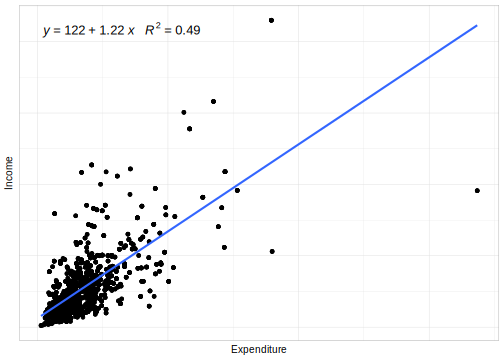
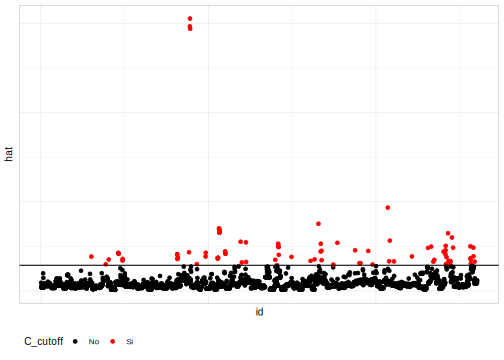

# Modelos de regresión bajo diseños de muestreo complejos

Un modelo matemático es una relación funcional entre variables. El interés consiste en encontrar modelos que relacionen un conjunto de variables de entrada provenientes de censos, registros administrativos, etc. con una variable de salida proveniente de encuestas de hogares. Normalmente en un proceso se tienen varias salidas, pero en este libro se estudia una variable de salida o respuesta del proceso que se asume condicionada a una, o que depende de los valores de una o más variables de entrada. 

A modo de contexto histórico (**Heringa**), los primeros autores en discutir, de manera empírica, el impacto que surten los diseños muestrales complejos en las inferencias relacionadas con modelos de regresión fueron  **Kish y Frankel (1974)**. Adicional a lo anterior, **Fuller (1975)** desarrolló un estimador de varianza tomando como insumos teóricos la linealización para modelos de regresión lineal múltiple con ponderación desigual de las observaciones e introdujo estimadores de varianza para parámetros de regresión estimados bajo diseños de muestreo estratificado y de dos etapas.

Ahora bien, como es bien sabido, para el uso de la teoría de modelos de regresión se requieren que se cumplan algunos supuestos estadísticos que en ocasiones no se cumplen. En este sentido,  **Sha et al. (1977)** discutieron las violaciones de dichos supuestos y métodos apropiados para hacer inferencias sobre los parámetros estimados de los modelos de regresión lineal usando datos de encuestas, y presentaron una evaluación empírica del desempeño de los estimadores de varianza basados en TSL. En relación con las distribuciones muestrales **Binder (1983)** se centró en dichas distribuciones muestrales de estimadores para parámetros de regresión en poblaciones finitas y estimadores de varianza relacionados definidos. **Skinner et al. (1989)** trabajaron estimadores de las varianzas para los coeficientes de regresión que permitieron diseños de muestras complejos y recomendaron el uso de métodos de linealización u otros métodos para la estimación de la varianza. Avanzando un poco en la línea de tiempo, **Fuller (2002)** generó un resumen de los métodos de estimación para modelos de regresión que contienen información relacionada con muestras complejas. Por último, **Pfeffermann (2011)** hizo una discusión sobre los distintos enfoques basados en el ajuste de modelos de regresión lineal a datos de encuestas de muestras complejas, presentando apoyo empírico para el uso de un método “q-weighted”.

Un modelo de regresión lineal simple se define como $y=\beta_{0}+\beta_{1}x+\varepsilon$ donde $y$ se define como la variable dependiente, $x$ es la variable independiente y $\beta_{0}$ y $\beta_{1}$ los parámetros del modelo. La variable $\varepsilon$ se conoce como el error aleatorio del modelo y se define como $\varepsilon=y-\hat{y}=y-\beta_{0}+\beta_{1}x$.

Generalizando el modelo anterior, se definen los modelos de regresión lineal múltiples como 

$$
y  =  \boldsymbol{x}\boldsymbol{\beta}+\varepsilon
  =  \sum_{j=0}^{p}\beta_{j}x_{j}+\varepsilon
 =  \beta_{0}+\beta_{1}x_{1}+\cdots+\beta_{p}x_{p}+\varepsilon
$$

Donde $x_{0}=1$. Por otro lado, se define como el valor esperado para la variable dependiente condicionado con las variables independientes $x$ como, $E\left(y\mid x\right)=\hat{\beta}_{0}+\hat{\beta_{1}}x_{1}+\hat{\beta}_{2}x_{2}+\cdots+\hat{\beta}_{p}x_{p}$. 

Otra manera de escribir el modelo de regresión múltiple es:

$$
y_{i}  =  x_{i}\boldsymbol{\beta}+\varepsilon_{i}
$$

donde, $x_{i}=\left[1\,x_{1i}\,\ldots\,x_{pi}\right]$ y $\boldsymbol{\beta}^{T}=\left[\beta_{0}\,\,\beta_{1}\,\,\ldots\,\,\beta_{p}\right]$.

El subíndice $i$ hace referencia al elemento muestral o respondiente
en el conjunto de datos. Algunas consideraciones para los modelos de regresión lineal son tomadas de **Heringa** y se describen a continuación:

-   $E\left(\varepsilon_{i}\mid x_{i}\right)=0,$ lo que significa que
el valor esperado de los residuos condicionado a un grupo de covariables
 es igual a 0.

-   $Var\left(\varepsilon_{i}\mid x_{i}\right)=\sigma_{y,x}^{2}$ (homogenidad
de varianza) lo que significa que, la varianza de los residuos condicionado
a un grupo de covariables es igual constante.

-   $\varepsilon_{i}\mid x_{i}\sim N\left(0,\,\sigma_{y,x}^{2}\right)$
(Normalidad en los errores) lo que significa que, los residuos condicionados
a un grupo de covariables se distribuye normal. Esta propiedad también
se extiende a la variable respuesta $y_{i}$.

-   $cov\left(\varepsilon_{i},\,\varepsilon_{j}\mid x_{i},x_{j}\right)$
(independencia en los residuales) los residuales en diferentes sujetos
no están correlacionados con los valores dados en sus variables predictoras.

Una vez definido el modelo de regresión lineal y sus supuestos, se puede deducir los siguiente:


$$
\hat{y}  =  E\left(y\mid x\right)
 =  E\left(\boldsymbol{x}\boldsymbol{\beta}\right)+E\left(\varepsilon\right)
=  \boldsymbol{x}\boldsymbol{\beta}+0
  =  \beta_{0}+\beta_{1}x_{1}+\cdots+\beta_{p}x_{p}
$$

y Adicionalmente,

$$
var\left(y_{i}\mid x_{i}\right)  =  \sigma_{y,x}^{2}
$$

$$
cov\left(y_{i},y_{j}\mid x_{i},x_{j}\right)  = 0
$$

$$
y_{i}  \sim  N\left(x_{i}\boldsymbol{\beta},\sigma_{y,x}^{2}\right)
$$


## Estimación de los parámetros en un modelo de regresión con muestras complejas.

Una vez se establecen los supuestos del modelo y las características distribucionales de los errores el paso siguientes es el proceso de estimación de los parámetros. A modo ilustrativo e introductorio al proceso de estimación de los parámetros con información provenientes de muestras complejas, si en lugar de observar una muestra de tamaño $n$ de los $N$ elementos de población se hubiera realizado un censo completo, el parámetro de regresión de población finita $\beta_{1}$ podría calcularse como sigue **(Tellez, et. al 2016)**:

$$
\beta_{1}  =  \frac{{\displaystyle \sum_{i=1}^{N}\left(X_{i}-\bar{X}\right)\left(Y_{i}-\bar{Y}\right)}}{\sum_{i=1}^{N}\left(X_{i}-\bar{X}\right)^{2}}
$$

Ahora bien, cuando se desea estimar los parámetros de un modelo de regresión lineal, pero considerando que la información muestral proviene de encuestas con muestras complejas se altera el enfoque estándar que se le da a la estimación de coeficientes de regresión y sus errores estándar.

La principal razón por la que los métodos de estimación de parámetros de los coeficientes de regresión cambian es que la información recolectada por medio de una encuesta con muestra compleja generalmente no está distribuida de manera idéntica dado que el diseño muestral así es planeado. En este contexto, al ajustar modelos  de regresión con este conjunto de datos, dado que los diseños complejos en su mayoría contienen estratificación, conglomerados, probabilidades de selección desiguales, etc, impiden el uso de estimadores de varianza convencionales que se pueden derivar por máxima verosimilitud puesto que, con esta metodología se asumen que los datos son independientes e idénticamente distribuidos y que provienen de alguna distribución de probabilidad (binomial, Poisson, exponencial, normal, etc.). En su lugar, según *Wolter, (2007)* se emplean métodos no paramétricos robustos basados en linealización de Taylor o métodos de estimación de la varianza usando replicación (Jackknife, bootstrapping, etc).

Con el fin de ilustrar la forma cómo se estiman los parámetros de regresión del modelo en el contexto de encuestas complejas se realizará estimando el parámetro $\beta_{1}$ y su varianza para una regresión lineal simple. La extensión a la estimación de los parámetros de un modelo de regresión múltiple, algebraicamente es compleja y se sale del contexto de este libro. A continuación, se presenta la estimación del intercepto y su varianza en un modelo de regresión lineal simple:

$$
\hat{\beta_{1}}  =  \frac{{\sum_{h}^{H}\sum_{\alpha}^{a_{h}}\sum_{i=1}^{n_{h\alpha}}\omega_{h\alpha i}\left(y_{h\alpha i}-\bar{y}_{\omega}\right)\left(x_{h\alpha i}-\bar{x}_{\omega}\right)}}{{ \sum_{h}^{H}\sum_{\alpha}^{a_{h}}\sum_{i=1}^{n_{h\alpha}}\omega_{h\alpha i}\left(x_{h\alpha i}-\bar{x}_{\omega}\right)^{2}}}
  = \frac{t_{xy}}{t_{x^{2}}}
$$

Como se puede observar en la ecuación anterior, el estimador del parámetro es un cociente de totales, por ende, su varianza estimada está dada por:

$$
var\left(\hat{\beta_{1}}\right)  =  \frac{var\left(t_{xy}\right)+\hat{\beta}_{1}^{2}var\left(t_{x^{2}}\right)-2\hat{\beta}_{1}cov\left(t_{xy},t_{x^{2}}\right)}{\left(t_{x^{2}}\right)^{2}}
$$

A modo de generalización según **Kish y Frankel, (1974)** para la estimación de la varianza en un modelo de regresión lineal múltiple los métodos de aproximación requieren totales de muestra ponderados para los cuadrados y productos cruzados de todas las combinaciones $y$ y $x = {1 x_{1} … x_{p}}$. A continuación, se presenta la estimación:


\begin{eqnarray*}
var\left(\hat{\beta}\right)=\hat{\Sigma}\left(\hat{\beta}\right) & = & \left[\begin{array}{cccc}
var\left(\hat{\beta}_{0}\right) & cov\left(\hat{\beta}_{0},\hat{\beta}_{1}\right) & \cdots & cov\left(\hat{\beta}_{0},\hat{\beta}_{p}\right)\\
cov\left(\hat{\beta}_{0},\hat{\beta}_{1}\right) & var\left(\hat{\beta}_{1}\right) & \cdots & cov\left(\hat{\beta}_{1},\hat{\beta}_{p}\right)\\
\vdots & \vdots & \ddots & \vdots\\
cov\left(\hat{\beta}_{0},\hat{\beta}_{p}\right) & cov\left(\hat{\beta}_{1},\hat{\beta}_{p}\right) & \cdots & var\left(\hat{\beta}_{p}\right)
\end{array}\right]
\end{eqnarray*}

Para ejemplificar los conceptos trabajados hasta este momento, se tomará la misma base que se ha venido trabajando durante todo el desarrollo de este libro. Se inicia con el cargue de las librerías, la base de datos y la definición del diseño de muestreo:


```r
knitr::opts_chunk$set(warning = FALSE, message = FALSE, error = FALSE)
options(digits = 4)
options(tinytex.verbose = TRUE)
library (survey)
library(srvyr)
library(convey)
library(TeachingSampling)
library(printr)
library(stargazer)
library(jtools)
library(broom)
```


Cargue de la base y definición del diseño muestral:


```r
data(BigCity, package = "TeachingSampling")
library(tidyverse)

encuesta <- readRDS("Data/encuesta.rds")
head(encuesta)
```


|HHID      |Stratum   | NIh| nIh|  dI|PersonID |PSU     |Zone  |Sex    | Age|MaritalST | Income| Expenditure|Employment |Poverty | dki| dk|       wk|Region |CatAge    |
|:---------|:---------|---:|---:|---:|:--------|:-------|:-----|:------|---:|:---------|------:|-----------:|:----------|:-------|---:|--:|--------:|:------|:---------|
|idHH00031 |idStrt001 |   9|   2| 4.5|idPer01  |PSU0003 |Rural |Male   |  68|Married   | 409.87|      346.34|Employed   |NotPoor |   8| 36| 34.50371|Norte  |Más de 60 |
|idHH00031 |idStrt001 |   9|   2| 4.5|idPer02  |PSU0003 |Rural |Female |  56|Married   | 409.87|      346.34|Employed   |NotPoor |   8| 36| 33.63761|Norte  |46-60     |
|idHH00031 |idStrt001 |   9|   2| 4.5|idPer03  |PSU0003 |Rural |Female |  24|Married   | 409.87|      346.34|Employed   |NotPoor |   8| 36| 33.63761|Norte  |16-30     |
|idHH00031 |idStrt001 |   9|   2| 4.5|idPer04  |PSU0003 |Rural |Male   |  26|Married   | 409.87|      346.34|Employed   |NotPoor |   8| 36| 34.50371|Norte  |16-30     |
|idHH00031 |idStrt001 |   9|   2| 4.5|idPer05  |PSU0003 |Rural |Female |   3|NA        | 409.87|      346.34|NA         |NotPoor |   8| 36| 33.63761|Norte  |0-5       |
|idHH00041 |idStrt001 |   9|   2| 4.5|idPer01  |PSU0003 |Rural |Female |  61|Widowed   | 823.75|      392.24|Employed   |NotPoor |   8| 36| 33.63761|Norte  |Más de 60 |

```r
library(srvyr)
diseno <- encuesta %>%
  as_survey_design(
    strata = Stratum,
    ids = PSU,
    weights = wk,
    nest = T
  )
```

Para efectos de los ejemplos y como se ha hecho en anteriores ocasiones, se divide la muestra en sub-grupos de la encuesta como sigue:


```r
sub_Urbano <- diseno %>%  filter(Zone == "Urban")
sub_Rural  <- diseno %>%  filter(Zone == "Rural")
sub_Mujer  <- diseno %>%  filter(Sex == "Female")
sub_Hombre <- diseno %>%  filter(Sex == "Male")
```

En este capítulo se ajustarán los modelos de regresión usando la base de datos de ejemplo que se ha venido trabajando en capítulos anteriores. Puesto que, en modelos de regresión, se utiliza muy frecuente el recurso gráfico. A continuación, se define un tema estándar que la CEPAL tiene para generar sus gráficos el cual se utilizará en este capítulo.


Para observar que existe una correlación entre el ingreso y el gasto, las cuales son las variables que se utilizarán para el ajuste de los modelos, se construye un scatterplot usando la librería `ggplot`. Cabe resaltar que, como la base de datos encuesta, la cual se usa para ejemplificar es una muestra de la base `BigCity`, analizaremos de manera gráfica si poblacionalmente las dos variables mencionadas anteriormente tienen correlación como se muestra a continuación:


```r
library(ggplot2); library(ggpmisc)
plot_BigCity <- ggplot(data = BigCity,
                       aes(x = Expenditure, y = Income)) +
                       geom_point() + geom_smooth(method = "lm",
                       se = FALSE,
                       formula = y ~ x) + theme_cepal()

plot_BigCity + stat_poly_eq(formula = y~x, aes(label = paste(..eq.label..,
   ..rr.label.., sep = "~~~"),size = 3), parse = TRUE)
```


Si bien, existen unas observaciones por fuera de la nube de punto, el comportamiento general de la relación ingresos vs gastos mantiene una tendencia lineal.

Una vez hecho el análisis gráfico de las variables a utilizar en los modelos a trabajar, se realizará primero un ajuste del modelo con los datos poblacionales y con esto poder analizar qué tan bueno serán los ajustes que se realizarán posteriormente. A continuación, se muestra el ajuste del modelo con los datos poblacionales:


```r
fit <- lm(Income ~ Expenditure, data = BigCity)
```

Ahora bien, para observar los parámetros poblacionales del modelo se utilizará la función `modelsummary` de la librería `modelsummary` de la siguiente manera:


Table: (\#tab:unnamed-chunk-4)Modelo BigCity

|            |   Pob   |
|:-----------|:-------:|
|(Intercept) | 123.337 |
|Expenditure |  1.229  |
|Num.Obs.    | 150266  |
|R2          |  0.359  |
|R2 Adj.     |  0.359  |
|RMSE        | 461.74  |

De la anterior salida se puede observar que, el intercepto es igual a 123.337 y el parámetro $\beta_{1}$ asociado al gasto es 1.229. La demás información relacionada a esta salida se analizará más adelante.

Una vez revisada la información poblacional, se utilizará la información obtenida de la muestra para estimar los parámetros y con ello analizar qué tan buenas son las estimaciones. A continuación, se presenta una sintaxis similar a la anterior que permite construir el scatterplot pero para los datos de la muestra.


```r
plot_sin <- ggplot(data = encuesta,
            aes(x = Expenditure, y = Income)) +
            geom_point() +
            geom_smooth(method = "lm",
            se = FALSE, formula = y ~ x) + theme_cepal()

plot_sin + stat_poly_eq(formula = y~x, aes(label = paste(..eq.label..,
     ..rr.label.., sep = "~~~"), size = 5), parse = TRUE)
```



Como se puede observar, los datos de la muestra tienen una tendencia lineal aunque un poco dispersa a medida que crecen los gastos en las familias.
 
 Una vez hecho los análisis gráficos se procede a ajustar los modelos de regresión lineal. A modo de comparar el efecto que tiene hacer un correcto uso de los factores de expansión del diseño, primero, se ajustará un modelo sin tener encuesta dichos factores como se muestra a continuación:
 

```r
fit_sinP <- lm(Income ~ Expenditure, data = encuesta)
fit_sinP
```

```
## 
## Call:
## lm(formula = Income ~ Expenditure, data = encuesta)
## 
## Coefficients:
## (Intercept)  Expenditure  
##      121.52         1.22
```

```r
stargazer(fit_sinP, header = FALSE,
          title = "Modelo sin factores de expansion", 
          style = "ajps")
```

```
## 
## \begin{table}[!htbp] \centering 
##   \caption{Modelo sin factores de expansion} 
##   \label{} 
## \begin{tabular}{@{\extracolsep{5pt}}lc} 
## \\[-1.8ex]\hline \\[-1.8ex] 
## \\[-1.8ex] & \textbf{Income} \\ 
## \hline \\[-1.8ex] 
##  Expenditure & 1.220$^{***}$ \\ 
##   & (0.025) \\ 
##   Constant & 121.516$^{***}$ \\ 
##   & (11.408) \\ 
##  N & 2605 \\ 
## R-squared & 0.487 \\ 
## Adj. R-squared & 0.487 \\ 
## Residual Std. Error & 345.012 (df = 2603) \\ 
## F Statistic & 2472.919$^{***}$ (df = 1; 2603) \\ 
## \hline \\[-1.8ex] 
## \multicolumn{2}{l}{$^{***}$p $<$ .01; $^{**}$p $<$ .05; $^{*}$p $<$ .1} \\ 
## \end{tabular} 
## \end{table}
```

Para el modelo ajustado sin factores de expansión, el $\hat{\beta}_{0}$ es  121.52 y el $\hat{\beta}_{1}$ asociado a la variable gastos es 1.22. 

Ahora, haciendo un Scatterplot con los datos encuesta pero utilizando los factores de expansión del diseño se debe agregar ` mapping = aes(weight = wk)` en la función `geom_smooth`como sigue:


```r
plot_Ponde <- ggplot(data = encuesta,
                     aes(x = Expenditure, y = Income)) + 
                     geom_point(aes(size = wk)) +
                     geom_smooth(method = "lm", se = FALSE, formula = y ~ x,                      mapping = aes(weight = wk)) + theme_cepal()

plot_Ponde + stat_poly_eq(formula = y~x, aes(weight = wk, 
label = paste(..eq.label..,..rr.label.., sep = "~~~")), parse = TRUE,size = 5)
```


En este sentido, para ajustar modelos teniendo en cuenta los factores de expansión existen 2 formas, la primera es usando la función `lm` y la segunda es usando la función `svyglm` de la librería `survey`. A continuación. se ajusta el modelo usando la función `lm`:


```r
fit_Ponde <- lm(Income ~ Expenditure, data = encuesta, weights = wk)
fit_Ponde
```

```
## 
## Call:
## lm(formula = Income ~ Expenditure, data = encuesta, weights = wk)
## 
## Coefficients:
## (Intercept)  Expenditure  
##     103.136        1.263
```

```r
stargazer(fit_Ponde, header = FALSE,
          title = "Modelo encuesta ponderada", 
          style = "ajps")
```

```
## 
## \begin{table}[!htbp] \centering 
##   \caption{Modelo encuesta ponderada} 
##   \label{} 
## \begin{tabular}{@{\extracolsep{5pt}}lc} 
## \\[-1.8ex]\hline \\[-1.8ex] 
## \\[-1.8ex] & \textbf{Income} \\ 
## \hline \\[-1.8ex] 
##  Expenditure & 1.263$^{***}$ \\ 
##   & (0.024) \\ 
##   Constant & 103.136$^{***}$ \\ 
##   & (11.264) \\ 
##  N & 2605 \\ 
## R-squared & 0.509 \\ 
## Adj. R-squared & 0.509 \\ 
## Residual Std. Error & 2626.691 (df = 2603) \\ 
## F Statistic & 2702.978$^{***}$ (df = 1; 2603) \\ 
## \hline \\[-1.8ex] 
## \multicolumn{2}{l}{$^{***}$p $<$ .01; $^{**}$p $<$ .05; $^{*}$p $<$ .1} \\ 
## \end{tabular} 
## \end{table}
```

Para el modelo ajustado con factores de expansión usando la función `lm`, el $\hat{\beta}_{0}$ es  103.14 y el $\hat{\beta}_{1}$ asociado a la variable gastos es 1.26. Ahora, haciendo el mismo ajuste pero usando la función `svyglm`:


```r
fit_svy <- svyglm(Income ~ Expenditure, 
                  design = diseno, family=stats::gaussian())
fit_svy
```

```
## Stratified 1 - level Cluster Sampling design (with replacement)
## With (238) clusters.
## Called via srvyr
## Sampling variables:
##  - ids: PSU
##  - strata: Stratum
##  - weights: wk
## 
## Call:  svyglm(formula = Income ~ Expenditure, design = diseno, family = stats::gaussian())
## 
## Coefficients:
## (Intercept)  Expenditure  
##     103.136        1.263  
## 
## Degrees of Freedom: 2604 Total (i.e. Null);  118 Residual
## Null Deviance:	    634600000 
## Residual Deviance: 311300000 	AIC: 38280
```

Obteniendo estimaciones para el $\hat{\beta}_{0}$ es  103.14 y el $\hat{\beta}_{1}$ asociado a la variable gastos es 1.26. Siendo exactamente las mismas que con la función `lm` ya que, como se definió en los argumentos de la función, la función de enlace es Gausiana.

Por último y a modo de resumen se muestra un gráfico donde se encuentran depositados todos los modelos estimados anteriormente y así poder comparar de manera gráfica su ajuste:


```r
df_model <- data.frame(
  intercept = c(coefficients(fit)[1],
               coefficients(fit_sinP)[1], 
               coefficients(fit_Ponde)[1],
               coefficients(fit_svy)[1]), 
  slope = c(coefficients(fit)[2],
               coefficients(fit_sinP)[2], 
               coefficients(fit_Ponde)[2],
               coefficients(fit_svy)[2]),
  Modelo = c("Población", "Sin ponderar", 
             "Ponderado(lm)", "Ponderado(svyglm)"))
plot_BigCity +  geom_abline( data = df_model,
    mapping = aes( slope = slope,
      intercept = intercept, linetype = Modelo,
      color = Modelo ), size = 2
  )
```


## Diagnóstico del modelo

En el análisis de las encuestas de hogares cuando se ajusten modelo estadístico es importante realizar verificaciones de calidad y con esto tener certezas de las conclusiones que se obtienen. La mayoría de textos académicos dan un panorama bastante detallado de los supuestos y consideraciones que se deben tener en cuenta para tener un modelo correctamente definido. A continuación, se enlistan algunas de ellas *(Tellez, 2016)*

-   Determinar si el modelo proporciona un adecuado ajuste a los datos.
-   Examinar si los errores están normalmente distribuidos.
-   Examinar si los errores tienen varianza constante.
-   Verificar si los errores se pueden asumir no correlacionados.
-   Determinar si alguno de los datos tiene valores con un efecto inusualmente grande sobre el modelo de regresión estimado, estos se conocen
como datos influyentes.
-   Determinar si algún punto no sigue la tendencia de la mayoría de los
datos cuando se toma en cuenta el modelo, estos puntos se conocen como outliers.

En este capítulo se abordarán alguno de los supuestos que se deben tener en cuenta al momento de ajustar un modelo de regresión lineal.

*Estimación del $R^{2}$ y $R_{adj}^{2}$*

Una medida del ajuste del modelo de regresión es el coeficiente de determinación o coeficiente de correlación múltiple ($R^{2})$). Dicho parámetro estima la proporción de la varianza de la población explicada por la regresión y oscila entre 0 y 1. Entre más cercano esté de uno significa que mayor variabilidad explica y lo contrario ocurrirá si está cerca de cero. Lo anterior, en ocasiones es muy ambigüo puesto que por ejemplo, los físicos pueden obtienen $R^{2}$ altísimos (mayores a 0.98–0.99) mientras que los químicos obtienen $R^{2}$ superiores a 0.90. Sin embargo, los científicos sociales y demás que trabajen con poblaciones humanas encontrarán que su mejor modelo de regresión a menudo explicará solo entre el 20 % y el 40 % de la variación en la variable dependiente (*Heringa*). A continuación, se presenta como se calcula este coeficiente:

$$
R^{2} =  1-\frac{SSE}{SST}
$$

Donde, SST es la suma de cuadrados totales y SSE es la suma de cuadrados del error. El estimador de este parámetro usando muestras complejas está dado por:

$$
R_{\omega}^{2} = 1-\frac{WSSE}{WSST}
$$

Donde, WSST es la variabilidad total estimada y WSSE es la suma de cuadrados estimada y se define como:

$$
\hat{WSSE_{\omega}}  =  \sum_{h}^{H}\sum_{\alpha}^{a_{h}}\sum_{i=1}^{n_{h\alpha}}\omega_{h\alpha i}\left(y_{h\alpha i}-x_{h\alpha i}\hat{\beta}\right)^{2}
$$

Por último, $R_{adj}^{2}$ se estima:

$$
R_{adj}^{2}  =  1-\frac{\left(n-1\right)}{\left(n-p\right)}R_{\omega}^{2}
$$

Para continuar con los modelos ajustados en la sección anterior, se procede a estimar los $R^{2}$ utilizando `R`. Inicialmente, se procede a estimar los parámetros del modelo utilizando la función `svyglm` de `survey` como se mostró anteriormente y también, se ajusta un modelo solo con el intercepto para obtener la estimación de la SST:


```r
fit_svy <- svyglm(Income ~ Expenditure, 
                  design = diseno)

modNul <- svyglm(Income ~ 1, design = diseno)

s1 <- summary(fit_svy)
s0 <-summary(modNul)

WSST<- s0$dispersion
WSSE<- s1$dispersion
```

Por tanto, la estimación del $R^{2}$ es: 


```r
R2 = 1- WSSE/WSST
R2
```

```
##      variance    SE
## [1,]  0.50942 19005
```

y, para estimar el $R_{adj}^{2}$ se requiere definir el diseño muestral pero incluyendo los q-weigthed **(Pffeferman, 2011)**. A continuación, se muestra los pasos para encontrar los q-weigthed:

-   Ajustar un modelo de regresión a los pesos finales de la encuesta utilizando las variables predictoras en el modelo de regresión de interés.


```r
fit_Nul <- lm(wk ~ 1, data = encuesta)
```

-   Obtener las predicciones de los pesos de la encuesta para cada caso como una función de las variables predictoras en el conjunto de datos


```r
qw <- predict(fit_Nul)
```

- Dividir los pesos finales de la encuesta por los valores predichos en el paso anterior:


```r
encuesta %<>% mutate(wk1 = wk/qw)
```

- Usar los nuevos pesos obtenidos para el ajuste de los modelos de regresión:


```r
diseno_qwgt <- encuesta %>%
  as_survey_design(
    strata = Stratum,
    ids = PSU,
    weights = wk1,
    nest = T)
```

Ahora bien, una vez definido el diseño muestral con los nuevos pesos q-weigthed, se procede a calcular el $R_{adj}^{2}$ como sigue:


```r
n = sum(diseno_qwgt$variables$wk)
p<- 2
R2Adj = 1-( ( (n-1)/(n-p) )*R2 )
R2Adj             
```

```
##      variance    SE
## [1,]  0.49058 19005
```

Como se puede observar, el $R_{adj}^{2}$ es un poco más bajo que el $R^{2}$ y cercanos al 50% que como se comentó anteriormente, dependiendo del contexto del problema se podrá concluir si es grande o pequeño.


Después de realizar la comparación entre las diferentes formas de estimar los coeficientes del modelo se opta  por la metodología consolidadas en  `svyglm`:


```r
diseno_qwgt %<>% mutate(Age2 = Age^2) 
mod_svy <- svyglm( Income ~ Expenditure + Zone + Sex + Age2 ,
                       design = diseno_qwgt)
s1 <- summary(mod_svy)
s0 <- summary(modNul)

mod_svy
```

Stratified 1 - level Cluster Sampling design (with replacement)
With (238) clusters.
Called via srvyr
Sampling variables:
 - ids: PSU
 - strata: Stratum
 - weights: wk1

Call:  svyglm(formula = Income ~ Expenditure + Zone + Sex + Age2, design = diseno_qwgt)

Coefficients:
(Intercept)  Expenditure    ZoneUrban      SexMale         Age2  
   62.18419      1.22548     63.46000     21.73256      0.00852  

Degrees of Freedom: 2604 Total (i.e. Null);  115 Residual
Null Deviance:	    634600000 
Residual Deviance: 3.08e+08 	AIC: 38260

```r
stargazer(mod_svy, header = FALSE,single.row = T,
           title = "Modelo propuesto", 
           style = "ajps",  omit.stat=c("bic", "ll"))
```


\begin{table}[!htbp] \centering 
  \caption{Modelo propuesto} 
  \label{} 
\begin{tabular}{@{\extracolsep{5pt}}lc} 
\\[-1.8ex]\hline \\[-1.8ex] 
\\[-1.8ex] & \textbf{Income} \\ 
\hline \\[-1.8ex] 
 Expenditure & 1.225$^{***}$ (0.198) \\ 
  ZoneUrban & 63.460 (40.090) \\ 
  SexMale & 21.733 (15.781) \\ 
  Age2 & 0.009 (0.006) \\ 
  Constant & 62.184 (62.989) \\ 
 N & 2605 \\ 
AIC & 38259.270 \\ 
\hline \\[-1.8ex] 
\multicolumn{2}{l}{$^{***}$p $<$ .01; $^{**}$p $<$ .05; $^{*}$p $<$ .1} \\ 
\end{tabular} 
\end{table} 


*Diagnósticos de los residuales*

En el diagnóstico de los modelos es crucial el análisis de los residuales. Estos análisis proporcionan, bajo el supuesto que el modelo ajustado es
adecuado, una estimación de los errores. Por tanto, un estudio cuidadoso
de los residuales deberá ayudar al investigador a concluir si el procedimiento de ajuste no ha violado los supuestos o si, por el contrario, uno o varios de los supuestos no se verifican y hay necesidad de revisar el procedimiento de ajuste. 

Para realizar el análisis de los residuales, en primera instancia, se definen los residuales de Pearson como sigue *(Heeringa)*

$$
r_{p_{i}}  =  \left(y_{i}-\mu_{i}\left(\hat{\beta}_{\omega}\right)\right)\sqrt{\frac{\omega_{i}}{V\left(\hat{\mu}_{i}\right)}}
$$
Donde, $\mu_{i}$ es el valor esperado de $y_{i}$,  $w_{i}$ es la ponderación de la encuesta para el i-ésimo individuo del diseño muestral complejo, Por último, $V(\mu_{i})$ es la función de varianza del resultado.

Otra definición que se debe tener en consideración para el análisis de los residuales es el de la matriz hat, la cual se estima como:

$$
H  =  W^{1/2}X\left(X'WX\right)^{-1}X'W^{1/2}
$$
donde,

$$
W  =  diag\left\{ \frac{\omega_{1}}{V\left(\mu_{1}\right)\left[g'\left(\mu_{1}\right)\right]^{2}},...,\frac{\omega_{n}}{V\left(\mu_{n}\right)\left[g'\left(\mu_{n}\right)\right]^{2}}\right\} 
$$
$W$ es una matriz diagonal de $n\times n$ y $g()$ es la función de enlace del modelo lineal generalizado.

Otras técnicas utilizadas también para el análisis de los modelos consisten en el análisis de observaciones influyentes. Una observación se denomina influyente si al removerlo de la nube de puntos este causa un cambio grande en el ajuste del modelo. Una observación importante para resaltar es que un punto influyente podría o no ser un dato atípico. Para detectar observaciones influyentes es necesario tener claro qué tipo de influencia se quiere detectar. Lo anterior puesto que, por ejemplo, una observación puede ser influyente sobre la estimación de los parámetros, pero no para la estimación de la varianza del error. A continuación, se presentan las distintas técnicas estadísticas para la detección de datos influyentes:

*Distancia de Cook's*: Diagnostica si la i-ésima observación es influyente
en la estimación del modelo, por estar lejos del centro de masa de los
datos. Se calcula de la siguiente manera:

$$
c_{i}=\frac{w_{i}^{*}w_{i}e_{i}^{2}}{p\phi V\left(\hat{\mu}_{i}\right)\left(1-h_{ii}\right)^{2}}\boldsymbol{x}_{i}^{t}\left[\widehat{Var}\left(U_{w}\left(\hat{\boldsymbol{B}}_{w}\right)\right)\right]^{-1}\boldsymbol{x}_{i}
$$

donde,

-   $w_i^* =$ Pesos de la encuesta.
-   $w_i$ Elementos por fuera de la diagonal de la matriz hat
-   $e_i=$ residuales
-   $p=$ número de parámetros del Modelo de regresión.
-   $\phi =$ parámetro de dispersión en el glm
-   $\widehat{Var}\left(U_{w}\left(\hat{\boldsymbol{B}}_{w}\right)\right) =$ estimación de varianza linealizada de la ecuación de puntuación, que se utiliza para pseudo MLE en modelos lineales generalizados ajustados a datos de encuestas de muestras complejas.

Luego del cálculo de la distancia de Cook's para las observaciones de la muestra, se procede a calcular el siguiente estadístico de prueba para evaluar la importancia de la estadística:


$$
\frac{\left(df-p+1\right)\times c_{i}}{df} \doteq F_{\left(p,df-p\right)}
$$

donde $df=$ grados de liberta basados en el diseño. Por otro lado, la literatura como *Tellez (2016)*, *Heeringa* considera a las observaciones influyentes cuando $c_{i}$ sean mayores a 2 o 3.


*$D_fBeta_{(i)}$*: Este estadístico mide el cambio en la estimación
del vector de coeficientes de regresión cuando la i-ésima observación
es eliminada. Se evalúa con la siguiente expresión:

$$
D_fBeta_{(i)} = \hat{B}-\hat{B}_{\left(i\right)}=\frac{\boldsymbol{A}^{-1}\boldsymbol{X}_{\left(i\right)}^{t}\hat{e}_{i}w_{i}}{1-h_{ii}}
$$

Donde $\boldsymbol{A} =\boldsymbol{X}^{t}\boldsymbol{WX}$ $\hat{B}_{(i)}$ es el vector de parámetros estimados una vez se ha eliminado la
i-ésima observación, $h_{ii}$ es el correspondiente elemento de la diagonal de *H* y $\hat{e}_i$ es el residual de la i-ésima observación.

Otra forma de reescribir este estadístico en términos de la matriz $H$ es:

$$
D_fBetas_{\left(i\right)}=\frac{{c_{ji}e_{i}}\big/{\left(1-h_{ii}\right)}}{\sqrt{v\left(\hat{B}_{j}\right)}}
$$

donde: 

  - $c_{ji}=$ es el ji-estimo elemento de $\boldsymbol{A}^{-1}w_{i}^{2}\boldsymbol{X}_{\left(i\right)}\boldsymbol{X}_{\left(i\right)}^{t}\boldsymbol{A}^{-1}$

 - El estimador de $v\left(\hat{B}_{j}\right)$ basado en el Modelo se obtiene como: $v_{m}\left(\hat{B}_{j}\right)=\hat{\sigma}\sum_{i=1}^{n}c_{ji}^{2}$ con $\hat{\sigma}=\sum_{i\in s}w_{i}e^2/ \left( \hat{N} - p \right)$ y $\hat{N} = \sum_{i \in s}w_{i}$

  - La i-ésima observación es influyente para $B_j$ si $\mid D_{f}Betas_{\left(i\right)j}\mid\geq\frac{z}{\sqrt{n}}$ con $z=$ 2 o 3

  - Como alternativa puede usar $t_{0.025,n-p}/\sqrt(n)$ donde $t_{0.025,n-p}$ es el percentil $97.5$


*Estadístico $D_{f}Fits_{\left(i\right)}$*: Este estadístico mide el cambio en el ajuste del modelo cuando se elimina el registro i-ésimo. Se calcula de la siguiente manera:

$$
D_{f}Fits_{\left(i\right)}= \frac{h_{ii}e_{i}\big/\left(1-h_{ii}\right)}{\sqrt{v\left(\hat{\beta}_{j}\right)}}
$$

Donde, $\sqrt{v\left(\hat{\beta}_{j}\right)}$ puede ser aproximada por el diseño o el Modelo. La i-ésima observación se considera influyente en el ajuste del Modelo si
$\mid DfFits\left(i\right)\mid\geq z\sqrt{\frac{p}{n}}$ con $z =$ 2 o 3

Por otro lado, un análisis que es de vital importancia en el ajuste de modelos de regresión más específicamente en el análisis de residuales es el de varianza constante en los errores. La principal consecuencia de no tener en cuenta la violación de este supuesto es que los estimadores pierden eficiencia. Si el supuesto de varianza constante no se cumple, los estimadores siguen siendo insesgados y consistentes, pero dejan de ser eficientes, es decir, dejan de ser los mejores en cuanto a que ya no tienen la menor varianza entre todos los estimadores insesgados. Como consecuencia de lo anterior, los intervalos de confianza serán más amplios y las pruebas t y F darán resultados imprecisos *(Tellez, 2016)*.

Una de las formas de analizar el supuesto de varianzas constantes en los errores es hacerlo de manera gráfica. Para ello, se grafica los residuos del modelo contra $\hat{y}$ o los residuos del modelo contra $X_{i}$. Si al realizar estos gráficos se logra evidenciar un patrón (funciones cuadráticas, cúbicas, logarítmicas, etc), se puede decir que la varianza de los errores no es constante.

Otro supuesto que se debe revisar en los errores al momento de realizar ajustes es la normalidad en lo errores. Una forma muy común para hacer dicha evaluación es realizar un gráfico cuantil-cuantil normal o QQplot. El QQplot es una gráfica de cuantiles para los residuos observados frente a los calculados a partir de una distribución normal teórica que tiene la misma media y varianza que la distribución de los residuos observados. Por lo tanto, una línea recta de 45° en este gráfico sugeriría que la normalidad es una suposición razonable para los errores aleatorios en el modelo.

A manera de ejemplificar los conceptos vistos, se van a utilizar los modelos previamente ajustados. En primero instancia, el análisis del modelo se centrará en los supuestos de normalidad y varianza constante en los errores. Primero, se realizará el análisis de la normalidad en los errores de manera gráfica como se muestra a continuación:


```r
par(mfrow = c(2,2))
plot(mod_svy)
```


Como se puedo observar en el QQplot, hay evidencia gráfica de que los errores no se distribuyen según una distribución normal.

La librería `svydiags` está pensada en ayudar en el diagnostico de modelos de regresión lineal, siendo una extensión más para complementar el paquete `survey`. Con las librerías `svydiags` se extraen los residuales estandarizados como sigue: 


```r
library(svydiags)
stdresids = as.numeric(svystdres(mod_svy)$stdresids)
diseno_qwgt$variables %<>% mutate(stdresids = stdresids)
```


Podemos hacer el análisis de normalidad también por medio del histograma de los residuales estandarizados como sigue: 


```r
ggplot(data = diseno_qwgt$variables,
       aes(x = stdresids)) +
  geom_histogram(aes(y = ..density..),
                 colour = "black", 
                 fill = "blue", alpha = 0.3) +
  geom_density(size = 2, colour = "blue") +
  geom_function(fun = dnorm, colour = "red",
                size = 2) +
  theme_cepal()+labs(y = "")
```

y como se puede observar gráficamente los errores no siguen una distribución normal. 

Por otro lado, el otro análisis que se realiza de manera gráfica es el de varianzas constantes el cual se realizará a continuación:


Primero, agreguemos las predicciones a la base de datos para poder realizar las gráficas.


```r
library(patchwork)
diseno_qwgt$variables %<>% 
  mutate(pred = predict(mod_svy))
g2 <- ggplot(data = diseno_qwgt$variables,
       aes(x = Expenditure, y = stdresids))+
  geom_point() +
  geom_hline(yintercept = 0) + theme_cepal()
g3 <- ggplot(data = diseno_qwgt$variables,
       aes(x = Age2, y = stdresids))+
  geom_point() +
  geom_hline(yintercept = 0) + theme_cepal()
```


```r
g4 <- ggplot(data = diseno_qwgt$variables,
       aes(x = Zone, y = stdresids))+
  geom_point() +
  geom_hline(yintercept = 0) + theme_cepal()
g5 <- ggplot(data = diseno_qwgt$variables,
       aes(x = Sex, y = stdresids))+
  geom_point() +  geom_hline(yintercept = 0) +
  theme_cepal()

(g2|g3)/(g4|g5)
```

Como se puede observar en las gráficas de gastos y edad, ambas muestran tendencias y no un comportamiento aleatorio. Por lo anterior, se puede decir que las varianzas no son constantes.

Otros de os análisis a realizar es revisar si existen datos influyentes en la base de datos. Para ejemplificar los conceptos definidos, se seguirán con los modelos ajustados en la sección anterior. Una vez ajustados estos modelos y verificados los supuestos, se procede a hacer el cálculo de la distancia de Cook's usando la función `svyCooksD`del paquete `svydiags` como sigue:


```r
library(svydiags) 
d_cook = data.frame(
   cook = svyCooksD(mod_svy), 
     id = 1:length(svyCooksD(mod_svy)))

table(d_cook$cook>3)


ggplot(d_cook, aes(y = cook, x = id)) +
  geom_point() + 
  theme_bw(20)
```

Como se puede observar, ninguna de las distancias de Cook's es mayor a 3 por lo que, podemos decir que no existen observaciones influyentes. 

Ahora bien, se desea observar si hay observaciones influyentes pero utilizando $D_{f}Betas_{\left(i\right)j}$ se realiza con la función `svydfbetas` como se muestra a continuación:


```r
d_dfbetas = data.frame(t(svydfbetas(mod_svy)$Dfbetas))
colnames(d_dfbetas) <- paste0("Beta_", 1:5)
d_dfbetas %>% slice(1:10L)
```


<table>
 <thead>
  <tr>
   <th style="text-align:right;"> Beta_1 </th>
   <th style="text-align:right;"> Beta_2 </th>
   <th style="text-align:right;"> Beta_3 </th>
   <th style="text-align:right;"> Beta_4 </th>
   <th style="text-align:right;"> Beta_5 </th>
  </tr>
 </thead>
<tbody>
  <tr>
   <td style="text-align:right;"> 0.0005544 </td>
   <td style="text-align:right;"> -0.0002176 </td>
   <td style="text-align:right;"> 0.0020984 </td>
   <td style="text-align:right;"> -0.0045432 </td>
   <td style="text-align:right;"> -0.0077196 </td>
  </tr>
  <tr>
   <td style="text-align:right;"> -0.0005745 </td>
   <td style="text-align:right;"> -0.0001378 </td>
   <td style="text-align:right;"> 0.0013896 </td>
   <td style="text-align:right;"> 0.0026485 </td>
   <td style="text-align:right;"> -0.0030881 </td>
  </tr>
  <tr>
   <td style="text-align:right;"> -0.0008522 </td>
   <td style="text-align:right;"> -0.0000546 </td>
   <td style="text-align:right;"> 0.0008822 </td>
   <td style="text-align:right;"> 0.0022298 </td>
   <td style="text-align:right;"> 0.0007935 </td>
  </tr>
  <tr>
   <td style="text-align:right;"> -0.0003870 </td>
   <td style="text-align:right;"> -0.0000551 </td>
   <td style="text-align:right;"> 0.0011523 </td>
   <td style="text-align:right;"> -0.0031478 </td>
   <td style="text-align:right;"> 0.0006928 </td>
  </tr>
  <tr>
   <td style="text-align:right;"> -0.0008850 </td>
   <td style="text-align:right;"> -0.0000401 </td>
   <td style="text-align:right;"> 0.0007854 </td>
   <td style="text-align:right;"> 0.0021273 </td>
   <td style="text-align:right;"> 0.0014197 </td>
  </tr>
  <tr>
   <td style="text-align:right;"> 0.0009195 </td>
   <td style="text-align:right;"> 0.0005560 </td>
   <td style="text-align:right;"> -0.0036343 </td>
   <td style="text-align:right;"> -0.0062969 </td>
   <td style="text-align:right;"> 0.0098007 </td>
  </tr>
  <tr>
   <td style="text-align:right;"> 0.0027031 </td>
   <td style="text-align:right;"> 0.0003880 </td>
   <td style="text-align:right;"> -0.0031253 </td>
   <td style="text-align:right;"> -0.0075726 </td>
   <td style="text-align:right;"> -0.0027665 </td>
  </tr>
  <tr>
   <td style="text-align:right;"> 0.0010931 </td>
   <td style="text-align:right;"> 0.0002906 </td>
   <td style="text-align:right;"> -0.0028323 </td>
   <td style="text-align:right;"> 0.0076881 </td>
   <td style="text-align:right;"> -0.0042777 </td>
  </tr>
  <tr>
   <td style="text-align:right;"> 0.0030304 </td>
   <td style="text-align:right;"> 0.0003560 </td>
   <td style="text-align:right;"> -0.0030245 </td>
   <td style="text-align:right;"> -0.0077961 </td>
   <td style="text-align:right;"> -0.0051035 </td>
  </tr>
  <tr>
   <td style="text-align:right;"> -0.0003135 </td>
   <td style="text-align:right;"> 0.0003715 </td>
   <td style="text-align:right;"> 0.0012078 </td>
   <td style="text-align:right;"> -0.0036874 </td>
   <td style="text-align:right;"> -0.0039914 </td>
  </tr>
</tbody>
</table>
Una vez calculado los $D_{f}Betas_{\left(i\right)j}$ se procede a acomodar la salida con para verificar cuáles observaciones son influyentes. Para esto, de calcula el umbral (cutoff) para definir si es o no influyente la observación. Ese umbral es tomado de las salidas de la función `svydfbetas`. Por último, se genera una variable dicotómica que indique si la observación es o no influyente como se muestra a continuación: 


```r
d_dfbetas$id <- 1:nrow(d_dfbetas)
d_dfbetas <- reshape2::melt(d_dfbetas, id.vars = "id")
cutoff <- svydfbetas(mod_svy)$cutoff
d_dfbetas %<>% mutate( Criterio = ifelse(abs(value) > cutoff, "Si", "No"))

tex_label <- d_dfbetas %>% 
  filter(Criterio == "Si") %>%
  arrange(desc(abs(value))) %>%
  slice(1:10L)
tex_label
```


<table>
 <thead>
  <tr>
   <th style="text-align:right;"> id </th>
   <th style="text-align:left;"> variable </th>
   <th style="text-align:right;"> value </th>
   <th style="text-align:left;"> Criterio </th>
  </tr>
 </thead>
<tbody>
  <tr>
   <td style="text-align:right;"> 889 </td>
   <td style="text-align:left;"> Beta_1 </td>
   <td style="text-align:right;"> 0.2781445 </td>
   <td style="text-align:left;"> Si </td>
  </tr>
  <tr>
   <td style="text-align:right;"> 890 </td>
   <td style="text-align:left;"> Beta_2 </td>
   <td style="text-align:right;"> -0.2592704 </td>
   <td style="text-align:left;"> Si </td>
  </tr>
  <tr>
   <td style="text-align:right;"> 891 </td>
   <td style="text-align:left;"> Beta_1 </td>
   <td style="text-align:right;"> 0.2558846 </td>
   <td style="text-align:left;"> Si </td>
  </tr>
  <tr>
   <td style="text-align:right;"> 889 </td>
   <td style="text-align:left;"> Beta_2 </td>
   <td style="text-align:right;"> -0.2537377 </td>
   <td style="text-align:left;"> Si </td>
  </tr>
  <tr>
   <td style="text-align:right;"> 891 </td>
   <td style="text-align:left;"> Beta_2 </td>
   <td style="text-align:right;"> -0.2490529 </td>
   <td style="text-align:left;"> Si </td>
  </tr>
  <tr>
   <td style="text-align:right;"> 890 </td>
   <td style="text-align:left;"> Beta_1 </td>
   <td style="text-align:right;"> 0.2456031 </td>
   <td style="text-align:left;"> Si </td>
  </tr>
  <tr>
   <td style="text-align:right;"> 2311 </td>
   <td style="text-align:left;"> Beta_5 </td>
   <td style="text-align:right;"> 0.2056438 </td>
   <td style="text-align:left;"> Si </td>
  </tr>
  <tr>
   <td style="text-align:right;"> 889 </td>
   <td style="text-align:left;"> Beta_5 </td>
   <td style="text-align:right;"> -0.1992701 </td>
   <td style="text-align:left;"> Si </td>
  </tr>
  <tr>
   <td style="text-align:right;"> 890 </td>
   <td style="text-align:left;"> Beta_5 </td>
   <td style="text-align:right;"> -0.1787722 </td>
   <td style="text-align:left;"> Si </td>
  </tr>
  <tr>
   <td style="text-align:right;"> 890 </td>
   <td style="text-align:left;"> Beta_4 </td>
   <td style="text-align:right;"> 0.1615834 </td>
   <td style="text-align:left;"> Si </td>
  </tr>
</tbody>
</table>

Como se pudo observar en la salida anterior hay varias observaciones que resultan influyentes dado el criterio del $D_{f}Betas_{\left(i\right)j}$. A continuación, y de manera ilustrativa, se grafican los $D_{f}Betas_{\left(i\right)j}$ y el umbral con el fin de ver de manera gráfica aquellas observaciones influyentes, teniendo en cuenta que, aquellos puntos rojos en la gráfica representan observaciones influyentes.


```r
ggplot(d_dfbetas, aes(y = abs(value), x = id)) +
  geom_point(aes(col = Criterio)) +
  geom_text(data = tex_label,
            angle = 45,
            vjust = -1,
            aes(label = id)) +
  geom_hline(aes(yintercept = cutoff)) +
  facet_wrap(. ~ variable, nrow = 2) +
  scale_color_manual(
    values = c("Si" = "red", "No" = "black")) +
  theme_cepal()
```
Si el objetivo ahora es detectar observaciones influyentes pero considerando ahora la estadística $D_{f}Fits_{\left(i\right)}$, se utiliza la función `svydffits` y se siguen los mismos pasos mostrados para el estadístico $D_{f}Betas_{\left(i\right)j}$:


```r
d_dffits = data.frame( dffits = svydffits(mod_svy)$Dffits, 
                       id = 1:length(svydffits(mod_svy)$Dffits))

cutoff <- svydffits(mod_svy)$cutoff

d_dffits %<>% mutate(C_cutoff = ifelse(abs(dffits) > cutoff, "Si", "No"))
ggplot(d_dffits, aes(y = abs(dffits), x = id)) +
  geom_point(aes(col = C_cutoff)) + 
  geom_hline(yintercept = cutoff) + 
   scale_color_manual(
    values = c("Si" = "red", "No" = "black"))+
  theme_cepal()
```

Como se puede observar en el gráfico anterior, también hay observaciones influyentes utilizando $D_{f}Fits_{\left(i\right)}$, las cuales se muestran en rojo en el gráfico.

Un último acercamiento que se trabajará en este texto para la detección de datos influyentes está encaminado al uso de la matriz *H*. En este sentido, la matriz asociada al Estimador de Pseudo Máxima Verosimilitud (PMLE) de $\hat{\boldsymbol{B}}$ es $\boldsymbol{H}=\boldsymbol{XA}^{-1}\boldsymbol{X}^{-t}\boldsymbol{W}$ cuya diagonal esta dado por $h_{ii} = \boldsymbol{x_{i}^tA}^{-1}\boldsymbol{x_{i}}^{-t}w_{i}$. Utilizando la matriz *H*, una observación puede ser grande y, como resultado, influir en las predicciones, cuando un $x_i$ es considerablemente diferente del promedio ponderado $\bar{x}_w=\sum_{i\in s}w_{i}\boldsymbol{x_{i}}\big/\sum_{i\in s}w_i$. Según *(Tellez, 2016)* una observación es considerada grande si es mayor a tres veces el promedio de los $h_{ii}$. A continuación, se muestra el procedimiento en `R` cuya función a utilizar es `svyhat`:


```r
vec_hat <- svyhat(mod_svy, doplot = FALSE)
d_hat = data.frame(hat = vec_hat, id = 1:length(vec_hat))
d_hat %<>% mutate(C_cutoff = ifelse(hat > (3 * mean(hat)),"Si", "No"))

ggplot(d_hat, aes(y = hat, x = id)) +
  geom_point(aes(col = C_cutoff)) + 
  geom_hline(yintercept = (3 * mean(d_hat$hat))) +
  scale_color_manual(
    values = c("Si" = "red", "No" = "black"))+
  theme_cepal()
```



Dado que esta última técnica es empírica, se puede observar en el gráfico anterior que hay varias observaciones posiblemente influyentes en el conjunto de datos de la muestra de hogares.


## Inferencia sobre los parámetros del Modelo

Una vez evaluado el correcto ajuste del modelo utilizando las metodologías vistas anteriormente y corroborando las propiedades distribucionales de los errores y por ende, de la variable respuesta $y$, el paso siguiente es verificar si los parámetros estimados son significativos y por ende, las covariables utilizadas para ajustar el modelo aportan significativamente para explicar o predecir a la variable de estudio $y$. 

Dada las propiedades distribucionales de los $\beta's$, un estadístico de prueba natural para evaluar la significancia de dicho parámetro se basa en la distribución "t-student" y se describe a continuación:


$$
t=\frac{\hat{\beta}_{k}-\beta_{k}}{se\left(\hat{\beta}_{k}\right)}\sim t_{n-p}
$$

Donde $p$ es el número de parámetros del modelo y $n$ el tamaño de la muestra de la encuesta. En este sentido, el estadístico de prueba anterior evalúa las hipótesis $H_{0}:\beta_{k}=0$ versus la alternativa $H_{1}:\beta_{k}\neq0$.

De las propiedades distribucionales de los $\beta$, se puede construir un intervalo de confianza al $(1-\alpha)\times100\%$ para $\beta_{k}$ está dado por:

$$
\hat{\beta}_{k}\pm t_{1-\frac{\alpha}{2},\,df}\,se\left(\hat{\beta}_{k}\right)
$$

Donde, los grados de libertad para el intervalo ($df$) en una encuesta de hogares (muestras complejas) está dado por el número de conglomerados finales de la primera etapa menos el número de estratos de la etapa primaria $\left(df=\sum_{h}a_{h}-H\right)$.

Para la aplicación de las temáticas vistas, es decir, realizar la prueba de hipótesis y los intervalos de confianza para los parámetros utilizaremos el modelo que se ha venido trabajando y aplicaremos las funciones `summary.svyglm` para las pruebas t y `confint.svyglm` para los intervalos de confianza como sigue:


```r
survey:::summary.svyglm(mod_svy)
```

```
## 
## Call:
## svyglm(formula = Income ~ Expenditure + Zone + Sex + Age2, design = diseno_qwgt)
## 
## Survey design:
## Called via srvyr
## 
## Coefficients:
##             Estimate Std. Error t value Pr(>|t|)    
## (Intercept) 62.18419   62.98928   0.987    0.326    
## Expenditure  1.22548    0.19798   6.190 9.55e-09 ***
## ZoneUrban   63.46000   40.09025   1.583    0.116    
## SexMale     21.73256   15.78081   1.377    0.171    
## Age2         0.00852    0.00557   1.530    0.129    
## ---
## Signif. codes:  0 '***' 0.001 '**' 0.01 '*' 0.05 '.' 0.1 ' ' 1
## 
## (Dispersion parameter for gaussian family taken to be 118297.1)
## 
## Number of Fisher Scoring iterations: 2
```

```r
survey:::confint.svyglm(mod_svy)
```


<table>
 <thead>
  <tr>
   <th style="text-align:left;">   </th>
   <th style="text-align:right;"> 2.5 % </th>
   <th style="text-align:right;"> 97.5 % </th>
  </tr>
 </thead>
<tbody>
  <tr>
   <td style="text-align:left;"> (Intercept) </td>
   <td style="text-align:right;"> -62.5854545 </td>
   <td style="text-align:right;"> 186.9538331 </td>
  </tr>
  <tr>
   <td style="text-align:left;"> Expenditure </td>
   <td style="text-align:right;"> 0.8333309 </td>
   <td style="text-align:right;"> 1.6176354 </td>
  </tr>
  <tr>
   <td style="text-align:left;"> ZoneUrban </td>
   <td style="text-align:right;"> -15.9510648 </td>
   <td style="text-align:right;"> 142.8710655 </td>
  </tr>
  <tr>
   <td style="text-align:left;"> SexMale </td>
   <td style="text-align:right;"> -9.5261885 </td>
   <td style="text-align:right;"> 52.9913044 </td>
  </tr>
  <tr>
   <td style="text-align:left;"> Age2 </td>
   <td style="text-align:right;"> -0.0025129 </td>
   <td style="text-align:right;"> 0.0195537 </td>
  </tr>
</tbody>
</table>

De lo anterior se puede observar que, con una confianza del 95% el único parámetro significativo del modelo es Expenditure y ese mismo resultado lo reflejan los intervalos de confianza.

*Estimación de una observación*

Los modelos de regresión lineales, según *(Neter et al., 1996).*, son utilizado esencialmente con 2 fines, el primero es tratar de explicar la variable respuesta en términos de covariables que pueden encontrarse en la encuesta o en registros administrativos, censos, etc. Adicionalmente, también son usados para predecir valores de la variable en estudio ya sea dentro del intervalo de valores recogidos en la muestra o por fuera de dicho intervalo. Lo primero se ha abordado a lo largo de todo el capítulo y lo segundo se obtiene de la siguiente manera:


$$
\hat{E}(y_{i}\mid\boldsymbol{x}_{obs,i})=\boldsymbol{x}_{obs,i}\hat{\boldsymbol{\beta}}
$$

De manera explícita, si se ajusta un modelo con 4 covariables la expresión sería:

$$
\hat{E}(y_{i}\mid\boldsymbol{x}_{obs,i})=\hat{\beta}_{0}+\hat{\beta}_{1}x_{1i}+\hat{\beta}_{2}x_{2i}+\hat{\beta}_{3}x_{3i}+\hat{\beta}_{4}x_{4i}
$$

La varianza de la estimación se calcula de la siguiente manera:

$$
var\left(\hat{E}\left(y_{i}\mid x_{obs,i}\right)\right) 
=  x'_{obs,i}cov\left(\hat{\beta}\right)x{}_{obs,i}
$$

A continuación, se presenta cómo se realiza la estimación del valor esperado, primero se estiman los parámetros del modelo:


<table>
 <thead>
  <tr>
   <th style="text-align:left;"> term </th>
   <th style="text-align:right;"> estimate </th>
   <th style="text-align:right;"> std.error </th>
   <th style="text-align:right;"> statistic </th>
   <th style="text-align:right;"> p.value </th>
  </tr>
 </thead>
<tbody>
  <tr>
   <td style="text-align:left;"> (Intercept) </td>
   <td style="text-align:right;"> 62.1841893 </td>
   <td style="text-align:right;"> 62.9892815 </td>
   <td style="text-align:right;"> 0.9872186 </td>
   <td style="text-align:right;"> 0.3256080 </td>
  </tr>
  <tr>
   <td style="text-align:left;"> Expenditure </td>
   <td style="text-align:right;"> 1.2254831 </td>
   <td style="text-align:right;"> 0.1979760 </td>
   <td style="text-align:right;"> 6.1900606 </td>
   <td style="text-align:right;"> 0.0000000 </td>
  </tr>
  <tr>
   <td style="text-align:left;"> ZoneUrban </td>
   <td style="text-align:right;"> 63.4600003 </td>
   <td style="text-align:right;"> 40.0902478 </td>
   <td style="text-align:right;"> 1.5829286 </td>
   <td style="text-align:right;"> 0.1161841 </td>
  </tr>
  <tr>
   <td style="text-align:left;"> SexMale </td>
   <td style="text-align:right;"> 21.7325579 </td>
   <td style="text-align:right;"> 15.7808095 </td>
   <td style="text-align:right;"> 1.3771510 </td>
   <td style="text-align:right;"> 0.1711403 </td>
  </tr>
  <tr>
   <td style="text-align:left;"> Age2 </td>
   <td style="text-align:right;"> 0.0085204 </td>
   <td style="text-align:right;"> 0.0055701 </td>
   <td style="text-align:right;"> 1.5296627 </td>
   <td style="text-align:right;"> 0.1288463 </td>
  </tr>
</tbody>
</table>

Por lo anterior, la estimación del valor esperado o predicción queda:

$$
\hat{E}(y_{i}\mid\boldsymbol{x}_{obs,i})=62.2+1.2x_{1i}+63.5x_{2i}+21.7x_{3i}+0.01x_{4i}
$$
Para calcular la varianza de la estimación, primero se deben obtener las varianzas de la estimación de los parámetros: 


```r
vcov(mod_svy)
```


<table>
 <thead>
  <tr>
   <th style="text-align:left;">   </th>
   <th style="text-align:right;"> (Intercept) </th>
   <th style="text-align:right;"> Expenditure </th>
   <th style="text-align:right;"> ZoneUrban </th>
   <th style="text-align:right;"> SexMale </th>
   <th style="text-align:right;"> Age2 </th>
  </tr>
 </thead>
<tbody>
  <tr>
   <td style="text-align:left;"> (Intercept) </td>
   <td style="text-align:right;"> 3967.6495831 </td>
   <td style="text-align:right;"> -11.3101288 </td>
   <td style="text-align:right;"> 275.9857536 </td>
   <td style="text-align:right;"> 312.4533433 </td>
   <td style="text-align:right;"> -0.1851869 </td>
  </tr>
  <tr>
   <td style="text-align:left;"> Expenditure </td>
   <td style="text-align:right;"> -11.3101288 </td>
   <td style="text-align:right;"> 0.0391945 </td>
   <td style="text-align:right;"> -3.5525825 </td>
   <td style="text-align:right;"> -0.5004199 </td>
   <td style="text-align:right;"> 0.0005145 </td>
  </tr>
  <tr>
   <td style="text-align:left;"> ZoneUrban </td>
   <td style="text-align:right;"> 275.9857536 </td>
   <td style="text-align:right;"> -3.5525825 </td>
   <td style="text-align:right;"> 1607.2279681 </td>
   <td style="text-align:right;"> -130.7107596 </td>
   <td style="text-align:right;"> -0.0559166 </td>
  </tr>
  <tr>
   <td style="text-align:left;"> SexMale </td>
   <td style="text-align:right;"> 312.4533433 </td>
   <td style="text-align:right;"> -0.5004199 </td>
   <td style="text-align:right;"> -130.7107596 </td>
   <td style="text-align:right;"> 249.0339481 </td>
   <td style="text-align:right;"> -0.0043208 </td>
  </tr>
  <tr>
   <td style="text-align:left;"> Age2 </td>
   <td style="text-align:right;"> -0.1851869 </td>
   <td style="text-align:right;"> 0.0005145 </td>
   <td style="text-align:right;"> -0.0559166 </td>
   <td style="text-align:right;"> -0.0043208 </td>
   <td style="text-align:right;"> 0.0000310 </td>
  </tr>
</tbody>
</table>

Ahora bien, se procede a realizar los cálculos como lo indica la expresión mostrada anteriormente:


```r
xobs <- model.matrix(mod_svy) %>%
        data.frame() %>% slice(1) %>% as.matrix()

cov_beta <- vcov(mod_svy) %>% as.matrix()

as.numeric(xobs %*% cov_beta %*% t(xobs))
```

```
## [1] 1920.837
```

Si el objetivo ahora es calcular el intervalo de confianza para la predicción se utiliza la siguiente ecuación:


$$
\boldsymbol{x}_{obs,i}\hat{\beta}\pm t_{\left(1-\frac{\alpha}{2},n-p\right)}\sqrt{var\left(\hat{E}\left(y_{i}\mid\boldsymbol{x}_{obs,i}\right)\right)}
$$

Para realizar los cálculos en R, se utiliza la función `confint` y `predict` como sigue:


```r
pred <- data.frame(predict(mod_svy, type = "link"))
pred_IC <- data.frame(confint(predict(mod_svy, type = "link")))
colnames(pred_IC) <- c("Lim_Inf", "Lim_Sup")
pred_IC
```

Ahora, de manera gráfica las predicciones e intervalos se vería de la siguiente manera:


```r
pred <- bind_cols(pred, pred_IC)
pred$Expenditure <- encuesta$Expenditure
pred %>% slice(1:6L)
pd <- position_dodge(width = 0.2)
ggplot(pred %>% slice(1:100L),
       aes(x = Expenditure , y = link)) +
  geom_errorbar(aes(ymin = Lim_Inf,
                    ymax = Lim_Sup),
                width = .1,
                linetype = 1) +
  geom_point(size = 2, position = pd) +
  theme_bw()
```

Por último, si el interés es hacer una predicción fuera del rango de valores que fue capturado en la muestra. Para esto, supongamos que se desea predecir:


```r
datos_nuevos <- data.frame(Expenditure = 1600, 
                           Age2 = 40^2, Sex = "Male", 
                           Zone = "Urban")
```

La varianza para la predicción se hace siguiendo la siguiente ecuación:

$$
var\left(\hat{E}\left(y_{i}\mid\boldsymbol{x}_{obs,i}\right)\right)=\boldsymbol{x}_{obs,i}^{t}cov\left(\boldsymbol{\beta}\right)\boldsymbol{x}_{obs,i} + \hat{\sigma}^2_{yx}
$$

Por tanto, se construye la matriz de observaciones y se calcula la varianza como sigue:


```r
x_noObs = matrix(c(1,1600,1,1,40^2),nrow = 1)
as.numeric(sqrt(x_noObs%*%cov_beta%*%t(x_noObs)))
```

```
## [1] 244.6294
```

Por último, el intervalo de confianza sigue la siguiente ecuación:

$$
\boldsymbol{x}_{obs,i}\hat{\beta}\pm t_{\left(1-\frac{\alpha}{2},n-p\right)}\sqrt{var\left(\hat{E}\left(y_{i}\mid\boldsymbol{x}_{obs,i}\right)\right)+\hat{\sigma}_{yx}^{2}}
$$
En `R` se hace la predicción de la siguiente manera:


```r
predict(mod_svy, newdata = datos_nuevos, type =  "link")
```

```
##     link     SE
## 1 2121.8 244.63
```

y el intervalo:

```r
confint(predict(mod_svy,newdata = datos_nuevos))
```


<table>
 <thead>
  <tr>
   <th style="text-align:right;"> 2.5 % </th>
   <th style="text-align:right;"> 97.5 % </th>
  </tr>
 </thead>
<tbody>
  <tr>
   <td style="text-align:right;"> 1642.318 </td>
   <td style="text-align:right;"> 2601.247 </td>
  </tr>
</tbody>
</table>
