# Gráficas en R

El objetivo de esta capítulo es mostrarle al lector cómo hacer gráficos generales en `R`. En todo análisis de encuestas, el componente gráfico es fundamental para revisar tendencias en algunas variables de interés. También son muy necesarias las gráficas cuando se el objetivo es chequear algunos supuestos en el ajustes de modelo, por ejemplo, varianza constante en los errores, normalidad, etc.

Uno de los paquetes más usados para graficar en `R` es ggplot2 el cual es un paquete potente y flexible, implementado por Hadley Wickham, para producir gráficos elegantes. El gg en ggplot2 significa Grammar of Graphics, el cual es un concepto gráfico que describe gráficos usando gramática.

Como es de costumbre, se inicia este capítulo cargando las librerías y bases de datos:


```r
# knitr::opts_chunk$set(cache = TRUE, warning = FALSE, message = FALSE, error = FALSE)
options(digits = 4)
library(survey)
library(srvyr)
library(convey)
library(TeachingSampling)
library(printr)
library(ggplot2)
library(patchwork)
```


El cargue de la base de datos se hace a continuación,


```r
data(BigCity, package = "TeachingSampling")
encuesta <- readRDS("Data/encuesta.rds")
```

A continuación, se define el diseño de muestreo:


```r
library(srvyr)
diseno <- encuesta %>%
  as_survey_design(
    strata = Stratum,
    ids = PSU,
    weights = wk,
    nest = T
  )
```

A partir de las variables de la encuesta, para efectos de los ejemplos, se definen las siguientes variables:


```r
diseno <- diseno %>% mutate(
  pobreza = ifelse(Poverty != "NotPoor", 1, 0),
  desempleo = ifelse(Employment == "Unemployed", 1, 0),
  edad_18 = case_when(
    Age < 18 ~ "< 18 años",
    TRUE ~ ">= 18 años"
  )
)
```

Como se mostró en capítulos anteriores, se divide la muestra en sub grupos para ejemplificar los conceptos que se mostrarán en este capítulo:


```r
sub_Urbano <- diseno %>% filter(Zone == "Urban")
sub_Rural <- diseno %>% filter(Zone == "Rural")
sub_Mujer <- diseno %>% filter(Sex == "Female")
sub_Hombre <- diseno %>% filter(Sex == "Male")
```

Para crear las gráficas en este texto se utilizará por defecto el tema que la CEPAL tiene asignado por defecto. El tema se define a continuación:


```r
theme_cepal <- function(...) {
  theme_light(10) +
    theme(
      axis.text.x = element_blank(),
      axis.ticks.x = element_blank(),
      axis.text.y = element_blank(),
      axis.ticks.y = element_blank(),
      legend.position = "bottom",
      legend.justification = "left",
      legend.direction = "horizontal",
      plot.title = element_text(size = 20, hjust = 0.5),
      ...
    )
}
```

## Histogramas para graficar variables continuas. 

Un histograma es una representación gráfica de los datos de una variable empleando
rectángulos (barras) cuya altura es proporcional a la frecuencia de los valores representados y su ancho proporcional a la amplitud de los intervalos de la clase.

Como se mencionó anteriormente, las gráficas se realizarán principalmente con la librería `ggplot2`y nos apoyamos en la librería `patchwork` para organizar la visual de las gráficas. A continuacuón, se presenta cómo realizar un histograma para la variable ingresos utilizando los factores de expansión de la encuesta. EN primera instancia se define la fuente de información (data), luego se definen la variable a graficar (x) y los pesos de muestreo (weight). Una vez definido los parámetros generales del gráfico se define el tipo de gráfico, que para nuestro caso como es un histograma es geom_histogram. Se definen los títulos que se quiere que tenga el histograma y por último, se aplica el tema de la CEPAL.


```r
plot1_Ponde <- ggplot(
  data = encuesta,              
  aes(x = Income, weight = wk)) +
  geom_histogram(               
    aes(y = ..density..)) +        
  ylab("") +                   
  ggtitle("Ponderado") +        
  theme_cepal()  
plot1_Ponde
```


De forma análoga se define el siguiente histograma, note que en este caso se omitió el parámetro `weight`. Es decir, se genera un histograma sin pesos de muestreo:


```r
plot1_SinPonde <-
  ggplot(encuesta, aes(x = Income)) +
  geom_histogram(aes(y = ..density..)) +
  ylab("") +
  ggtitle("Sin ponderar") +
  theme_cepal()
plot1_SinPonde
```


Ahora bien, para efectos de comparación, se grafica la variable ingreso tomada de la población (BigCity) y se muestran los tres histogramas para notar las diferencias que tienen en comparación con el poblacional.  


```r
plot1_censo <- ggplot(BigCity, aes(x = Income)) +
  geom_histogram(aes(y = ..density..)) +
  ylab("") +
  ggtitle("Poblacional") +
  theme_cepal() +
  xlim(0, 2500)

plot1_censo | plot1_Ponde | plot1_SinPonde
```

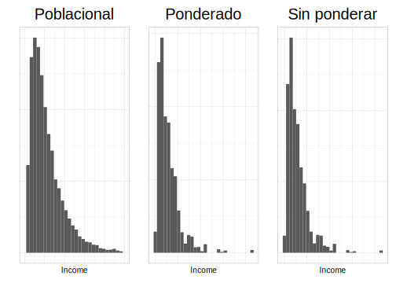

Por otro lado, repetimos ahora la secuencia de gráficos pero en este caso para la variable *Expenditure*:


```r
plot2_Ponde <- ggplot(
  data =  encuesta,
  aes(x = Expenditure, weight = wk)
) +
  geom_histogram(aes(y = ..density..)) +
  ylab("") +
  ggtitle("Ponderado") +
  theme_cepal()
plot2_Ponde
```


```r
plot2_SinPonde <- ggplot(data = encuesta,
      aes(x = Expenditure)) +
      geom_histogram(aes(y = ..density..)) +
      ylab("") +
      ggtitle("Sin ponderar") +
      theme_cepal()
plot2_SinPonde
```

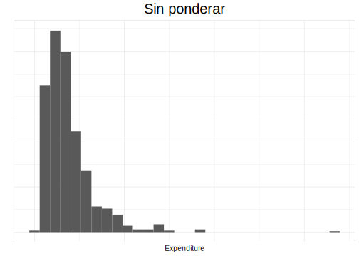


```r
plot2_censo <- ggplot(BigCity, aes(x = Expenditure)) +
  geom_histogram(aes(y = ..density..)) +
  ylab("") +
  ggtitle("Poblacional") +
  theme_cepal() +
  xlim(0, 1500)

plot2_censo | plot2_Ponde | plot2_SinPonde
```

Como conclusión, de ambos ejercicios, se puede observar que el histograma que mejor se aproxima al poblacional es aquel que utiliza los pesos de muestreo, aunque el gráfico que no los utiliza se aproxima bien y esto debido a la correcta selección de la muestra.

Por otro lado, cuando el interés ahora es realizar comparaciones entre dos o más agrupaciones, es posible hacer uso del parámetro `fill`, el cual "rellena" las barras del histograma con diferentes colores según sea el grupo. Para este ejemplo, se van a graficar subgrupos por zonas:   


```r
plot3_Ponde <- ggplot(
  encuesta,
  aes(x = Income, weight = wk)) +
  geom_histogram(
    aes(y = ..density.., fill = Zone),
    alpha = 0.5,
     position = "identity" 
  ) +
  ylab("") +
  ggtitle("Ponderado") +
  theme_cepal()
plot3_Ponde
```

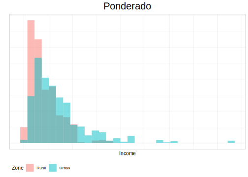

Como se pudo observar en la generación del histograma, se utilizó el parámetro position el cual permite que las barras del gráfico sean distingibles.


Ahora se graficará la misma variable pero esta vez sin los pesos de muestreo:


```r
plot3_SinPonde <- ggplot(encuesta, aes(x = Income)) +
  geom_histogram(aes(y = ..density.., fill = Zone),
    alpha = 0.5, position = "identity"
  ) +
  ggtitle("Sin ponderar") +
  theme_cepal() +
  ylab("")
plot3_SinPonde
```

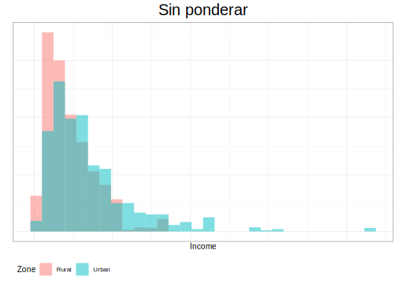

Ahora, siguiendo el esquema de comparación anterior, se graficará la variable ingreso usando la información de la población y los subgrupos de zonas definidos anteriormente y por último, se muestran los 3 histogramas para poder compararlos:


```r
plot3_censo <- ggplot(BigCity, aes(x = Income)) +
  geom_histogram(aes(y = ..density.., fill = Zone),
    alpha = 0.5, position = "identity"
  ) +
  ggtitle("Poblacional") +
  theme_cepal() +
  xlim(0, 1500) +
  ylab("")
plot3_censo | plot3_Ponde | plot3_SinPonde
```

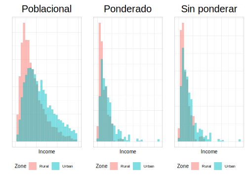

Ahora, repetimos la secuencia de gráficos anteriores pero, para la variable *Expenditure*:


```r
plot4_Ponde <- ggplot(
  encuesta,
  aes(x = Expenditure, weight = wk)
) +
  geom_histogram(aes(y = ..density.., fill = Zone),
    alpha = 0.5, position = "identity"
  ) +
  ylab("") +
  ggtitle("Ponderado") +
  theme_cepal()
plot4_Ponde
```

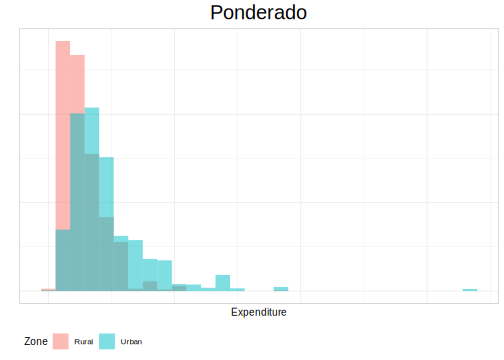
Sin ponderar,


```r
plot4_SinPonde <- ggplot(
  encuesta,
  aes(x = Expenditure)
) +
  geom_histogram(aes(y = ..density.., fill = Zone),
    alpha = 0.5, position = "identity"
  ) +
  ggtitle("Sin ponderar") +
  theme_cepal() +
  ylab("")
plot4_SinPonde
```

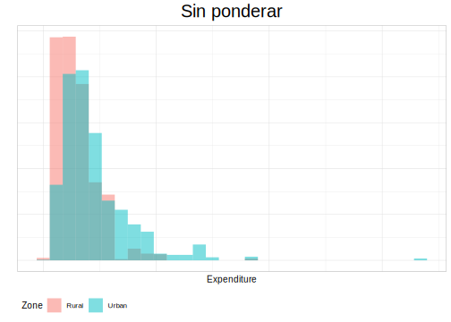

Poblacional,


```r
plot4_censo <- ggplot(BigCity, aes(x = Expenditure)) +
  geom_histogram(aes(y = ..density.., fill = Zone),
    alpha = 0.5, position = "identity"
  ) +
  ggtitle("Poblacional") +
  theme_cepal() +
  xlim(0, 1500) +
  ylab("")
plot4_censo | plot4_Ponde | plot4_SinPonde
```

Ahora, repetimos la secuencia de gráficos para la variable *Income*, pero hacemos las particiones por la variable *sexo*, Primero, hagamos el histogramas ponderado:


```r
plot5_Ponde <- ggplot(
  encuesta,
  aes(x = Income, weight = wk)
) +
  geom_histogram(aes(y = ..density.., fill = Sex),
    alpha = 0.5, position = "identity"
  ) +
  ylab("") +
  ggtitle("Ponderado") +
  theme_cepal()
plot5_Ponde
```

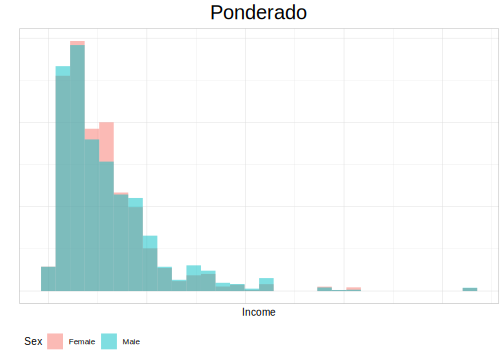

Sin ponderar,


```r
plot5_SinPonde <- ggplot(encuesta, aes(x = Income)) +
  geom_histogram(aes(y = ..density.., fill = Sex),
    alpha = 0.5, position = "identity"
  ) +
  ggtitle("Sin ponderar") +
  theme_cepal() +
  ylab("")
plot5_SinPonde
```

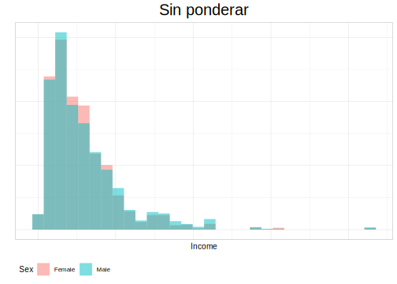

Poblacional,


```r
plot5_censo <- ggplot(BigCity, aes(x = Income)) +
  geom_histogram(aes(y = ..density.., fill = Sex),
    alpha = 0.5, position = "identity"
  ) +
  ggtitle("Poblacional") +
  theme_cepal() +
  xlim(0, 1500) +
  ylab("")
plot5_censo | plot5_Ponde | plot5_SinPonde
```

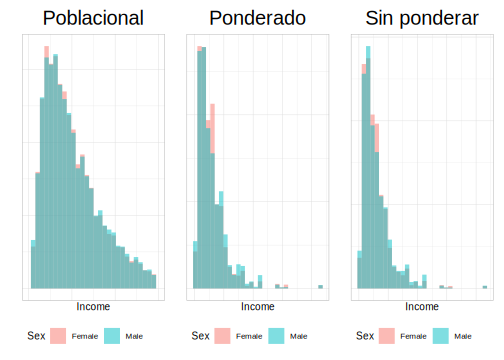

Ahora, repetimos la secuencia de gráficos para la variable *Expenditure* desagregada por la variable *sexo*, primero, ponderado: 


```r
plot6_Ponde <- ggplot(
  encuesta,
  aes(x = Expenditure, weight = wk)
) +
  geom_histogram(aes(y = ..density.., fill = Sex),
    alpha = 0.5, position = "identity"
  ) +
  ylab("") +
  ggtitle("Ponderado") +
  theme_cepal()
plot6_Ponde
```

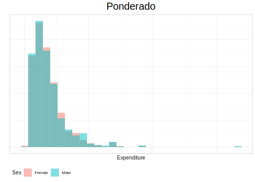

Sin ponderar,


```r
plot6_SinPonde <- ggplot(encuesta, aes(x = Expenditure)) +
  geom_histogram(aes(y = ..density.., fill = Sex),
    alpha = 0.5, position = "identity"
  ) +
  ggtitle("Sin ponderar") +
  theme_cepal() +
  ylab("")
plot6_SinPonde
```


Poblacional,


```r
plot6_censo <- ggplot(BigCity, aes(x = Expenditure)) +
  geom_histogram(aes(y = ..density.., fill = Sex),
    alpha = 0.5, position = "identity"
  ) +
  ggtitle("Poblacional") +
  theme_cepal() +
  xlim(0, 1500) +
  ylab("")
plot6_censo | plot6_Ponde | plot6_SinPonde
```

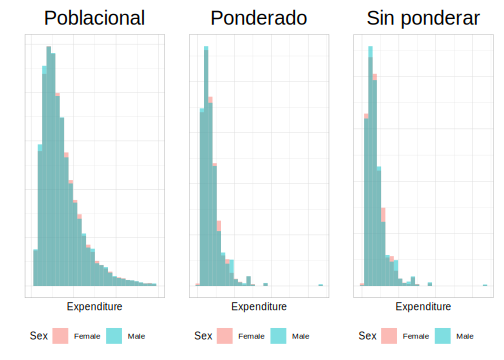

## Agregando densidades y graficando Boxplot

Dadas las cualidades de la librería ggplot2, se pueden agregar nuevas capas a los gráficos, particularmente, a los histogramas antes realizados. La densidad se agrega con el argumento `geom_density` y se incorpora el parámetro `alpha` que regula la transparencia del relleno. A continuacuón, se muestra cómo se agregan las densidades:


```r
plot1_Ponde + geom_density(fill = "blue", alpha = 0.3) |
  plot2_Ponde + geom_density(fill = "blue", alpha = 0.3)
```

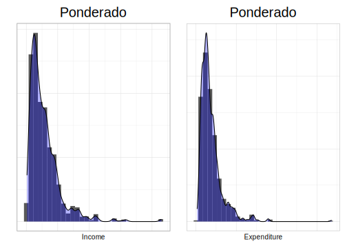

Ahora bien, al aplicar `aes(fill = Zone)` permite que la densidad sea agregada para cada una de las agrupaciones como se muestra a continución,


```r
plot3_Ponde + geom_density(aes(fill = Zone), alpha = 0.3) |
  plot4_Ponde + geom_density(aes(fill = Zone), alpha = 0.3)
```

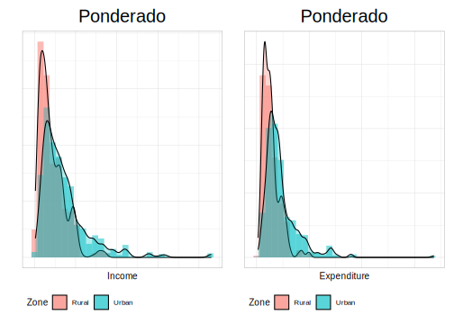

En está oportunidad se agrega la desnidad por sexo,


```r
plot5_Ponde + geom_density(aes(fill = Sex), alpha = 0.3) |
  plot6_Ponde + geom_density(aes(fill = Sex), alpha = 0.3)
```

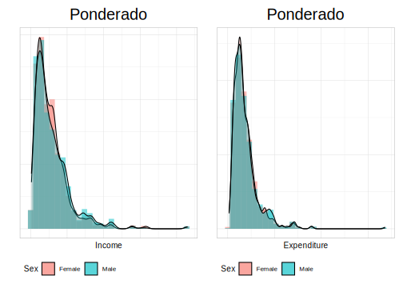


 *Boxplot*
 
El boxplot, diagrama de caja y bigotes, es un gráfico resumen presentado por John Tukey en 1977 que en la actualidad es ampliamente utilizado en la práctica estadística. En este diagrama se visualiza de forma general un conjunto de datos empleando el resumen de cinco números. La forma generada por este gráfico compuesto por un rectángulo (“caja”) y dos brazos (“bigotes”) suministra información sobre la relación ente los cuartiles (Q1, Q2 o mediana y Q3) y los valores mínimo y máximo, sobre la existencia de valores atípicos y la simetría
de la distribución.
 
 
Para realizar este gráfico en ggplot2 se utiliza la función `geom_boxplot`. A continuación, se presentan los Boxplot para las variables ingresos y gastos respectivamente:


```r
plot7_Ponde <- ggplot(
  data = encuesta, aes(x = Income, weight = wk)
) +
  geom_boxplot() +
  ggtitle("Ponderado") +
  coord_flip() +
  theme_cepal()


plot8_Ponde <- ggplot(
  encuesta,
  aes(x = Expenditure, weight = wk)
) +
  geom_boxplot() +
  ggtitle("Ponderado") +
  coord_flip() +
  theme_cepal()

plot7_Ponde | plot8_Ponde
```
En los gráficos anteriores se puede observar que la variable ingresos tiene más variabilidad que la variable gastos. En ambos gráficos se observan datos atípicos.

Estos diagramas también permiten la comparación  entre dos o más niveles de agrupamiento, por ejemplo, por zonas para las variables ingresos y gastos como se muestra a continuación,  


```r
plot9_Ponde <- ggplot(
  encuesta,
  aes(x = Income, weight = wk)
) +
  geom_boxplot(aes(fill = Zone)) +
  ggtitle("Ponderado") +
  coord_flip() +
  theme_cepal()

plot10_Ponde <- ggplot(
  encuesta,
  aes(x = Expenditure, weight = wk)
) +
  geom_boxplot(aes(fill = Zone)) +
  ggtitle("Ponderado") +
  coord_flip() +
  theme_cepal()

plot9_Ponde | plot10_Ponde
```

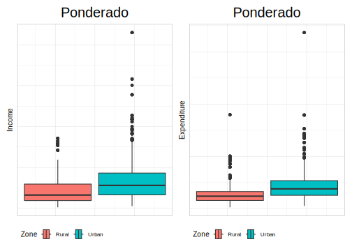
Observándose, entre otros que, para la variable gasto en la zona rural es donde más datos atípico hay.

Ahora, si se desea personalizar los colores del relleno debe hacer uso de la función `scale_fill_manual`como se muestra a continuación: 


```r
colorZona <- c(Urban = "#48C9B0", Rural = "#117864")
plot9_Ponde + scale_fill_manual(values = colorZona) |
  plot10_Ponde + scale_fill_manual(values = colorZona)
```

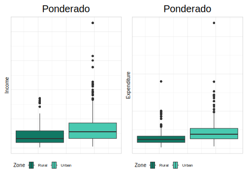
Para mayores colores, ver la ayuda de la librería. Ahora, si se desea comparar los ingresos y gastos por sexo se procede de la siguiente manera:


```r
plot11_Ponde <- ggplot(
  data = encuesta,
  aes(x = Income, weight = wk)) +
  geom_boxplot(aes(fill = Sex)) +
  ggtitle("Ponderado") +
  coord_flip() +
  theme_cepal()

plot12_Ponde <- ggplot(
  encuesta,
  aes(x = Expenditure, weight = wk)
) +
  geom_boxplot(aes(fill = Sex)) +
  ggtitle("Ponderado") +
  coord_flip() +
  theme_cepal()

plot11_Ponde | plot12_Ponde
```

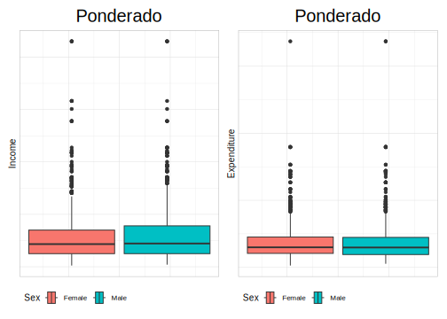

Definiendo el color del relleno para hombres y mujeres: 


```r
colorSex <- c(Male = "#5DADE2", Female = "#2874A6")
plot11_Ponde + scale_fill_manual(values = colorSex) |
  plot12_Ponde + scale_fill_manual(values = colorSex)
```

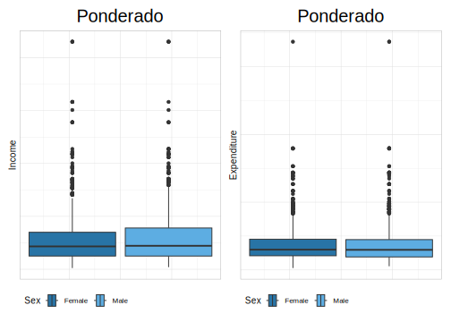
Realizando la comparación para más de dos categorías, por ejemplo región, se procede como: 


```r
plot13_Ponde <- ggplot(
  data = encuesta,
  aes(x = Income, weight = wk)) +
  geom_boxplot(aes(fill = Region)) +
  ggtitle("Ponderado") +
  coord_flip() +
  theme_cepal()

plot14_Ponde <- ggplot(
  data = encuesta,
  aes(x = Expenditure, weight = wk)) +
  geom_boxplot(aes(fill = Region)) +
  ggtitle("Ponderado") +
  coord_flip() +
  theme_cepal()

plot13_Ponde | plot14_Ponde
```

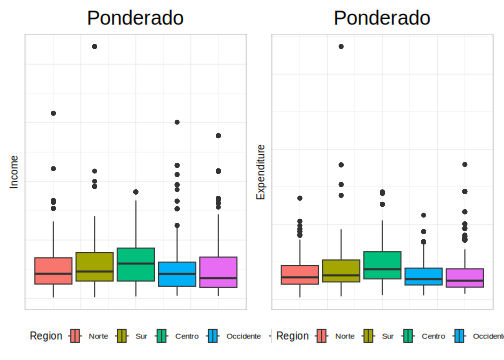

Personalizando los coles cuando hay más de  dos categorías, se realiza como se muestra a continuación: 


```r
colorRegion <- c(
  Norte = "#D6EAF8", Sur = "#85C1E9",
  Centro = "#3498DB", Occidente = "#2E86C1", Oriente = "#21618C"
)
plot13_Ponde + scale_fill_manual(values = colorRegion) |
plot14_Ponde + scale_fill_manual(values = colorRegion)
```

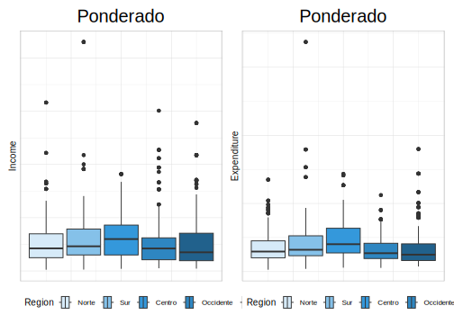

La función `geom_boxplot`permite realizar comparaciones con más de dos variables al tiempo. A continuación se compara los ingresos por sexo en las diferentes zonas.  


```r
plot15_Ponde <-ggplot(data = encuesta,
    aes(x = Income, y = Zone, weight = wk)) +
  geom_boxplot(aes(fill = Sex)) +
  ggtitle("Ponderado") +
  scale_fill_manual(values = colorSex) +
  coord_flip()
plot15_Ponde
```

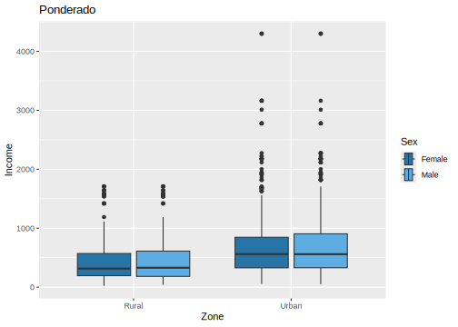

De forma análoga podemos realizar la comparación de los gastos por sexo en las diferentes zonas:


```r
plot16_Ponde <- ggplot(data = encuesta,
    aes(x = Expenditure, y = Zone, weight = wk)) +
  geom_boxplot(aes(fill = Sex)) +
  ggtitle("Ponderado") +
  scale_fill_manual(values = colorSex) +
  coord_flip()
plot15_Ponde / plot16_Ponde
```

Se puede extender las comparaciones a variables que tienen más de dos categorías.


```r
plot17_Ponde <- ggplot(data = encuesta,
    aes(x = Income, y = Region, weight = wk)) +
  geom_boxplot(aes(fill = Sex)) +
  ggtitle("Ponderado") +
  scale_fill_manual(values = colorSex) +
  coord_flip()
plot17_Ponde
```

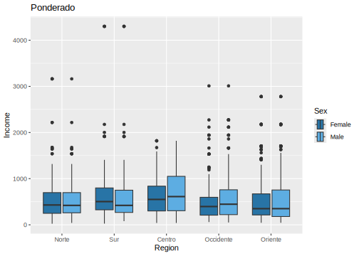


```r
plot18_Ponde <- ggplot(data = encuesta,
    aes(x = Expenditure,
        y = Region, weight = wk)) +
  geom_boxplot(aes(fill = Sex)) +
  ggtitle("Ponderado") +
  scale_fill_manual(values = colorSex) +
  coord_flip()

plot17_Ponde / plot18_Ponde
```


## Scaterplot  

Un diagrama de dispersión o Scaterplot representa cada observación como un punto, posicionado según el valor de dos variables. Además de una posición horizontal y vertical, cada punto también tiene un tamaño, un color y una forma. Estos atributos se denominan estética y son las propiedades que se pueden percibir en el gráfico. Cada estética puede asignarse a una variable o establecerse en un valor constante. Para realizar este tipo de gráfico se usará la función `geom_point`. Para ejemplificar el uso de esta función, se graficarán las variables ingresos y gastos como se muestra a continuación:   


```r
plot19_Ponde <- ggplot( 
  data = encuesta,
      aes(
      y = Income,
      x = Expenditure,
      weight = wk)) +
  geom_point() +
  theme_cepal()
plot19_Ponde
```

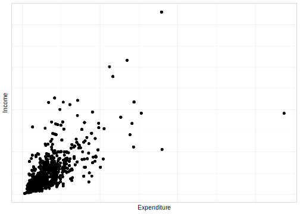
Note, que en este caso el parámetro `weight` no está aportando información visual al gráfico. El parámetro `weight` se puede usar para controlar el tamaño de los puntos, y así,  tener un mejor panorama del comportamiento de la muestra:


```r
plot20_Ponde <- ggplot(
  data = encuesta,
    aes(y = Income, x = Expenditure)) +
  geom_point(aes(size = wk), alpha = 0.3) +
  theme_cepal()
plot20_Ponde
```


Otra forma de usar la variable `wk`, es asignar la intensidad del color según el valor de la variable:


```r
plot21_Ponde <- ggplot(
  data = encuesta,
    aes(y = Income, x = Expenditure)) +
  geom_point(aes(col = wk), alpha = 0.3) +
  theme_cepal()
plot21_Ponde
```

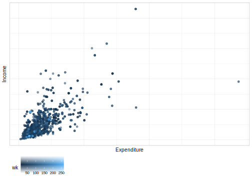

Se puede extender las bondades de los gráfico de `ggplot2` para obtener mayor información de las muestra. Por ejemplo, agrupar los datos por Zona. Para lograr esto se introduce el parámetro `shape`:  


```r
plot22_Ponde <- ggplot(
  data = encuesta,
    aes(y = Income, 
        x = Expenditure,
        shape = Zone)) + 
  geom_point(aes(size = wk, color = Zone), alpha = 0.3) +
  labs(size = "Peso") + scale_color_manual(values = colorZona) +
  theme_cepal()
plot22_Ponde
```


De forma similar se puede obtener el resultado por sexo: 


```r
plot23_Ponde <- ggplot(
  data = encuesta,
    aes(
      y = Income,
      x = Expenditure,
      shape = Sex)) +
  geom_point(aes(
    size = wk,
    color = Sex),
  alpha = 0.3) +
  labs(size = "Peso") +
  scale_color_manual(values = colorSex) +
  theme_cepal()
plot23_Ponde
```

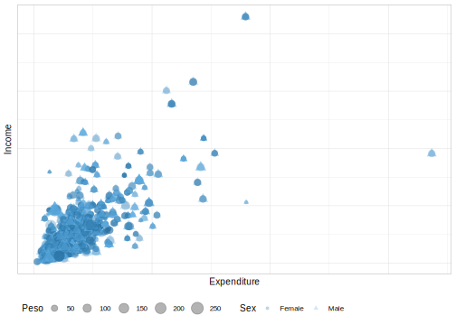

Un resultado equivalente se obtiene por región: 


```r
plot24_Ponde <- ggplot(
  data = encuesta,
        aes(
      y = Income,
      x = Expenditure,
      shape = Region)) +
  geom_point(aes(
    size = wk,
    color = Region),
  alpha = 0.3) +
  labs(size = "Peso") +
  scale_color_manual(values = colorRegion) +
  theme_cepal()
plot24_Ponde
```

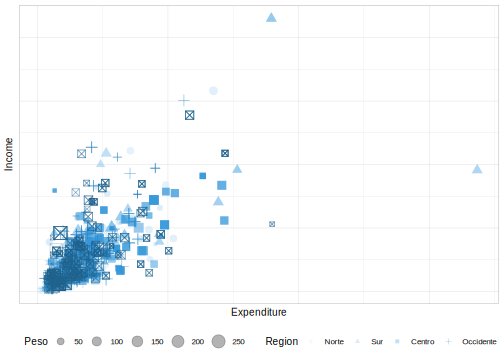

## Diagrama de barras para variables categoricas  

Para realizar estos gráfico, en primer lugar, se deben realizar las estimaciones puntuales de los tamaños que se van a graficar:


```r
tamano_zona <- diseno %>%
  group_by(Zone) %>%
  summarise( Nd = survey_total(vartype = c("se", "ci")))
tamano_zona 
```


|Zone  |    Nd| Nd_se| Nd_low| Nd_upp|
|:-----|-----:|-----:|------:|------:|
|Rural | 72102|  3062|  66039|  78165|
|Urban | 78164|  2847|  72526|  83802|

Ahora, se procede a hacer el gráfico como se mostró en las secciones anteriores:


```r
plot25_Ponde <- ggplot(
  data = tamano_zona, 
  aes(
    x = Zone,         
    y = Nd,           
    ymax = Nd_upp,    
    ymin = Nd_low,    
    fill = Zone)) +
  geom_bar(stat = "identity", position = "dodge") +
  geom_errorbar(position = position_dodge(width = 0.9),
    width = 0.3) +
  theme_bw()
plot25_Ponde
```


Como se ha visto en los gráficos anteriores, se pueden extender a variables con muchas más categorías:


```r
tamano_pobreza <- diseno %>%
  group_by(Poverty) %>%
  summarise(Nd = survey_total(vartype = c("se", "ci")))
tamano_pobreza
```


|Poverty  |    Nd| Nd_se| Nd_low| Nd_upp|
|:--------|-----:|-----:|------:|------:|
|NotPoor  | 91398|  4395|  82696| 100101|
|Extreme  | 21519|  4949|  11719|  31319|
|Relative | 37349|  3695|  30032|  44666|

El gráfico se obtiene con una sintaxis homologa a la anterior: 


```r
plot26_Ponde <- ggplot(
  data = tamano_pobreza,
  aes(
    x = Poverty,
    y = Nd,
    ymax = Nd_upp,
    ymin = Nd_low,
    fill = Poverty)) +
  geom_bar(stat = "identity", position = "dodge") +
  geom_errorbar(
    position = position_dodge(width = 0.9),
    width = 0.3) +
  theme_bw()
plot26_Ponde
```


De forma similar a los gráficos Boxplot, es posible realizar comparaciones entre más dos variables. 


```r
tamano_ocupacion_pobreza <- diseno %>%
  group_by(desempleo, Poverty) %>%
  summarise(Nd = survey_total(vartype = c("se", "ci"))) %>% as.data.frame() %>% 
  mutate(desempleo = ifelse(is.na(desempleo),"Ninos",desempleo))
tamano_ocupacion_pobreza
```


|desempleo |Poverty  |    Nd|  Nd_se|  Nd_low| Nd_upp|
|:---------|:--------|-----:|------:|-------:|------:|
|0         |NotPoor  | 68946| 3676.3| 61666.8|  76226|
|0         |Extreme  | 11549| 2208.8|  7175.8|  15923|
|0         |Relative | 22847| 2558.5| 17780.5|  27913|
|1         |NotPoor  |  1768|  405.4|   965.7|   2571|
|1         |Extreme  |  1169|  348.1|   479.9|   1859|
|1         |Relative |  1697|  457.8|   790.7|   2604|
|Ninos     |NotPoor  | 20684| 1256.6| 18195.4|  23172|
|Ninos     |Extreme  |  8800| 2979.9|  2899.7|  14701|
|Ninos     |Relative | 12805| 1551.0|  9733.9|  15876|
El gráfico para la tabla anterior queda de la siguiente manera: 


```r
plot27_Ponde <- ggplot(
  data = tamano_ocupacion_pobreza,
    aes(
      x = Poverty,
      y = Nd,
      ymax = Nd_upp,
      ymin = Nd_low,
      fill = as.factor(desempleo))) +
  geom_bar(stat = "identity", position = "dodge") +
  geom_errorbar(
    position = position_dodge(width = 0.9),
    width = 0.3) +
  theme_bw()
plot27_Ponde
```

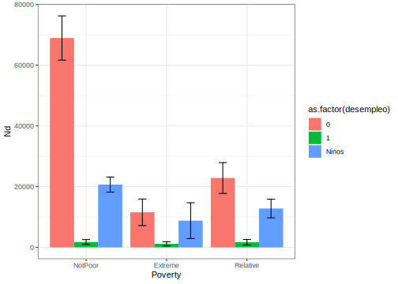

En estos gráficos también se pueden presentar proporciones, como se muestra a continuación: 

```r
prop_ZonaH_Pobreza <- sub_Hombre %>%
  group_by(Zone, Poverty) %>%
  summarise(prop = survey_prop(vartype = c("se", "ci")))
prop_ZonaH_Pobreza
```

```
## # A tibble: 6 × 6
## # Groups:   Zone [2]
##   Zone  Poverty   prop prop_se prop_low prop_upp
##   <chr> <fct>    <dbl>   <dbl>    <dbl>    <dbl>
## 1 Rural NotPoor  0.549  0.0626   0.424     0.668
## 2 Rural Extreme  0.198  0.0675   0.0958    0.364
## 3 Rural Relative 0.254  0.0372   0.187     0.334
## 4 Urban NotPoor  0.660  0.0366   0.584     0.728
## 5 Urban Extreme  0.113  0.0245   0.0726    0.171
## 6 Urban Relative 0.227  0.0260   0.180     0.283
```

Después de tener la tabla con los valores a presentar en el gráfico, los códigos computacionales para realizar el gráfico es el siguiente:


```r
plot28_Ponde <- ggplot(
  data = prop_ZonaH_Pobreza,
  aes(
    x = Poverty, y = prop,
    ymax = prop_upp, ymin = prop_low,
    fill = Zone)) + 
  geom_bar(stat = "identity", position = "dodge") +
  geom_errorbar(
    position = position_dodge(width = 0.9),
    width = 0.3
  ) + scale_fill_manual(values = colorZona) +
  theme_bw()
plot28_Ponde
```

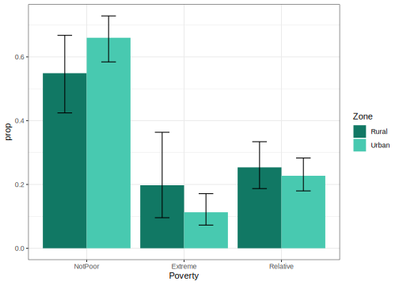

Ahora bien, grafiquemos la proporción de hombres en condición de pobreza por región:


```r
prop_RegionH_Pobreza <- sub_Hombre %>%
  group_by(Region, pobreza) %>%
  summarise(
    prop = survey_prop(vartype = c("se", "ci"))) %>%
  data.frame()
prop_RegionH_Pobreza
```


|Region    | pobreza|   prop| prop_se| prop_low| prop_upp|
|:---------|-------:|------:|-------:|--------:|--------:|
|Norte     |       0| 0.6315|  0.0552|   0.5171|   0.7327|
|Norte     |       1| 0.3685|  0.0552|   0.2673|   0.4829|
|Sur       |       0| 0.6134|  0.0567|   0.4970|   0.7181|
|Sur       |       1| 0.3866|  0.0567|   0.2819|   0.5030|
|Centro    |       0| 0.6453|  0.0846|   0.4666|   0.7910|
|Centro    |       1| 0.3547|  0.0846|   0.2090|   0.5334|
|Occidente |       0| 0.6259|  0.0439|   0.5358|   0.7080|
|Occidente |       1| 0.3741|  0.0439|   0.2920|   0.4642|
|Oriente   |       0| 0.5450|  0.1012|   0.3480|   0.7289|
|Oriente   |       1| 0.4550|  0.1012|   0.2711|   0.6520|

El gráfico de barras es el siguiente:


```r
plot29_Ponde <- ggplot(
  data = prop_RegionH_Pobreza,
  aes(
    x = Region, y = prop,
    ymax = prop_upp, ymin = prop_low,
    fill = as.factor(pobreza))) +
  geom_bar(stat = "identity", position = "dodge") +
  geom_errorbar(
    position = position_dodge(width = 0.9),
    width = 0.3
  ) +
  theme_bw()
plot29_Ponde
```


## Creando mapas 

Los mapas son una herramienta gráfica poderosa para la visualización de datos. Particularmente, para indicadores sociales-demográficos estos son una gran referencia visual para desagregaciones a nivel País, región, departamento, provincia, distrito, municipio, comuna, etc. `R` posee un sin fin de métodos de programación para representar dichos mapas. 

Para graficar mapas es necesario contar con información geoespacial, datos que contienen las coordenadas o delimitaciones geográficas de determinado país o región.  Sitios web como http://www.diva-gis.org/gdata ofrecen de manera gratuita bases de datos o `shapes` que contienen los vectores asociados a las geografías correspondientes. 

Dichos conjuntos de datos poseen observaciones sobre la longitud y latitud lo cuál permite graficar en `R` un conjunto de puntos cuya unión en el gráfico formarán las formas los polígonos que dan forma a las áreas geográficas. Entre las distintas librería para realizar mapas en `R` están `tmap` y `ggplot2`. A continuación, se ilustra cómo se generan mapas, inicalmente con la librería `tmap`: 

Inicialmente, para realizar el mapa hay que contar con el archivo de *shepefile* el cual se carga de la siguiente manera::


```r
library(sf)
library(tmap)
shapeBigCity <- read_sf("Data/shapeBigCity/BigCity.shp")
```

Una vez cargado el shape, el mapa se genera usando las funciones tm_shape y lo que se desea graficar en el mapa se incluye con la función tm_polygons. Para este ejemplo, solo grafiquemos las regiones en el mapa:


```r
tm_shape(shapeBigCity) + 
  tm_polygons(col = "Region") 
```


Si ahora el objetivo es graficar en las regiones el procentaje de probreza para hombres, inicialmente se debe agregar esa información a la base de datos con la que se graficará el mapa como sigue:


```r
shape_temp <- tm_shape(
  shapeBigCity %>%      # shapefile
    left_join(          # Agregando una variable
      prop_RegionH_Pobreza %>%
        filter(pobreza == 1), # Filtrando el nivel de interés. 
      by = "Region"))
```

Una vez generado la base de datos, se procede a crear el mapa. En este ejemplo, agregarán unos puntos de corte en el mapas que son definidos en el argumento brks como se muestra a continuación:


```r
brks <- c(0, .2, .4, .6, 0.8, 1)
shape_temp + tm_polygons(
  col = "prop",              
  breaks = brks,        
  title = "pobreza",   
  palette = "YlOrRd") 
```

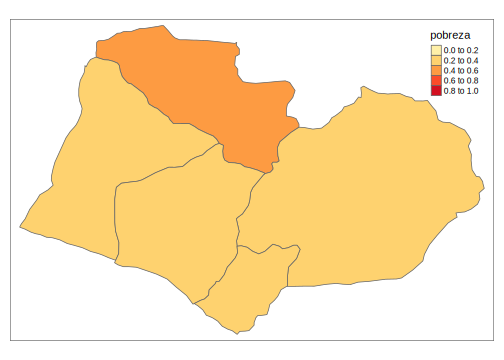

A modo de otro ejemplo, se desea graficar ahora los coeficientes de variación de las estimaciones de los ingresos medios obtenidas por el diseño a nivel de región:


```r
prom_region <- svyby(~Income, ~Region, diseno,
  svymean,
  na.rm = T, covmat = TRUE,
  vartype = c("cv"))
prom_region
```


|          |Region    |   Income|        cv|
|:---------|:---------|--------:|---------:|
|Norte     |Norte     | 552.3637| 0.1002236|
|Sur       |Sur       | 625.7740| 0.0997257|
|Centro    |Centro    | 650.7820| 0.0944538|
|Occidente |Occidente | 517.0071| 0.0894006|
|Oriente   |Oriente   | 541.7543| 0.1322830|

```r
brks <- c(0, 0.2, 1)
shape_temp <- tm_shape(
  shapeBigCity %>%
    left_join(
      prom_region,
      by = "Region"))

shape_temp + tm_polygons(
  "cv",
  breaks = brks,
  title = "cv",
  palette = c("#FFFFFF", "#000000"),
) + tm_layout(asp = 0)
```

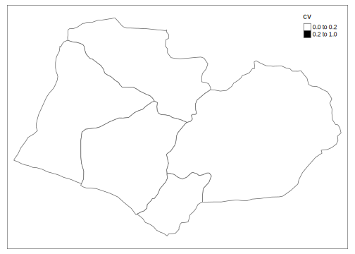
Ahora, realizar el mismo ejercicio anterior pero por zona y sexo:


```r
prom_region_Sex <- diseno %>%
  group_by(Region, Zone, Sex, pobreza) %>%
  summarise(prop = survey_mean(vartype = "cv")) %>%
  filter(pobreza == 1, Zone == "Rural", Sex == "Female")

shape_temp <- tm_shape(
  shapeBigCity %>%
    left_join(
      prom_region_Sex,
      by = "Region"))

shape_temp + tm_polygons(
  "prop",
  title = "Pobreza",
) + tm_layout(asp = 0)
```

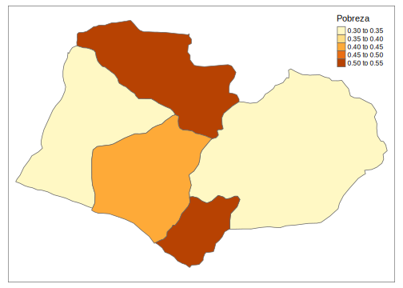

Como se comentó en la introducción de esta sección, los gráficos también se pueden hacer usando la librería ggplot2. Esta librería se apoya en las librerías biscale y cowplot. El procedimiento en R para hacer los mapas es muy similar al mostrado con la librería tmap y se realiza de la siguiente manera: 


```r
library(biscale)
library(cowplot)
temp_shape <- shapeBigCity %>%
  left_join(
    prom_region_Sex,
    by = "Region")

k <- 3
datos.RM.bi <- bi_class(temp_shape,
  y = prop, x = prop_cv, dim = k,
  style = "fisher")

map.RM <- ggplot() +
  geom_sf(
    data = datos.RM.bi,
    aes(fill = bi_class, geometry = geometry),
    colour = "white", size = 0.1) +
  bi_scale_fill(pal = "GrPink", dim = k) +
  bi_theme() +
  theme(legend.position = "none")
map.RM
```

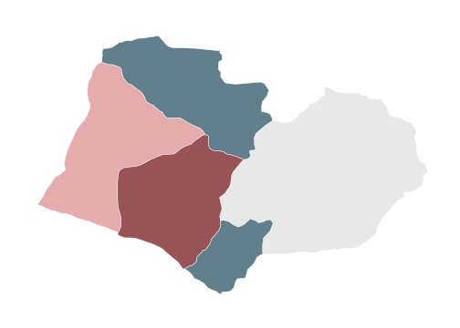

Ahora, para crear la leyenda del mapa se hace de la siguiente manera:

```r
legend1 <- bi_legend(
  pal = "GrPink", dim = k,
  xlab = "Coeficiente de variaci<U+00F3>n",
  ylab = "Pobreza", size = 8)

mapa1 <- ggdraw() +
  draw_plot(map.RM, 0, 0, 1, scale = 0.7) +
  draw_plot(legend1, 0.75, 0.4, 0.2, 0.2, scale = 1) +
  draw_text("Estimaciones directas de la pobreza en la mujer rural",
    vjust = -13, size = 18)

mapa1
```

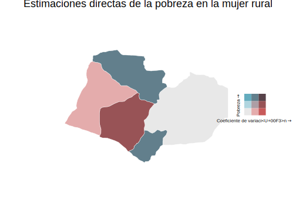
