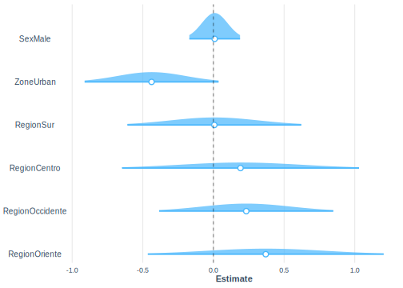

# Modelos lineales generalizados en encuestas de hogares

Los modelos lineales generalizados (MLGs) proporcionan una aproximación unificada a la mayoría de los procedimientos usados en estadística aplicada.

El nombre se debe a que ellos generalizan los modelos lineales basados en el supuesto de distribución normal para la variable respuesta. Al igual que los modelos lineales clásicos, tratados en capítulos anteriores, los MLG tienen aplicación en todas las disciplinas del saber. *Nelder & Wedderburn (1972)* presentaron por primera vez el término en un artículo que, sin lugar a dudas, es uno de los más importantes publicados en el área de estadística, por su gran impacto en la forma como se aplica esta disciplina. Desde entonces, poco a
poco los modelos lineales generalizados se han ido conociendo y usando ampliamente. 

La genialidad de *Nelder & Wedderburn (1972)* consistió en darse cuenta (y demostrar) que muchos de los métodos estadísticos ampliamente usados en la época, aparentemente desligados unos de otros, tales como la regresión lineal múltiple, el análisis probit, el análisis de datos provenientes de ensayos de dilución usando la distribución binomial (realizados por Fisher), los modelos logit para proporciones, los modelos log-lineales para conteos, los modelos de regresión para datos de sobrevivencia, entre otros, se podían tratar con un marco teórico unificado y que las estimaciones de máxima verosimilitud para los parámetros de esos modelos podían obtenerse por el mismo algoritmo conocido como mínimos cuadrados ponderados iterativos (MCPI).

Los desarrollos teóricos en modelos lineales clásicos parten del supuesto que la variable respuesta tiene distribución normal, cuando un fenómeno en estudio genera datos para los cuales no es razonable la suposición de normalidad, como por ejemplo cuando la respuesta es categórica, una proporción o un conteo, obviamente la respuesta no es normal y no es recomendable analizar los datos suponiendo normalidad.

Otro supuesto de los modelos lineales clásicos es el de homogeneidad de la varianza, situación que no se verifica cuando la respuesta
es, por ejemplo, una variable aleatoria de poisson, distribución donde la media y la varianza son iguales, es decir, en este modelo un cambio en la media necesariamente implica cambio en la varianza.

Los modelos lineales generalizados son excelentes para modelar datos en condiciones de no normalidad y varianza no constante. Específicamente, se debería considerar usar los MLGs cuando la variable respuesta es: conteos expresados como proporciones, conteos que no son proporciones, respuestas binarias, tiempos de sobrevida donde la varianza se incrementa con la media.

Sin lugar a dudas, en las encuestas de hogares existen variables de tipo conteo, binomiales, etc que meritan su análisis usando modelos lineales generalizados. Es por esto que, este capítulo es de relevancia en este texto.

Para ejemplificar los conceptos, inicialmente se cargan las librerías y la base de datos como sigue:


```r
options(digits = 4)
options(tinytex.verbose = TRUE)
library (survey)
library(srvyr)
library(convey)
library(TeachingSampling)
library(printr)
library(stargazer)
library(broom)
library(jtools)
library(modelsummary)
library(patchwork)
```

Cargue de las bases de datos,


```r
encuesta <- readRDS("Data/encuesta.rds")
data("BigCity", package = "TeachingSampling")
```

Por último, se define el diseño muestral,


```r
diseno <- encuesta %>%
  as_survey_design(
    strata = Stratum,
    ids = PSU,
    weights = wk,
    nest = T
  )
```


Se generan nuevas variables en el diseño para ser utilizadas en los ejemplos,


```r
diseno <- diseno %>% mutate(
  pobreza = ifelse(Poverty != "NotPoor", 1, 0),
  desempleo = ifelse(Employment == "Unemployed", 1, 0))
```

Como se ha definido en secciones y capítulos anteriores, con variables dicotómicas se pueden generar tablas de frecuencias teniendo en cuenta los factores de expansión del diseño. En `R` se hace usando la función `svyby` de la siguiente manera. Primero, se define la variable a la que se le requiere hacer la tabla (formula), luego se le indica cuál es la variable clasificadora (by). En este caso se quiere hacer una tabla de pobreza claificada por sexo. En tercer lugar se define la función que se quiere aplicar (FUN), en este caso, se quieren calcular totales por celda, por último, se define el diseño de muestreo (design)  


```r
tab_pobreza_sexo <- svyby(formula = ~factor(pobreza), 
                          by = ~Sex,
                          FUN = svytotal, 
                          design = as.svrepdesign(diseno), 
                          se=F, na.rm=T, ci=T, keep.var=TRUE)
tab_pobreza_sexo
```


|       |Sex    | factor(pobreza)0| factor(pobreza)1|      se1|      se2|
|:------|:------|----------------:|----------------:|--------:|--------:|
|Female |Female |         48366.17|         30823.83| 2410.577| 2916.237|
|Male   |Male   |         43032.16|         28043.84| 2521.692| 3094.588|

Sin embargo para la estimación de tamaños, se puede emplear también la función `svytable` como sigue:


```r
tab <- svytable(formula = ~pobreza + Sex, design = diseno)
kable(tab)
```

<table>
 <thead>
  <tr>
   <th style="text-align:left;">   </th>
   <th style="text-align:right;"> Female </th>
   <th style="text-align:right;"> Male </th>
  </tr>
 </thead>
<tbody>
  <tr>
   <td style="text-align:left;"> 0 </td>
   <td style="text-align:right;"> 48366.17 </td>
   <td style="text-align:right;"> 43032.16 </td>
  </tr>
  <tr>
   <td style="text-align:left;"> 1 </td>
   <td style="text-align:right;"> 30823.83 </td>
   <td style="text-align:right;"> 28043.84 </td>
  </tr>
</tbody>
</table>

Al hacer uso de la función `svyby` pero usando en el argumento `FUN= svymean` es posible estimar proporciones como se muestra a continuación:


```r
tab_pobreza_sexo <- svyby(formula = ~factor(pobreza), 
                          by = ~Sex,
                          FUN = svymean, 
                          design = as.svrepdesign(diseno), 
                          se=F, na.rm=T, ci=T, keep.var=TRUE)
tab_pobreza_sexo
```


|       |Sex    | factor(pobreza)0| factor(pobreza)1|       se1|       se2|
|:------|:------|----------------:|----------------:|---------:|---------:|
|Female |Female |        0.6107611|        0.3892389| 0.0315974| 0.0315974|
|Male   |Male   |        0.6054388|        0.3945612| 0.0366316| 0.0366316|

También se pueden hacer tablas de doble entrada para la proporción. 
En forma alternativa es posible usar la función `prop.table` del paquete base.


```r
kable(prop.table(tab, margin = 2))
```

<table>
 <thead>
  <tr>
   <th style="text-align:left;">   </th>
   <th style="text-align:right;"> Female </th>
   <th style="text-align:right;"> Male </th>
  </tr>
 </thead>
<tbody>
  <tr>
   <td style="text-align:left;"> 0 </td>
   <td style="text-align:right;"> 0.6107611 </td>
   <td style="text-align:right;"> 0.6054388 </td>
  </tr>
  <tr>
   <td style="text-align:left;"> 1 </td>
   <td style="text-align:right;"> 0.3892389 </td>
   <td style="text-align:right;"> 0.3945612 </td>
  </tr>
</tbody>
</table>

Estas diferentes formas de proceder son de mucha importancia al momento de hacer uso de pruebas de independencia en tablas cruzadas.


## Prueba de independencia F 

La prueba de independencia F de Fisher permite analizar si dos variables dicotómicas están asociadas cuando la muestra a estudiar es demasiado pequeña y no se cumplen las condiciones para aplicar la prueba $\chi^{2}$. Para utilizar esta técnica, tengamos en cuenta que la probabilidad estimada se escribe como:

$$
\hat{\pi}_{rc}=\frac{n_{r+}}{n_{++}}\times\frac{n_{+c}}{n_{++}}
$$
Teniendo en cuenta esta expresión, la estadística $\chi{2}$ de Pearson se define de la siguiente manera: 

$$
\chi_{pearsom}^{2}=n_{++}\times\sum_{r}\sum_{c}\left(\frac{\left(p_{rc}-\hat{\pi}_{rc}\right)^{2}}{\hat{\pi}_{rc}}\right)
$$

y la estadística de razón de verosimilitud se define como:

$$
G^{2}=2\times n_{++}\times\sum_{r}\sum_{c}p_{cr}\times\ln\left(\frac{p_{rc}}{\hat{\pi}_{rc}}\right)
$$

donde, $r$ es el número de filas y $c$ representa el número de columnas, la prueba tiene $(R-1)\times (C-1)$ grados de libertad. 

Como lo menciona *Heeringa*, *Fay (1979, 1985)* y *Fellegi (1980)* fueron de los primeros en proponer la corrección del estadístico chi-cuadrado de Pearson basada en un efecto de diseño generalizado (GDEFF, por sus siglas en inglés). *Rao y Scott (1984)* y más tarde *Thomas y Rao (1987)* ampliaron la teoría de las correcciones del efecto de diseño generalizado para estas pruebas estadísticas. El método de Rao-Scott requiere el cálculo de efectos de diseño generalizados que son analíticamente más complicados que el enfoque de Fellegi. Las correcciones de Rao-Scott son ahora el estándar en los procedimientos para el análisis de datos de encuestas categóricas en sistemas de software como Stata y SAS. Los estadísticos de prueba Rao-Scott Pearson ajustados por diseño y razón de verosimilitud chi-cuadrado se calculan de la siguiente manera:

$$
\chi^2_{(R-S)} = \chi^2_{(Pearson)}\big/GDEFF
$$
y, para la estadística basada en la razón de verosimilitud se calcula como:


$$
G^2_{(R-S)}  =  G^2\big/GDEFF
$$

donde el efecto generalizado del diseño ($GDEFF$) de Rao–Scott, está dado por 


$$
GDEFF=\frac{\sum_{r}\sum_{c}\left(1-p_{rc}\right)d^{2}\left(p_{rc}\right)-\sum_{r}\left(1-p_{r+}\right)d^{2}\left(p_{r+}\right)-\sum_{c}\left(1-p_{+c}\right)d^{2}\left(p_{+c}\right)}{\left(R-1\right)\left(C-1\right)}
$$

Por tanto, la estadística F para independencia basada en la chi-cuadrado de Pearson se calcula como sigue:

$$
F_{R-S,Pearson}=\chi_{R-S}^{2}\big/\left[\left(R-1\right)\left(C-1\right)\right]\sim F_{\left(R-1\right)\left(C-1\right),\left(R-1\right)\left(C-1\right)df}
$$

y, la estadística F para independencia basada en la razón de verosimilitudes se calcula como sigue:

$$
F_{R-S,LRT}=G_{R-S}^{2}\big/\left(C-1\right)\sim F_{\left(C-1\right),df}
$$
donde $C$ es el número de columnas de la tabla cruzada.

En `R`, el cálculo de las estadísticas chi-cuadrado y F se camculan usando la función `summary` como se muestra a continuación:


```r
summary(tab, statistic = "Chisq")
```

```
##        Sex
## pobreza Female  Male
##       0  48366 43032
##       1  30824 28044
## 
## 	Pearson's X^2: Rao & Scott adjustment
## 
## data:  NextMethod()
## X-squared = 0.077194, df = 1, p-value = 0.8122
```

Basado en la estadística de Pearson, se puede concluir que el estado de pobreza y el sexo no están relacionados con una confianza del 95%.


```r
summary(tab, statistic = "F")
```

```
##        Sex
## pobreza Female  Male
##       0  48366 43032
##       1  30824 28044
## 
## 	Pearson's X^2: Rao & Scott adjustment
## 
## data:  NextMethod()
## F = 0.056464, ndf = 1, ddf = 119, p-value = 0.8126
```

Resultados similares se obtienen con la prueba F de independencia.

## Estadístico de Wald 

Este estadístico se aplica cuando ya se ha elegido un modelo estadístico ( regresión lineal simple, regresión logística, entre otros).El estadístico de prueba de Wald $\chi^{2}$ para la hipótesis nula de independencia de filas y columnas en una tabla de doble entrada se define de la siguiente manera:

$$
Q_{wald}=\hat{\boldsymbol{Y}^{t}}\left(\boldsymbol{H}\hat{\boldsymbol{V}}\left(\hat{\boldsymbol{N}}\right)\boldsymbol{H}^{t}\right)^{-1}\hat{\boldsymbol{Y}}
$$

donde, 

$$
\hat{\boldsymbol{Y}}=\left(\hat{N}-E\right)
$$

es un vector de $R\times C$ de  diferencias entre los recuentos de celdas observadas y esperadas, esto es, $\hat{N}_{rc}-E_{rc}$. La matriz  $\boldsymbol{H}\hat{\boldsymbol{V}}\left(\hat{\boldsymbol{N}}\right)\boldsymbol{H}^{t}$, representa la matriz de varianza y covarianza estimada para el vector de diferencias. En el caso de un diseño de muestra complejo, la matriz de varianza-covarianza de los conteos de frecuencia ponderada, $\hat{V}\left(\hat{N}\right)$, se estima utilizando métodos de remuestreo o aproximación de Taylor. La matriz $\boldsymbol{H}$  es la inversa de la matriz $\boldsymbol{J}$ dada por:

$$
\boldsymbol{J}=-\left[\frac{\delta^{2}\ln PL\left(\boldsymbol{B}\right)}{\delta^{2}\boldsymbol{B}}\right] \mid \boldsymbol{B}=\hat{\boldsymbol{B}}
$$
Bajo la hipótesis nula de independencia, el estadístico de wald se distribuye chi cuadrado con $\left(R-1\right)\times\left(C-1\right)$ grados de libertad,
$$
Q_{wald}\sim\chi_{\left(R-1\right)\times\left(C-1\right)}^{2}
$$

La transformación F del estadístico de Wald es:
$$
F_{wald}=Q_{wald}\times\frac{df-\left(R-1\right)\left(C-1\right)+1}{\left(R-1\right)\left(C-1\right)df}\sim F_{\left(R-1\right)\left(C-1\right),df-\left(R-1\right)\left(C-1\right)+1}
$$

En `R`, para calcular el estadístico de Wald se hace similarmente al cálculo de los estadísticos anteriores usando la función `summary` como sigue:


```r
summary(tab, statistic = "Wald")
```

```
##        Sex
## pobreza Female  Male
##       0  48366 43032
##       1  30824 28044
## 
## 	Design-based Wald test of association
## 
## data:  NextMethod()
## F = 0.056213, ndf = 1, ddf = 119, p-value = 0.813
```

Se puede concluir que, con una confianza del 95% y basado en la muestra no hay relación entre el estado de pobreza y el sexo.

En este mismo sentido, el estadístco de Wald ajustado en `R` se se calcula similarmente al anterior y los resultados fueron similares:


```r
summary(tab, statistic = "adjWald")
```

```
##        Sex
## pobreza Female  Male
##       0  48366 43032
##       1  30824 28044
## 
## 	Design-based Wald test of association
## 
## data:  NextMethod()
## F = 0.056213, ndf = 1, ddf = 119, p-value = 0.813
```


## Modelo log lineal para tablas de contingencia 

El término modelo log-lineal, que básicamente describe el papel de la función de enlace que se utiliza en los modelos lineales generalizados. Iniciaremos esta sección con los modelos log-lineales en tablas de contingencia. El modelo estadístico es el siguiente:

$$
  \log(p_{ijk}) = \mu + \lambda_i^X + \lambda_j^Y + \lambda_k^Z + \lambda_{ij}^{XY}  ,   
$$
  
  donde:
  
  - $p_{ijk}=$ la proporción esperada en la celda bajo el modelo. 

  - $\mu = \log(p_{0})=\frac{1}{\#\ de\ celdas}$

El modelo log-lineal en `R` se ajusta utilizando la función `svyloglin` como sigue: 
  

```r
mod1 <- svyloglin(formula = ~pobreza+Sex + pobreza:Sex, 
                    design = diseno)
s1 <- summary(mod1)
s1
```

```
## Loglinear model: svyloglin(formula = ~pobreza + Sex + pobreza:Sex, design = diseno)
##                      coef         se           p
## pobreza1      0.219672853 0.06778341 0.001191924
## Sex1          0.052843010 0.01624864 0.001145356
## pobreza1:Sex1 0.005583339 0.02349684 0.812175178
```

En la salida anterior se puede observar que, con una confianza del 95% el estado de pobreza es independiente del sexo, como se ha mostrado con las pruebas anteriores. 

Ahora bien, puesto que en la salida anterior se pudo observar que la interacción es no significativa, entonces, ajustemos ahora el modelo sin interacción:


```r
mod2 <- svyloglin(formula = ~pobreza+Sex, 
                  design = diseno)
s2 <- summary(mod2)
s2
```

```
## Loglinear model: svyloglin(formula = ~pobreza + Sex, design = diseno)
##                coef         se            p
## pobreza1 0.21996762 0.06752159 0.0011230416
## Sex1     0.05405015 0.01576635 0.0006076032
```
  

Por último, mediante un análisis de varianza es posible comparar los dos modelos como sigue: 

```r
anova(mod1, mod2)
```

```
## Analysis of Deviance Table
##  Model 1: y ~ pobreza + Sex
## Model 2: y ~ pobreza + Sex + pobreza:Sex 
## Deviance= 0.07718786 p= 0.8125902 
## Score= 0.07719412 p= 0.8125827
```

De la anterior salida se puede concluir que, con una confianza del 95%, la interacción no es significativa en el modelo log-lineal ajustado.

*Modelo de regresión logistica*

Un modelo de regresion logística es un modelo matemático que puede ser utilizado para describir la relacion entre un conjunto de variables independientes y una variable dicotomica Y. El modelo logístico se describe a continuación:

$$
    g(\pi(x))=logit(\pi(x)) 
$$
De aquí,

$$
z = \ln\left(\frac{\pi(x)}{1-\pi(x)}\right) = B_0 + B_1x_1+\dots+B_px_p
$$

Por tanto, la probabilidad estimada utilizando el modelo logístico es la siguiente:
  
$$
    \hat{\pi}\left(\boldsymbol{x}\right)=\frac{\exp\left(\boldsymbol{X\hat{B}}\right)}{1-\exp\left(\boldsymbol{X\hat{B}}\right)}=\frac{\exp\left(\hat{B}_{0}+\hat{B}_{1}x_{1}+\cdots+\hat{B}x_{p}\right)}{1-\exp\left(\hat{B}_{0}+\hat{B}_{1}x_{1}+\cdots+\hat{B}x_{p}\right)}
$$

$$
    \pi\left(x_{i}\right)=\frac{\exp\left(x_{i}\boldsymbol{B}\right)}{1-\exp\left(x_{i}\boldsymbol{B}\right)}
$$
La varianza de los parámetros estimados se calcula como sigue:

$$
    var\left(\boldsymbol{\hat{B}}\right)=\boldsymbol{J}^{-1}var\left(S\left(\hat{\boldsymbol{B}}\right)\right)\boldsymbol{J}^{-1}
$$
con,

$$
    S\left(B\right)=\sum_{h}\sum_{a}\sum_{i}w_{hai}\boldsymbol{D}_{hai}^{t}\left[\left(\pi_{hai}\left(\boldsymbol{B}\right)\right)\left(1-\pi_{hai}\left(\boldsymbol{B}\right)\right)\right]^{-1}\left(y_{hai}-\pi_{hai}\left(\boldsymbol{B}\right)\right)=0
$$
y,

$$
    D_{hai} = \frac{\delta\left(\pi_{hai}\left(\boldsymbol{B}\right)\right)}{\delta B_{j}}
$$
donde $j=0,\dots,p$
    
*Prueba de Wald para los parámetros del modelo*
 
Para utilizar el estadístico de Wald en en la significancia de los parámetros del modelo se utiliza la razón de verosimilitud. En este caso se contrastan el modelo con todos los parámetros (modelo full) versus el modelo reducido, es decir, el modelo con menos parámetros (modelo reduced),  

$$
    G=-2\ln\left[\frac{L\left(\hat{\boldsymbol{\beta}}_{MLE}\right)_{reduced}}{L\left(\hat{\boldsymbol{\beta}}_{MLE}\right)_{full}}\right]
$$

Dado que el modelo tiene enlace logaritmo, para construir los intervalos de confianza se debe aplicar el función exponencial a cada parámetro, 

$$
    \hat{\psi}=\exp\left(\hat{B}_{1}\right)
$$
por ende, el intervalo de confianza es: 

$$
    CI\left(\psi\right)=\exp\left(\hat{B}_{j}\pm t_{df,1-\frac{\alpha}{2}}se\left(\hat{B}_{j}\right)\right)
$$

A continuación, se muestra el ajuste de un modelo logístico teniendo e cuenta el diseño muestral:


```r
  mod_loglin <- svyglm(formula = pobreza ~ Sex + Zone + Region,
                       family = binomial, 
                       design=diseno)
  tidy(mod_loglin) 
```


|term            |   estimate| std.error|  statistic|   p.value|
|:---------------|----------:|---------:|----------:|---------:|
|(Intercept)     | -0.4082083| 0.2639805| -1.5463580| 0.1248142|
|SexMale         |  0.0086488| 0.0915245|  0.0944974| 0.9248814|
|ZoneUrban       | -0.4378393| 0.2418265| -1.8105513| 0.0728675|
|RegionSur       |  0.0063190| 0.3140470|  0.0201212| 0.9839822|
|RegionCentro    |  0.1915247| 0.4278798|  0.4476134| 0.6552892|
|RegionOccidente |  0.2319468| 0.3144209|  0.7376952| 0.4622288|
|RegionOriente   |  0.3699120| 0.4258530|  0.8686378| 0.3868864|
  
La función *tidy* muestra que ninguna de las covariables son significativas con una confianza del 95%. A continuación, se presentan los intervalos de confianza en los cuales se pueden concluir que en todos los parámetros el cero se encuentra dentro del intrevalo:


```r
confint(mod_loglin, level = 0.95) 
```


|                |      2.5 %|    97.5 %|
|:---------------|----------:|---------:|
|(Intercept)     | -0.9312013| 0.1147846|
|SexMale         | -0.1726777| 0.1899753|
|ZoneUrban       | -0.9169413| 0.0412626|
|RegionSur       | -0.6158647| 0.6285026|
|RegionCentro    | -0.6561823| 1.0392317|
|RegionOccidente | -0.3909778| 0.8548713|
|RegionOriente   | -0.4737796| 1.2136036|
  
Para verificar de manera gráfica la distribución de los parámetros del modelo, se realizará un gráfico de estos usando la función *plot_summs* como se muestra a continuación,


```r
library(ggstance)
plot_summs(mod_loglin, 
             scale = TRUE, plot.distributions = TRUE)
```



Se puede observar en el gráfico que el número cero se encuentra dentro del intervalo de confianza de cada uno de los parámetros, lo que confirma la no significancia al 95% de los parámetros del modelo.

Por otro parte, el estadístico de Wald para el cada una de las variables del modelo se calcula a continuación con la función *regTermTest* para las variables del modelo:

  

```r
  regTermTest(model = mod_loglin, ~Sex)
```

```
## Wald test for Sex
##  in svyglm(formula = pobreza ~ Sex + Zone + Region, design = diseno, 
##     family = binomial)
## F =  0.00892975  on  1  and  113  df: p= 0.92488
```

```r
  regTermTest(model = mod_loglin, ~Zone)
```

```
## Wald test for Zone
##  in svyglm(formula = pobreza ~ Sex + Zone + Region, design = diseno, 
##     family = binomial)
## F =  3.278096  on  1  and  113  df: p= 0.072868
```

```r
  regTermTest(model = mod_loglin, ~Region)
```

```
## Wald test for Region
##  in svyglm(formula = pobreza ~ Sex + Zone + Region, design = diseno, 
##     family = binomial)
## F =  0.3653695  on  4  and  113  df: p= 0.83284
```
  
Concluyendo que con una confianza del 95% no son significativas en el modelo como se había mencionado anteriormente.

Como es tradicional en el ejuste de modelos de regresión ya sea, clásico o generalizado, se pueden realizar ajustes con interacciones. A continuación, se present cómo se ajustan modelos loglineales con interacción:


```r
mod_loglin_int <- svyglm(formula = pobreza ~ Sex + Zone + Region + 
                           Sex:Zone + Sex:Region,
                           family=binomial, 
                           design=diseno)
tab_mod <- tidy(mod_loglin_int) %>% arrange(p.value)
tab_mod
```


|term                    |   estimate| std.error|  statistic|   p.value|
|:-----------------------|----------:|---------:|----------:|---------:|
|ZoneUrban               | -0.4248452| 0.2562449| -1.6579656| 0.1002263|
|(Intercept)             | -0.4289088| 0.2848992| -1.5054758| 0.1351210|
|SexMale:RegionSur       |  0.2870574| 0.2773933|  1.0348389| 0.3030558|
|RegionOriente           |  0.3842514| 0.4279106|  0.8979712| 0.3711984|
|RegionOccidente         |  0.3342034| 0.3782893|  0.8834599| 0.3789502|
|SexMale:RegionOccidente | -0.2302025| 0.2868191| -0.8026051| 0.4239657|
|RegionCentro            |  0.2466221| 0.4560181|  0.5408165| 0.5897478|
|SexMale:RegionCentro    | -0.1161737| 0.2791409| -0.4161829| 0.6781021|
|RegionSur               | -0.1325129| 0.3464413| -0.3824974| 0.7028441|
|SexMale                 |  0.0478245| 0.1993842|  0.2398611| 0.8108926|
|SexMale:RegionOriente   | -0.0304037| 0.2877664| -0.1056540| 0.9160529|
|SexMale:ZoneUrban       | -0.0154225| 0.1871727| -0.0823972| 0.9344834|

Observando que la interacción tampoco es significativa con una confianza del 95%.

El gráfico de la distribución de los parámetros del modelo con intercepto y sin intercepto se presenta a continuación:

  

```r
plot_summs(mod_loglin_int, mod_loglin, scale = TRUE, plot.distributions = TRUE)
```


  
El estadístico de Wald sobre los parámetros del modelo con intercepto son:


```r
  regTermTest(model = mod_loglin_int, ~Sex)
```

```
## Wald test for Sex
##  in svyglm(formula = pobreza ~ Sex + Zone + Region + Sex:Zone + Sex:Region, 
##     design = diseno, family = binomial)
## F =  0.05753333  on  1  and  108  df: p= 0.81089
```

```r
  regTermTest(model = mod_loglin_int, ~Zone)
```

```
## Wald test for Zone
##  in svyglm(formula = pobreza ~ Sex + Zone + Region + Sex:Zone + Sex:Region, 
##     design = diseno, family = binomial)
## F =  2.74885  on  1  and  108  df: p= 0.10023
```

```r
  regTermTest(model = mod_loglin_int, ~Region)
```

```
## Wald test for Region
##  in svyglm(formula = pobreza ~ Sex + Zone + Region + Sex:Zone + Sex:Region, 
##     design = diseno, family = binomial)
## F =  0.8999115  on  4  and  108  df: p= 0.46679
```

```r
  regTermTest(model = mod_loglin_int, ~Sex:Zone)
```

```
## Wald test for Sex:Zone
##  in svyglm(formula = pobreza ~ Sex + Zone + Region + Sex:Zone + Sex:Region, 
##     design = diseno, family = binomial)
## F =  0.006789293  on  1  and  108  df: p= 0.93448
```

```r
  regTermTest(model = mod_loglin_int, ~Sex:Region)
```

```
## Wald test for Sex:Region
##  in svyglm(formula = pobreza ~ Sex + Zone + Region + Sex:Zone + Sex:Region, 
##     design = diseno, family = binomial)
## F =  1.05752  on  4  and  108  df: p= 0.38123
```

Observándose que con una confianza del 95% ninguno de los parámetros del modelo es significativo.

Ahora bien, como se ha explicado a los largo de los capítulos relacionado con modelos, se pueden ajustar modelos usando *Q_Weighting*. A continuación, se presenta cómo se ajusta el modelo usando estos pesos:
  

```r
  fit_wgt <- lm(wk ~  Sex + Zone + Region ,
                data = encuesta)
  wgt_hat <- predict(fit_wgt)
  encuesta %<>% mutate(wk2 = wk/wgt_hat)
  
  diseno_qwgt <- encuesta %>%
    as_survey_design(
      strata = Stratum,
      ids = PSU,
      weights = wk2,
      nest = T
    )
```


Defiendo la variable pobreza dentro de la base de datos.


```r
diseno_qwgt <- diseno_qwgt %>% mutate(
pobreza = ifelse(Poverty != "NotPoor", 1, 0))
```

Ajustando el modelo se tiene:

```r
mod_loglin_qwgt <- svyglm(formula = pobreza ~ Sex + Zone + Region,
                          family=quasibinomial,
                          design=diseno_qwgt)
tab_mod <- tidy(mod_loglin_qwgt)
tab_mod
```


|term            |   estimate| std.error|  statistic|   p.value|
|:---------------|----------:|---------:|----------:|---------:|
|(Intercept)     | -0.4644389| 0.2630449| -1.7656260| 0.0801596|
|SexMale         |  0.0240640| 0.0882830|  0.2725779| 0.7856752|
|ZoneUrban       | -0.3444666| 0.2311446| -1.4902647| 0.1389407|
|RegionSur       | -0.0040539| 0.3116473| -0.0130079| 0.9896444|
|RegionCentro    |  0.1612961| 0.4269907|  0.3777509| 0.7063242|
|RegionOccidente |  0.2424433| 0.3146520|  0.7705126| 0.4426039|
|RegionOriente   |  0.3936689| 0.4318686|  0.9115480| 0.3639472|

Concluyendo que, con una confianza del 95% y basado en la muestra, ninguno de los parámetros del modelo es significativo. Lo cual se puede corroborar con el gráfico de la distribución de los parámetros del modelo con los pesos ajustados y sin los pesos:
  

```r
plot_summs(mod_loglin, mod_loglin_qwgt, 
             scale = TRUE, plot.distributions = TRUE)
```


El Estadístico de Wald sobre los parámetros del modelo se obtiene de manera similar a lo visto anteriormente:
  

```r
regTermTest(model = mod_loglin_qwgt, ~Sex)
```

```
## Wald test for Sex
##  in svyglm(formula = pobreza ~ Sex + Zone + Region, design = diseno_qwgt, 
##     family = quasibinomial)
## F =  0.07429872  on  1  and  113  df: p= 0.78568
```

```r
regTermTest(model = mod_loglin_qwgt, ~Zone)
```

```
## Wald test for Zone
##  in svyglm(formula = pobreza ~ Sex + Zone + Region, design = diseno_qwgt, 
##     family = quasibinomial)
## F =  2.220889  on  1  and  113  df: p= 0.13894
```

```r
regTermTest(model = mod_loglin_qwgt, ~Region)
```

```
## Wald test for Region
##  in svyglm(formula = pobreza ~ Sex + Zone + Region, design = diseno_qwgt, 
##     family = quasibinomial)
## F =  0.4155767  on  4  and  113  df: p= 0.79712
```

Concluyendo también que ninguna de las variables son significativas.
